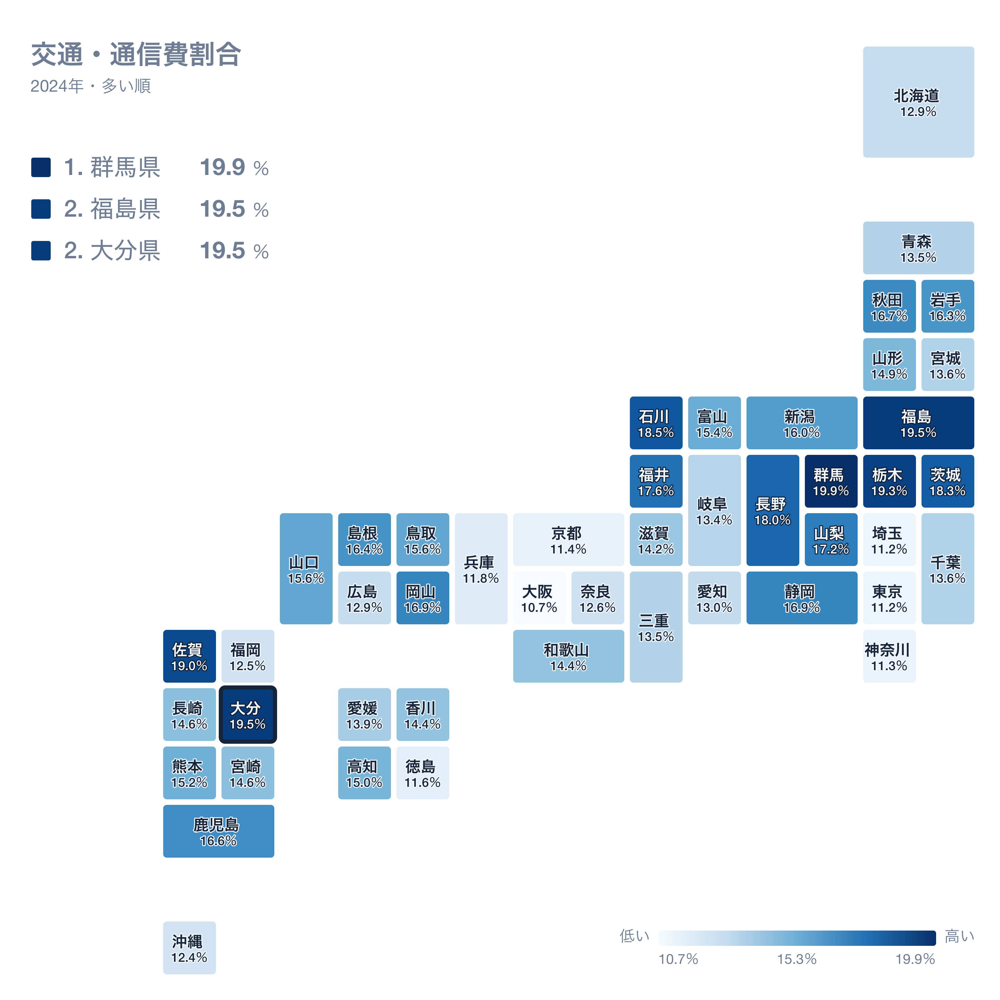
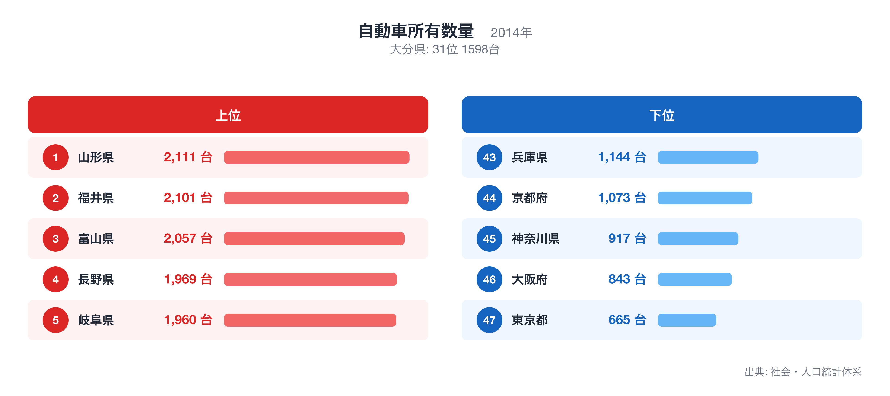
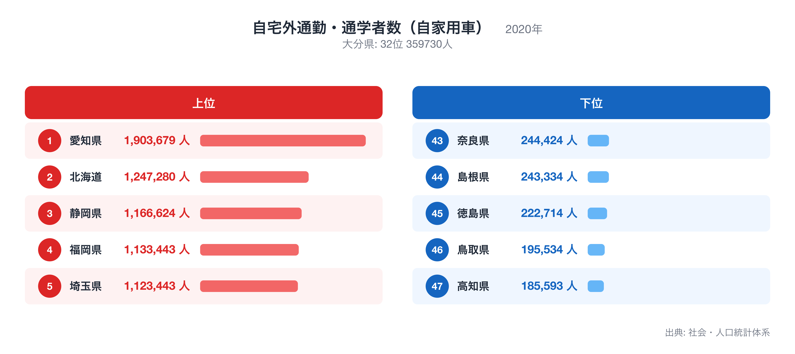

大分県の県庁所在地・大分市の家計を、総務省「家計調査」(2024年・二人以上の世帯)で十大費目に分けて見ると、47都道府県庁所在市の単純平均を1.00としたとき、最も乖離が大きいのは交通・通信の1.27倍です。

この記事では、十大費目の偏り、47県の中での大分市の位置、突出した個別品目、そして交通・通信が高くなる背景を他の都道府県統計で確かめる、という順で大分市の家計を読み解きます。比率はすべて47市平均に対する倍率で、家計調査が公表する全国平均とは基準が異なります。

十大費目とは食料、住居、光熱・水道、家具・家事用品、被服及び履物、保健医療、交通・通信、教育、教養娯楽、その他の消費支出の10区分で、家計調査が消費支出を分類する最上位の区分です。

## 十大費目にみる大分市の家計の偏り

47市平均を上回るのは3費目で、交通・通信(1.27倍)、その他の消費支出(1.08倍)、被服及び履物(1.07倍)です。下回るのは7費目で、教育(0.78倍)、光熱・水道(0.83倍)、教養娯楽(0.84倍)、住居(0.86倍)、家具・家事用品(0.87倍)、保健医療(0.88倍)、食料(0.92倍)です。最も大きく離れているのは交通・通信の1.27倍、最も平均に近いのは被服及び履物の1.07倍で、大分市の家計は交通・通信が高いほうに偏った構造だとわかります。

上の地図は、消費支出に占める交通・通信の割合(交通・通信費割合)を47都道府県で比べたもので、大分県は2位(19.5%)です。割合が最も高いのは群馬県(19.9%)、次いで福島県(19.5%)、大分県(19.5%)で、最も低いのは大阪府(10.7%)です。倍率は「47市平均に対して何倍か」、地図の順位は「支出全体に占める割合が大きい順」なので、同じ費目でも見方が違います。倍率が高くても割合の順位が中位にとどまる場合は、他の費目も同じように多いことを意味します。全国ランキングの詳細は[交通・通信費割合](https://stats47.jp/ranking/transport-communication-expenditure-ratio-multi-person-households)で確認できます。

## 突出した品目にみる暮らしの実像

品目別に見ると、47市平均より多い側の上位10品目は食器戸棚(10.60倍)、他の交通(3.75倍)、カメラ・ビデオカメラ(3.15倍)、専修学校(2.94倍)、炊事用ガス器具(2.23倍)、干ししいたけ(2.11倍)、自動車購入(2.07倍)、住宅関係負担費(2.01倍)、国内遊学仕送り金(1.87倍)、自動車以外の輸送機器整備費(1.83倍)です。少ない側の10品目は語学月謝(0.02倍)、他の工事費(0.02倍)、通学用かばん(0.06倍)、給排水関係工事費(0.07倍)、自動車教習料(0.09倍)、植木・庭手入れ代(0.12倍)、教養娯楽用品修理代(0.17倍)、エアコン(0.18倍)、まぐろ(0.23倍)、腕時計(0.23倍)で、平均の2%程度にとどまる品目もあります。多い側の1位である食器戸棚と、少ない側の1位である語学月謝が、大分市の暮らしを最も端的に表す品目です。品目の倍率は世帯あたりの年間支出額を47市平均で割ったもので、購入頻度の低い品目ほど年ごとの振れが大きい点には注意が必要です。

## 交通・通信の高さを他の統計で確かめる

自動車所有数量は大分県が全国31位(1,598台、2014年)で中位にあり、交通・通信が高くなる理由としては説明力が弱い指標です。全国1位は山形県(2,111台)、最下位は東京都(665台)です。順位は値が大きい順で、全国ランキングは[自動車所有数量](https://stats47.jp/ranking/car-ownership-multi-person-households-per-1000)で確認できます。

自宅外通勤・通学者数（自家用車）は大分県が全国32位(359,730人、2020年)で、交通・通信の偏りとは逆方向にあり、この指標では説明できません。全国1位は愛知県(1,903,679人)、最下位は高知県(185,593人)です。順位は値が大きい順で、全国ランキングは[自宅外通勤・通学者数（自家用車）](https://stats47.jp/ranking/commute-by-car)で確認できます。

ここで示した対応関係は同じ年次の都道府県統計を並べた相関であり、因果の証明ではありません。家計調査の県庁所在市データは標本が小さく、年ごとの変動も大きいため、複数年・複数指標で確かめることを前提に読んでください。倍率の分母は47都道府県庁所在市の単純平均で、東京都区部や政令市の重みづけはしていません。順位は同じ値の県を小さい方の順位にそろえています。

## データの出典

本記事の数値は総務省統計局「家計調査」(2024年、二人以上の世帯)にもとづきます。都道府県の値は県全体ではなく県庁所在市である大分市の世帯を対象にした数値で、比率の基準は47都道府県庁所在市の単純平均を1.00としたものです。裏付けに使った自動車所有数量と自宅外通勤・通学者数（自家用車）は stats47 のランキングページ(出典は各ページに記載)から取得しました。
