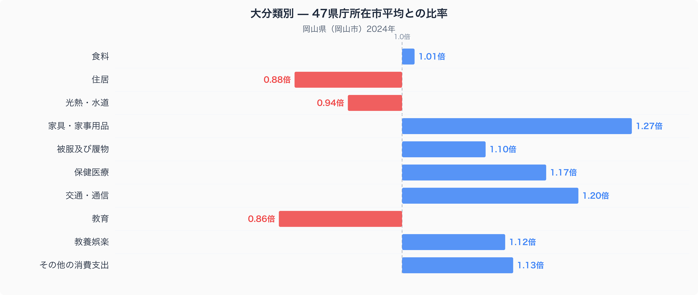
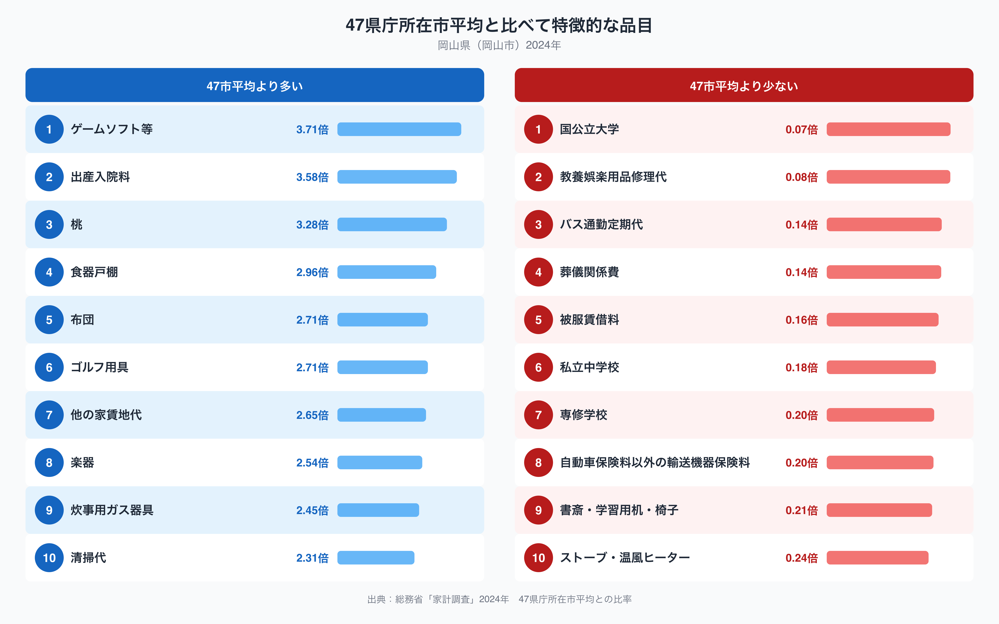

岡山県岡山市の家計簿を全国の県庁所在市と比べると、いちばん際立って違うのは家具・家事用品です。岡山市の家具・家事用品への支出は47都道府県庁所在市の単純平均を1.00とした場合1.27倍で、十大費目のなかで最も平均から離れています。一方で住居は0.88倍、教育は0.86倍と平均を下回っています。同じ家計のなかで、なぜこれほどの偏りが生まれるのでしょうか。十大費目の内訳と、平均から特に離れた品目のデータから見ていきます。

## 十大費目で見る、岡山市の支出の偏り

図のとおり、家具・家事用品（1.27倍）がもっとも平均を上回り、交通・通信（1.20倍）、保健医療（1.17倍）、その他の消費支出（1.13倍）、教養娯楽（1.12倍）、被服及び履物（1.10倍）も平均を上回っています。反対に住居（0.88倍）と教育（0.86倍）は大きく下回り、光熱・水道（0.94倍）もやや低めです。食料（1.01倍）はほぼ平均並みの水準にとどまっています。家具・家事用品の高さは、県内に家具の産地を抱えることと関係している可能性があり、交通・通信の高さは自家用車への依存度を反映しているのかもしれません。

## 品目に見る、家具・家事用品と桃、そして低い暖房費

品目単位で見ると、支出が特に多いのはゲームソフト等（3.71倍）と出産入院料（3.58倍）で、次いで桃（3.28倍）が続きます。桃は岡山県を代表する特産品として知られており、地元での消費の多さがうかがえます（岡山市の食卓を数量と価格で詳しく見た記事は[こちら](https://stats47.jp/blog/okayama-food-culture)にまとめています）。家具・家事用品に関わる品目では食器戸棚（2.96倍）、布団（2.71倍）、炊事用ガス器具（2.45倍）が上位に並び、十大費目の家具・家事用品の高さと重なっています。ほかにもゴルフ用具（2.71倍）、他の家賃地代（2.65倍）、楽器（2.54倍）、清掃代（2.31倍）が47市平均を上回っています。

一方、支出が少ないのは国公立大学（0.07倍）で、次いで教養娯楽用品修理代（0.08倍）、バス通勤定期代（0.14倍）、葬儀関係費（0.14倍）が続きます。私立中学校（0.18倍）や専修学校（0.20倍）など教育関連の品目も低い水準にあり、十大費目の教育（0.86倍）の低さと重なっています。またストーブ・温風ヒーター（0.24倍）も平均を大きく下回っており、暖房需要の低さがうかがえます。

## なぜこうした偏りが生まれるのか

岡山県は「晴れの国おかやま」と呼ばれるほど降水量・降雪量が少ない温暖な気候で知られており、ストーブ・温風ヒーターへの支出の低さは冬の暖房需要の少なさを反映していると考えられます。家具・家事用品への支出の高さは、県内に家具の産地を抱えることと関係している可能性がありますが、これは推測にとどまります。出産入院料や保健医療費の高さは、県内に大規模な医療機関が集積していることと関係しているのかもしれません。桃をはじめとする果物への支出の高さは、フルーツの名産地としての地域性を反映していると考えられます。国公立大学やバス通勤定期代への支出の低さについては、公共交通よりも自家用車での移動が中心であることや、進学先の選択傾向が背景にある可能性がありますが、いずれも断定はできません。

## データの出典

この記事の数値は、総務省統計局「家計調査」（2024年）をもとにした、二人以上の世帯の品目別支出額を使っています。ここでの比率は47都道府県庁所在市の単純平均を1.00とした値で、家計調査が公表する全国平均そのものとは異なります。また都道府県のデータとして扱っていますが、実際の集計対象は県庁所在市である岡山市の世帯であり、県全体の平均ではない点にご注意ください。岡山県のランキングデータをまとめた[県データブック](https://stats47.jp/areas/33000)では、家計以外の指標も含めて岡山県の特徴を確認できます。
