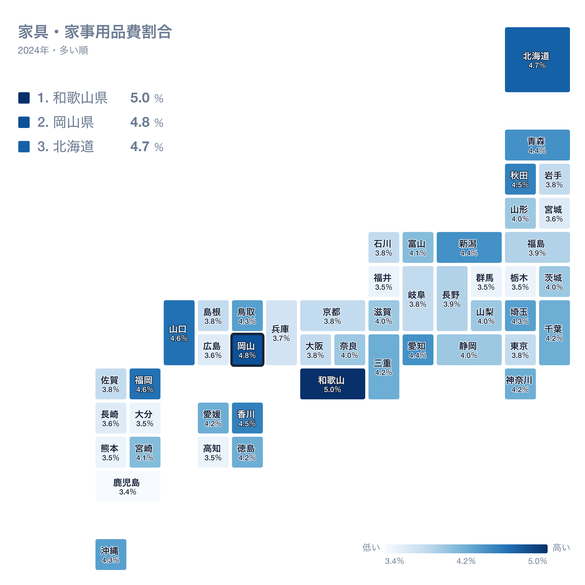
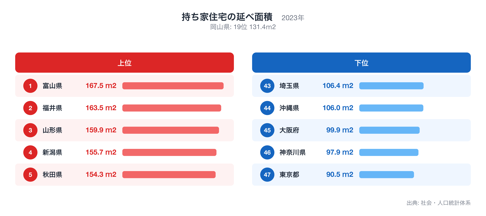
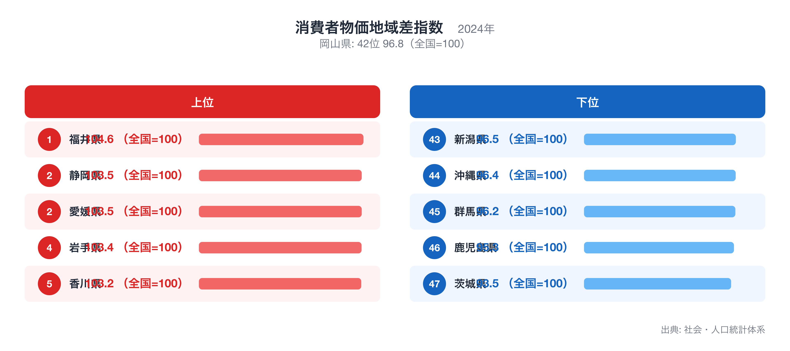

岡山県の県庁所在地・岡山市の家計を、総務省「家計調査」(2024年・二人以上の世帯)で十大費目に分けて見ると、47都道府県庁所在市の単純平均を1.00としたとき、最も乖離が大きいのは家具・家事用品の1.27倍です。

この記事では、十大費目の偏り、47県の中での岡山市の位置、突出した個別品目、そして家具・家事用品が高くなる背景を他の都道府県統計で確かめる、という順で岡山市の家計を読み解きます。比率はすべて47市平均に対する倍率で、家計調査が公表する全国平均とは基準が異なります。

十大費目とは食料、住居、光熱・水道、家具・家事用品、被服及び履物、保健医療、交通・通信、教育、教養娯楽、その他の消費支出の10区分で、家計調査が消費支出を分類する最上位の区分です。

## 十大費目にみる岡山市の家計の偏り

47市平均を上回るのは7費目で、家具・家事用品(1.27倍)、交通・通信(1.20倍)、保健医療(1.17倍)、その他の消費支出(1.13倍)、教養娯楽(1.12倍)、被服及び履物(1.10倍)、食料(1.01倍)です。下回るのは3費目で、教育(0.86倍)、住居(0.88倍)、光熱・水道(0.94倍)です。最も大きく離れているのは家具・家事用品の1.27倍、最も平均に近いのは食料の1.01倍で、岡山市の家計は家具・家事用品が高いほうに偏った構造だとわかります。

上の地図は、消費支出に占める家具・家事用品の割合(家具・家事用品費割合)を47都道府県で比べたもので、岡山県は2位(4.8%)です。割合が最も高いのは和歌山県(5.0%)、次いで岡山県(4.8%)、北海道(4.7%)で、最も低いのは鹿児島県(3.4%)です。倍率は「47市平均に対して何倍か」、地図の順位は「支出全体に占める割合が大きい順」なので、同じ費目でも見方が違います。倍率が高くても割合の順位が中位にとどまる場合は、他の費目も同じように多いことを意味します。全国ランキングの詳細は[家具・家事用品費割合](https://stats47.jp/ranking/furniture-household-goods-expenditure-ratio-multi-person-households)で確認できます。

## 突出した品目にみる暮らしの実像

品目別に見ると、47市平均より多い側の上位10品目はゲームソフト等(3.71倍)、出産入院料(3.58倍)、桃(3.28倍)、食器戸棚(2.96倍)、布団(2.71倍)、ゴルフ用具(2.71倍)、他の家賃地代(2.65倍)、楽器(2.54倍)、炊事用ガス器具(2.45倍)、清掃代(2.31倍)です。少ない側の10品目は国公立大学(0.07倍)、教養娯楽用品修理代(0.08倍)、バス通勤定期代(0.14倍)、葬儀関係費(0.14倍)、被服賃借料(0.16倍)、私立中学校(0.18倍)、専修学校(0.20倍)、自動車保険料以外の輸送機器保険料(0.20倍)、書斎・学習用机・椅子(0.21倍)、ストーブ・温風ヒーター(0.24倍)で、平均の7%程度にとどまる品目もあります。多い側の1位であるゲームソフト等と、少ない側の1位である国公立大学が、岡山市の暮らしを最も端的に表す品目です。品目の倍率は世帯あたりの年間支出額を47市平均で割ったもので、購入頻度の低い品目ほど年ごとの振れが大きい点には注意が必要です。

## 家具・家事用品の高さを他の統計で確かめる

持ち家住宅の延べ面積は岡山県が全国19位(131.4ｍ2、2023年)で中位にあり、家具・家事用品が高くなる理由としては説明力が弱い指標です。全国1位は富山県(167.5ｍ2)、最下位は東京都(90.5ｍ2)です。順位は値が大きい順で、全国ランキングは[持ち家住宅の延べ面積](https://stats47.jp/ranking/floor-area-per-dwelling-owner)で確認できます。

消費者物価地域差指数は岡山県が全国42位(96.8（全国=100）、2024年)で、家具・家事用品の偏りとは逆方向にあり、この指標では説明できません。全国1位は福井県(104.6（全国=100）)、最下位は茨城県(93.5（全国=100）)です。順位は値が大きい順で、全国ランキングは[消費者物価地域差指数](https://stats47.jp/ranking/consumer-price-difference-index-furniture-household)で確認できます。

ここで示した対応関係は同じ年次の都道府県統計を並べた相関であり、因果の証明ではありません。家計調査の県庁所在市データは標本が小さく、年ごとの変動も大きいため、複数年・複数指標で確かめることを前提に読んでください。倍率の分母は47都道府県庁所在市の単純平均で、東京都区部や政令市の重みづけはしていません。順位は同じ値の県を小さい方の順位にそろえています。

## データの出典

本記事の数値は総務省統計局「家計調査」(2024年、二人以上の世帯)にもとづきます。都道府県の値は県全体ではなく県庁所在市である岡山市の世帯を対象にした数値で、比率の基準は47都道府県庁所在市の単純平均を1.00としたものです。裏付けに使った持ち家住宅の延べ面積と消費者物価地域差指数は stats47 のランキングページ(出典は各ページに記載)から取得しました。
