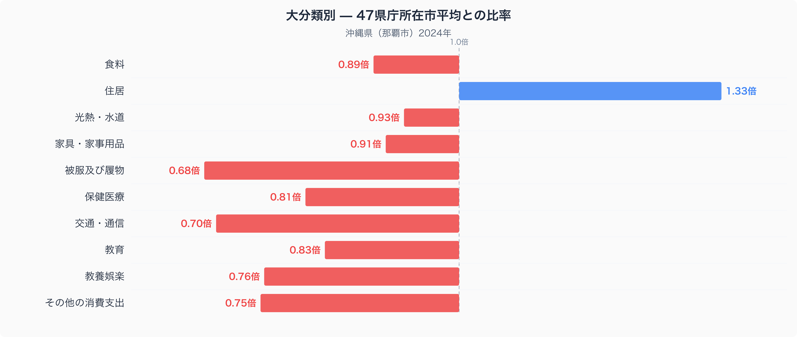
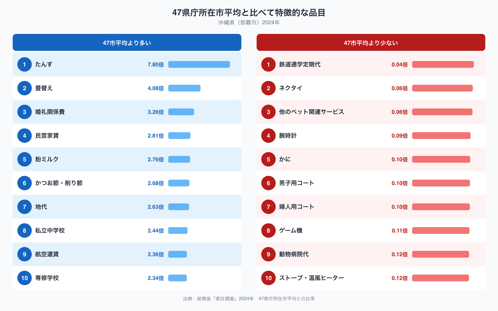

沖縄県の家計を47都道府県庁所在市と比べると、最も際立って高いのは住居費です。那覇市の住居への支出は47都道府県庁所在市の単純平均を1.33倍上回っており、十大費目のなかで唯一「1.00」から大きくプラス方向へ離れています。逆に被服及び履物は0.68倍、交通・通信は0.70倍と、平均を大きく下回る費目も複数あります。家計全体を見渡すと、住居に支出が偏り、それ以外の多くの費目は抑えられているという構図が浮かび上がります。この記事では、この偏りがどこから生まれているのかを、家計調査の品目データから読み解いていきます。

## 十大費目で見る那覇市の家計

十大費目を47市平均(=1.00)と比べると、住居が1.33倍で最も高く、次いで光熱・水道が0.93倍、食料が0.89倍と続きます。一方で被服及び履物は0.68倍、交通・通信は0.70倍、教養娯楽は0.76倍、その他の消費支出は0.75倍と、いずれも平均の7〜8割にとどまっています。教育も0.83倍とやや低めです。住居だけが突出して高く、それ以外の大半の費目が47市平均を下回るという偏りは、離島という地理条件が生活コストの配分そのものを変えていることを示しているように見えます。住居にお金がかかる分、被服や教養娯楽といった支出を抑える家計になっているのかもしれません。

## 何にお金がかかり、何にかからないのか

品目単位で見ると、この偏りの正体がより具体的に見えてきます。47市平均より特に多いのは、たんすが7.80倍、畳替えが4.08倍、婚礼関係費が3.26倍、民営家賃が2.81倍、地代が2.63倍という結果です。住居関連の品目が上位を占めており、住居費の高さは家賃や地代そのものだけでなく、家具や住宅の維持にかかる費用にも表れています。私立中学校が2.44倍、専修学校が2.34倍と教育関連の一部も高く、航空運賃も2.36倍と目立ちます。逆に少ないのは、鉄道通学定期代が0.04倍、ネクタイが0.06倍、男子用コートと婦人用コートがそろって0.10倍、ストーブ・温風ヒーターが0.12倍という結果です。防寒や鉄道通学に関わる支出が、ほぼ消えている点が印象的です。

## なぜこの偏りが生まれるのか

これらの品目から見えてくるのは、気候と地理条件の影響です。年間を通じて温暖な那覇市では、コートやストーブといった防寒関連の支出がほとんど必要とされておらず、ネクタイのように改まった服装文化と関わる品目も低い水準にとどまっています。かりゆしウェアが公式の場でも定着していることと関係している可能性があります。交通面では、那覇市には鉄道網が限られており、鉄道通学定期代が極端に低いのは通学手段そのものが本土の多くの地域と異なるためと考えられます。一方で本土との往来には航空機が欠かせず、航空運賃の高さは離島県という地理条件を映しています。住居費については、たんすや畳替えまで高いことから、地価や家賃の水準だけでなく住宅設備への支出全体が押し上げられている可能性があります。畳替えの頻度が高いのは、湿度の高い気候と関係しているのかもしれません。婚礼関係費や粉ミルクの高さについては、[沖縄県の食卓を扱った記事](https://stats47.jp/blog/okinawa-food-culture)とあわせて見ると、家族や親族のつながりを重視する暮らし方や出生率の高さを反映している可能性があります。

## データの出典と読み方の注意

この記事の数値は、総務省統計局「家計調査」(2024年、二人以上の世帯)を基に、47都道府県庁所在市の単純平均を1.00とした比率で算出しています。ここでの都道府県の値は県全体の平均ではなく、那覇市という県庁所在市のみの数値であることにご注意ください。また、この比率の基準はあくまで47都道府県庁所在市の単純平均であり、家計調査が公表する全国平均そのものとは基準が異なります。品目によっては対象世帯数が少なく変動が大きい場合もあるため、家計の傾向をつかむ目安として読んでいただければと思います。より詳しい沖縄県の統計は、[沖縄県のデータブック](https://stats47.jp/areas/47000)でも確認できます。
