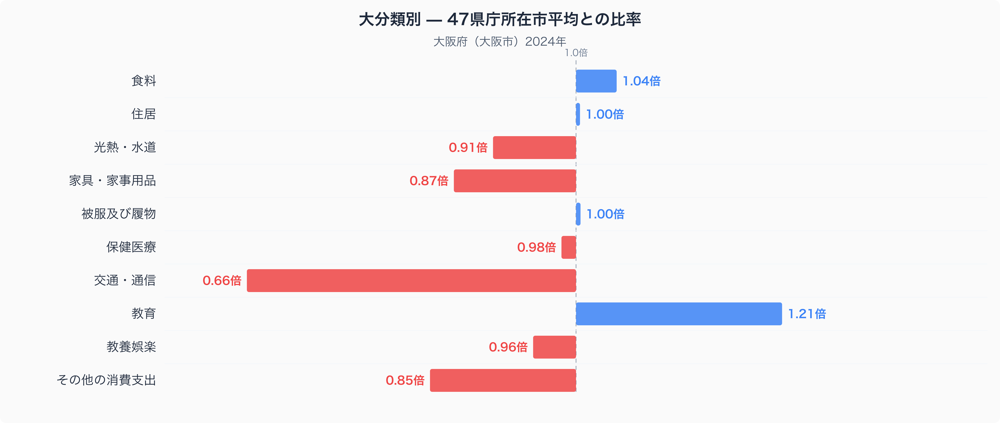
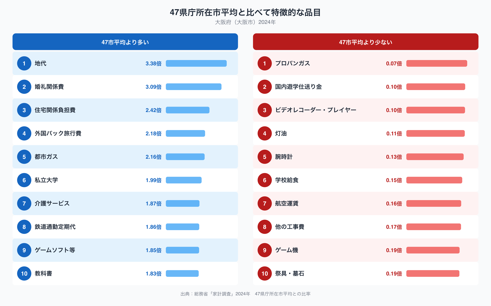

大阪市の家計を、家計調査(二人以上世帯)にもとづく十大費目でみると、いちばん際立つのは交通・通信費の少なさです。全国47都道府県庁所在市の単純平均を1.00としたとき、大阪市の交通・通信費は0.66倍にとどまり、10費目のなかで平均からもっとも離れています。一方で、地代や都市ガスのように大阪市らしさが色濃く出る品目には、逆に支出が大きく偏っています。大阪市の家計は、いったいどこにお金をかけ、どこを抑えているのでしょうか。

## 大分類でみる支出の偏り

上の図は、大阪市の十大費目それぞれが、47都道府県庁所在市の平均と比べてどれだけ多いか少ないかを表したものです。平均を1.00とすると、もっとも低いのは交通・通信で0.66倍、次いでその他の消費支出が0.85倍、家具・家事用品が0.87倍と続きます。逆に平均を上回るのは教育の1.21倍がもっとも高く、食料も1.04倍とわずかに平均を超えています。住居は1.00倍、被服及び履物も1.00倍とほぼ47市平均どおりで、地価の高い大都市であっても住居費全体が突出して膨らんでいるわけではありません。なお食料はほぼ平均並みですが、品目ごとの数量や価格の違いは[大阪市の食卓を読み解いた記事](https://stats47.jp/blog/osaka-food-culture)で詳しく取り上げています。

## 特徴的な品目に表れる暮らし

品目単位でみると、大阪市らしさがさらにはっきり表れます。47市平均を大きく上回るのは、地代(3.38倍)、婚礼関係費(3.09倍)、住宅関係負担費(2.42倍)、外国パック旅行費(2.18倍)、都市ガス(2.16倍)などです。なかでも興味深いのは鉄道通勤定期代(1.86倍)で、こちらは47市平均より高いにもかかわらず、交通・通信費全体では0.66倍まで下がっています。定期代にはしっかりお金をかけていても、自動車の維持費やガソリン代がその分抑えられているため、費目全体としては47市平均を大きく下回っているのだと考えられます。

反対に、47市平均を大きく下回るのはプロパンガス(0.07倍)や灯油(0.11倍)です。都市ガスが2.16倍と高いのとは対照的に、プロパンガスや灯油に頼る暮らしはほとんど見られません。学校給食(0.15倍)や航空運賃(0.16倍)の低さも、大阪市ならではの暮らし方を映していると考えられます。

## なぜこうした偏りが生まれるのか

大阪市の家計に表れるこうした特徴は、いくつかの要因が重なって生まれていると考えられます。ひとつは移動手段です。鉄道・地下鉄網が発達した大阪市では、通勤や日常の移動を公共交通機関でまかなえる世帯が多く、鉄道通勤定期代への支出が47市平均より高くなる一方、自動車の購入費や燃料費、駐車場代といった支出は抑えられ、交通・通信費全体を押し下げていると考えられます。航空運賃が低いのも、新幹線や在来線で他地域へ移動できる立地が関係しているのかもしれません。

もうひとつはエネルギーのインフラです。都市ガスの供給網が整った市街地であることは、プロパンガスや灯油にほとんど頼らない理由の一つと考えられます。地代の高さは、大都市圏特有の地価水準を反映していると見ることができ、教育費の高さも、私立大学や教科書費の高さと合わせて、都市部ならではの教育投資の傾向を示している可能性があります。大阪府の人口や産業構造といった全体像は、[大阪府のデータブック](https://stats47.jp/areas/27000)でも確認できます。

## データの出典

本記事の数値は、総務省統計局「家計調査」(2024年)にもとづいています。ここでの都道府県別の値は、大阪府全体ではなく大阪市など県庁所在市の二人以上世帯を対象としたものである点にご注意ください。また、比率の基準は47都道府県庁所在市の単純平均を1.00としたものであり、家計調査が公表する全国平均の値そのものとは一致しません。
