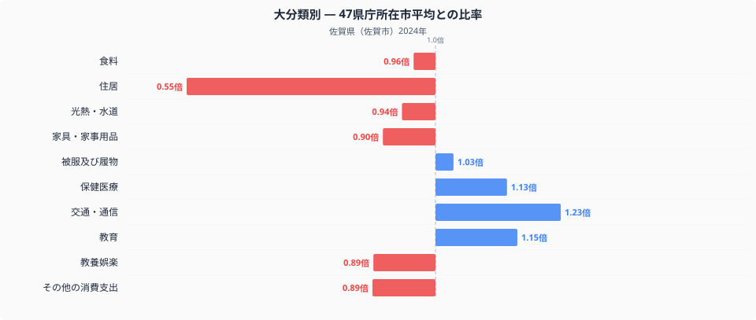
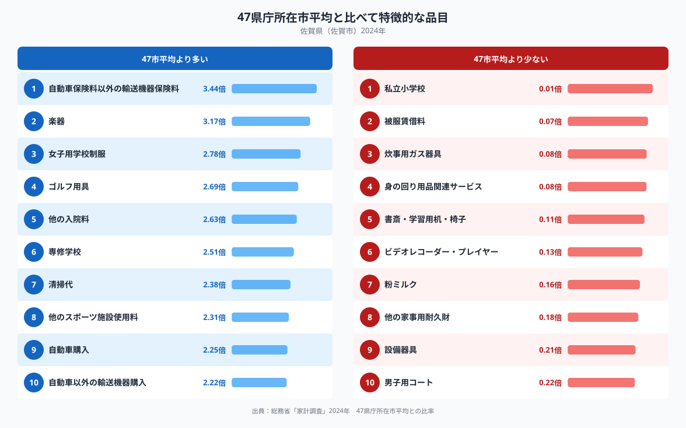

佐賀県佐賀市の家計簿を全国の県庁所在市と比べると、いちばん際立って違うのは住居費です。佐賀市の住居費は47都道府県庁所在市の単純平均を1.00とした場合0.55倍にとどまり、十大費目のなかで最も平均から離れています。一方で交通・通信は1.23倍と平均を上回っています。同じ家計のなかで、なぜこれほどの偏りが生まれるのでしょうか。十大費目の内訳と、平均から特に離れた品目のデータから見ていきます。

## 十大費目で見る、佐賀市の支出の偏り

図のとおり、住居（0.55倍）は平均を大きく下回り、教養娯楽（0.89倍）、その他の消費支出（0.89倍）、家具・家事用品（0.90倍）、光熱・水道（0.94倍）、食料（0.96倍）もやや低めです。反対に交通・通信（1.23倍）は平均を上回り、教育（1.15倍）、保健医療（1.13倍）も高めの水準にあります。被服及び履物（1.03倍）はほぼ平均並みです。住居費の低さは持ち家率の高さや土地の価格水準と関係している可能性があり、交通・通信費の高さは自家用車への依存度の高さを映しているのかもしれません。

## 品目に見る、自動車関連支出と際立つ低さ

品目単位で見ると、支出が特に多いのは自動車保険料以外の輸送機器保険料（3.44倍）と楽器（3.17倍）で、次いで女子用学校制服（2.78倍）、ゴルフ用具（2.69倍）、他の入院料（2.63倍）、専修学校（2.51倍）、清掃代（2.38倍）が続きます。自動車購入（2.25倍）や自動車以外の輸送機器購入（2.22倍）の高さは、交通・通信費全体の高さを引き上げている一因と考えられます（佐賀市の食卓を数量と価格で詳しく見た記事は[こちら](https://stats47.jp/blog/saga-food-culture)にまとめています）。

一方、支出が少ないのは私立小学校（0.01倍）や被服賃借料（0.07倍）、炊事用ガス器具（0.08倍）で、身の回り用品関連サービス（0.08倍）や書斎・学習用机・椅子（0.11倍）も低い水準です。ビデオレコーダー・プレイヤー（0.13倍）や粉ミルク（0.16倍）、他の家事用耐久財（0.18倍）、設備器具（0.21倍）、男子用コート（0.22倍）も平均を大きく下回っており、こうした品目の低さが住居や家具・家事用品といった費目の水準にも重なっていると考えられます。

## なぜこうした偏りが生まれるのか

佐賀県は福岡都市圏に近い一方で、公共交通の路線網が限られており、自家用車での移動が生活の前提になっている地域が多いとされます。世帯あたりの自動車保有台数が多くなりやすいことが、自動車購入や輸送機器保険料の高さに表れている可能性があります。住居費の低さについては、持ち家率の高さや、都市部に比べて土地の価格水準が抑えられていることが関係しているのかもしれません。専修学校や女子用学校制服といった教育関連品目の高さは、進学先の選択肢や制服文化の違いを反映している可能性がありますが、これらはいずれも推測であり、断定できるものではありません。

## データの出典

この記事の数値は、総務省統計局「家計調査」（2024年）をもとにした、二人以上の世帯の品目別支出額を使っています。ここでの比率は47都道府県庁所在市の単純平均を1.00とした値で、家計調査が公表する全国平均そのものとは異なります。また都道府県のデータとして扱っていますが、実際の集計対象は県庁所在市である佐賀市の世帯であり、県全体の平均ではない点にご注意ください。佐賀県のランキングデータをまとめた[県データブック](https://stats47.jp/areas/41000)では、家計以外の指標も含めて佐賀県の特徴を確認できます。
