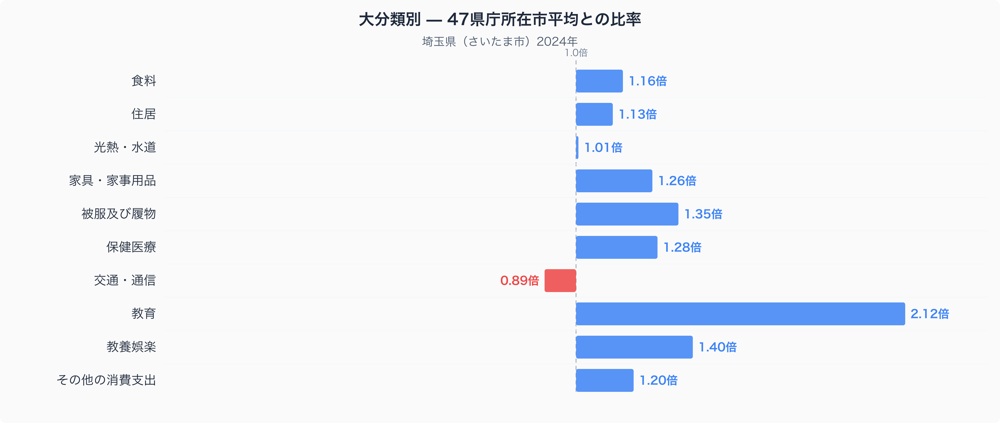
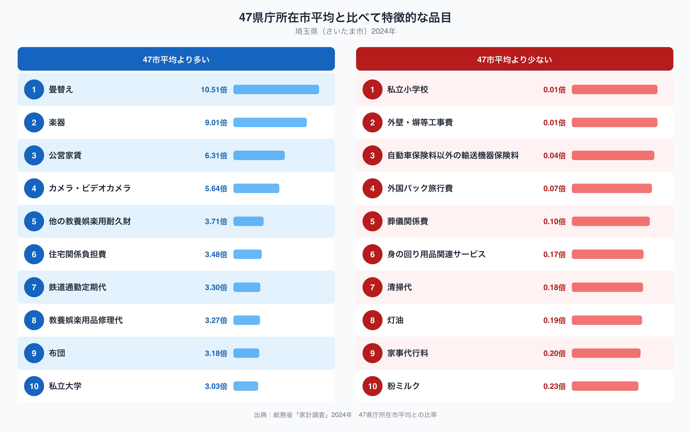

埼玉県さいたま市の家計を、47都道府県庁所在市の平均と比べてみると、突出して大きな偏りがある費目が一つ浮かび上がります。教育費です。十大費目の中で、教育は平均の2.12倍という際立った数字になっており、他のどの費目よりも差が大きくなっています。なぜさいたま市の家計はここまで教育にお金をかけているのでしょうか。十大費目の全体像と、その内側にある特徴的な品目から、埼玉県の家計の姿を読み解いていきます。

## 十大費目で見ると教育費だけが突出している

十大費目の比率を見ると、交通・通信を除くすべての費目で47市平均を上回っています。なかでも教育は2.12倍と、2位の教養娯楽（1.40倍）や被服及び履物（1.35倍）を大きく引き離しています。保健医療も1.28倍、家具・家事用品も1.26倍と、いずれも平均を2割以上超えており、埼玉県の家計は全体としてお金をかける費目が多いことがわかります。一方で交通・通信だけは0.89倍と唯一平均を下回っており、住居も1.13倍にとどまるなど、費目ごとの濃淡がはっきり分かれているのが特徴です。教育費の突出は、単に子育て世帯が多いというだけでなく、進学や習い事にかける支出の水準そのものが高いことを示しているといえるでしょう。

## 通勤と公営住宅に表れる特徴的な品目

品目単位で見ると、教育費の内訳をより具体的に映す数字が並びます。私立大学への支出は47市平均の3.03倍で、上位10品目にも入っています。同時に、鉄道通勤定期代は3.30倍と全品目の中でも高い水準にあり、公営家賃も6.31倍にのぼります。逆に平均を大きく下回る品目としては、私立小学校が47市平均の1%に満たない水準でほぼゼロに近く、灯油も0.19倍にとどまっています。教育費全体は高いのに私立小学校だけが極端に低いという組み合わせは、家庭が就学段階によって公立と私立を使い分けている可能性を示しています。[埼玉県の食料品目に絞った分析](https://stats47.jp/blog/saitama-food-culture)では、食料費が47市平均の1.16倍になっている理由をさらに詳しく取り上げています。

## 通勤圏としてのさいたま市が生む家計の姿

鉄道通勤定期代の高さは、さいたま市が東京への通勤圏に位置していることと関係している可能性があります。都心へ電車で通う世帯が多いほど、定期代の負担は重くなりやすいためです。公営家賃の比率が高いことも、都市近郊で人口が集積してきた地域特性を反映しているのかもしれません。教育費が47市平均を大きく上回っているのも、通勤圏として所得水準が比較的高い世帯が集まりやすいことや、私立大学への進学を選びやすい環境が影響していると考えられます。一方で灯油の支出が低いのは、関東平野に位置し冬の寒さが厳しい地域ほど暖房用の灯油を多く使う傾向と整合的です。畳替えや楽器といった品目が47市平均の10倍前後になっている点は、住宅の状況や趣味への支出傾向を映している可能性がありますが、購入する世帯数が少ない品目ほど数値が振れやすいという点にも注意が必要です。

## データの出典

このデータは総務省統計局「家計調査」（2024年、二人以上の世帯）をもとにしています。ここで示した比率は、家計調査が公表する全国平均ではなく、47都道府県庁所在市の単純平均を1.00とした場合の値です。また、都道府県ごとの数値は県全体ではなく県庁所在市（さいたま市）の家計を示している点にも注意してください。埼玉県のデータブック全体は[こちら](https://stats47.jp/areas/11000)から確認できます。
