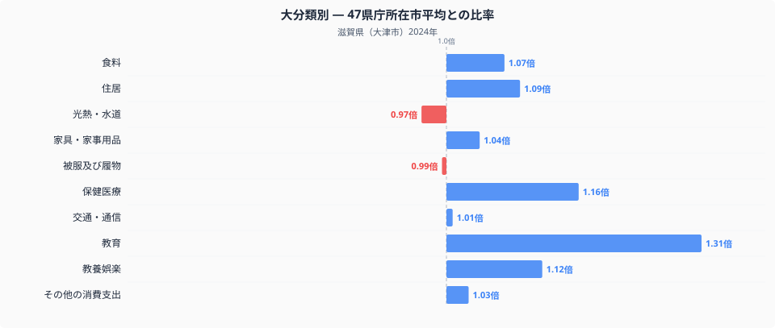
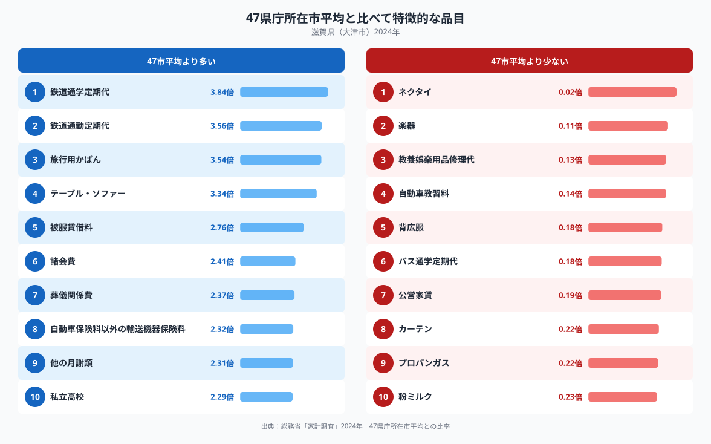

大津市の家計を全国の家計調査データと比べると、十大費目のなかで最も際立つのは教育費です。大津市の教育費は47都道府県庁所在市の平均を1.00とした場合に1.31倍に達しており、他のどの費目よりも平均から離れています。特徴的な品目を見ていくと、教育費の突出と並んで、鉄道の定期代が全国平均の3倍を超えるという際立った特徴も見えてきます。なぜ大津市の家計はこのような偏りを見せるのでしょうか。

## 十大費目に見る大津市家計の偏り

十大費目のグラフを見ると、教育が1.31倍で最も高く、次いで保健医療が1.16倍、教養娯楽が1.12倍、住居が1.09倍と続きます。食料はやや平均を上回る1.07倍で、品目ごとの数量や価格の違いは[大津市の食卓を数量と価格で読み解いた記事](https://stats47.jp/blog/shiga-food-culture)で扱っています。一方で最も低いのは光熱・水道の0.97倍で、被服及び履物の0.99倍、交通・通信の1.01倍もほぼ平均並みです。教育以外の費目はおおむね平均の前後に収まっており、大津市の家計はほかの生活費を大きく削ることなく、教育にだけ突出した資金を振り向けている構図がうかがえます。

## 全国平均から突出・低下する品目

特徴品目を見ると、最も突出しているのは鉄道通学定期代の3.84倍で、鉄道通勤定期代の3.56倍もこれに続きます。通勤・通学とも鉄道の利用が際立って多いことがわかります。教育関連では私立高校が2.29倍、他の月謝類(塾や習い事の月謝)が2.31倍と高く、教育費の突出を裏づけています。ほかにも旅行用かばんが3.54倍、テーブル・ソファーが3.34倍、諸会費が2.41倍と上位に並び、自動車保険料以外の輸送機器保険料も2.32倍に達しています。琵琶湖を抱える立地を考えると、この保険料の高さはボートなど水上のレジャー用品への支出を映している可能性があります。反対に低いのはネクタイの0.02倍で、ほぼ購入されていない水準です。背広服も0.18倍、自動車教習料も0.14倍、バス通学定期代も0.18倍にとどまり、公営家賃も0.19倍と低くなっています。

## なぜ大津市はこうなるのか

大津市はJR琵琶湖線・湖西線や京阪石山坂本線・京津線で京都市内と直結しており、京都駅までは10分前後、大阪方面へもそのまま乗り入れられる立地にあります。京阪神への通勤・通学圏として発展してきた経緯が、鉄道通学定期代・鉄道通勤定期代がともに全国平均の3倍を超えている背景にあると考えられます。通勤先や通学先が京都や大阪に及ぶ世帯が多いことは、教育費の突出とも結びついている可能性があります。通勤圏の世帯は相対的に所得水準が高くなりやすく、私立高校や塾・習い事といった教育関連支出に資金を振り向けやすい面があるのかもしれません。自動車教習料やバス通学定期代が低いのは、鉄道網が発達しているために自家用車やバスに頼らずに生活できることを反映していると考えられます。ネクタイや背広服の支出が低いのは、大津市内で働く世帯が相対的に少なく、伝統的なスーツ通勤の需要がそれほど大きくないことを示しているのかもしれません。滋賀県全体の詳しい統計は[滋賀県のデータブック](https://stats47.jp/areas/25000)にまとめています。

## データの出典

本記事の数値は総務省統計局「家計調査」(2024年、二人以上の世帯)を基に、47都道府県庁所在市の単純平均を1.00とした比率で算出しています。ここでの滋賀県のデータは滋賀県全体ではなく大津市の値であり、また比率の基準は家計調査が公表する全国平均そのものではなく、47都道府県庁所在市の単純平均である点にご注意ください。
