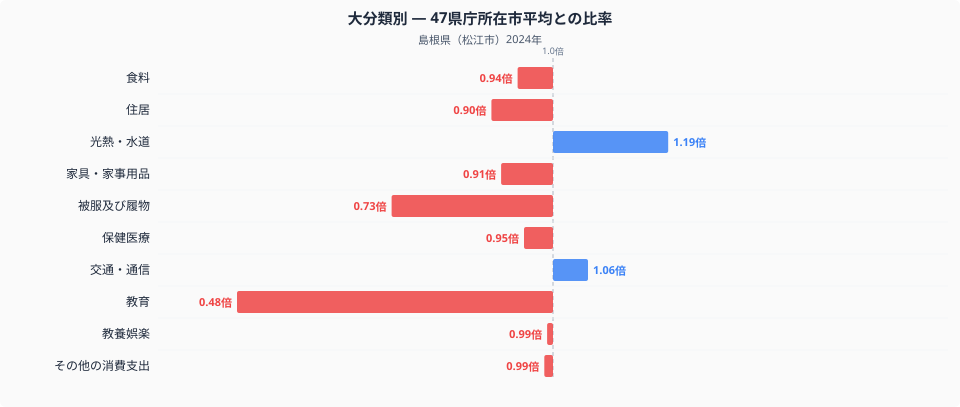
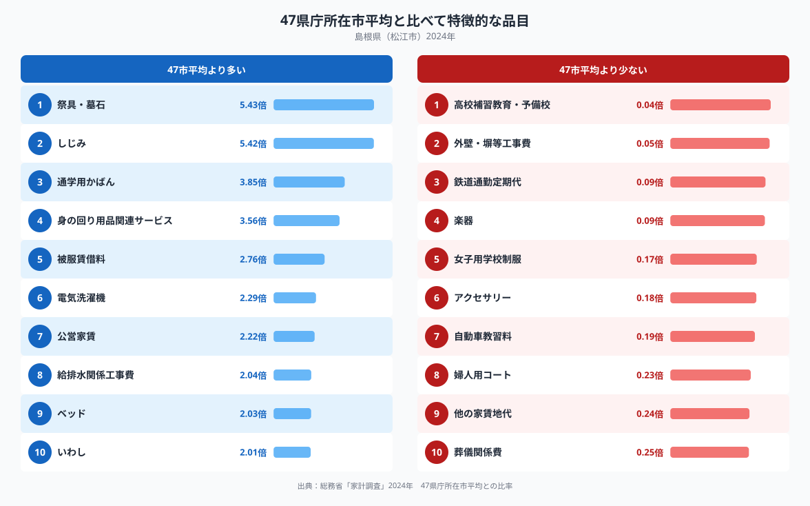

島根県庁所在地・松江市の家計調査を十大費目で比べると、もっとも全国平均から離れているのは教育です。47都道府県庁所在市の単純平均を1.00とすると、松江市の教育費は0.48倍。平均の半分にも届きません。子育て世帯が少ないという単純な話では片づけられない数字で、支出の中身を見ていくと、松江市らしい暮らし方が浮かび上がってきます。

## 大分類で見る支出の偏り

十大費目のうち、教育の0.48倍という数字は突出しています。次に低いのは被服及び履物の0.73倍で、逆に高い側でもっとも数字が大きいのは光熱・水道の1.19倍です。この2つを除くと、食料が0.94倍、住居が0.90倍、家具・家事用品が0.91倍、保健医療が0.95倍、交通・通信が1.06倍、教養娯楽が0.99倍、その他の消費支出が0.99倍と、いずれも0.9倍台から1.1倍台に収まっています。つまり松江市の家計全体は全国平均に近い形をしていて、教育費だけが単独で大きく落ち込んでいる構造だとわかります。教育の内訳をさらに見ると、高校補習教育・予備校への支出は全国平均の0.038倍しかなく、488品目のなかでもっとも低い水準です。全国平均の26分の1という差は、進学塾や予備校に通うという選択肢そのものが少ない地域事情を反映していると考えられます。

## 品目に表れる松江市らしさ

品目単位で全国平均より多い上位を見ると、しじみが5.42倍で2位に入っています。松江市に隣接する宍道湖はしじみの産地として知られており、日常的に食卓に並ぶ食材であることが数字にそのまま表れているといえそうです。品目そのものの数量や価格については、[松江市の食卓を扱った記事](https://stats47.jp/blog/shimane-food-culture)で詳しく取り上げているので、ここでは支出額の比率だけを見ていきます。1位は祭具・墓石の5.43倍で、仏事や先祖供養に関わる支出が全国平均を大きく上回ります。一方で、同じ弔い関連でも葬儀関係費は0.25倍と全国平均を下回っており、祭具・墓石とは対照的な位置にあります。日々手を合わせる仏壇や墓石への備えは手厚い一方、葬儀そのものにかける費用は控えめという配分がうかがえます。ほかにも電気洗濯機が2.29倍、公営家賃が2.22倍、給排水関係工事費が2.04倍と、住まいまわりの実用品や工事関連への支出も目立ちます。

## なぜこうした差が生まれるのか

こうした偏りの背景には、いくつかの地理的・産業的な要因が重なっていると考えられます。しじみの支出が多いのは、宍道湖という水産資源が身近にあり、遠方から取り寄せる必要がないことと関係している可能性があります。祭具・墓石への支出が多い一方で葬儀費が少ないのは、地域に根ざした仏事の習慣と、比較的簡素な葬儀を選ぶ傾向が併存しているのかもしれません。教育費の低さについては、進学塾・予備校といった事業者が都市部に比べて少なく、通塾という選択肢自体が限られていることが背景にあると考えられます。鉄道通勤定期代が0.088倍と全国平均を大きく下回っている点も、公共交通機関よりも自家用車での移動が中心という地域の交通事情を映しているとみられます。いずれも観測できるのは支出の差であり、住民の好みや価値観そのものを断定するものではない点には注意が必要です。松江市を含む島根県の他の統計は[島根県のデータブック](https://stats47.jp/areas/32000)でもまとめて確認できます。

## データの出典

本記事の数値は、総務省統計局「家計調査」（2024年、二人以上の世帯）をもとに、47都道府県庁所在市の値を単純平均1.00として算出した比率です。都道府県の家計調査値は県全体の平均ではなく、松江市という県庁所在市の世帯を対象とした調査である点にご注意ください。また、ここでの「全国平均」は家計調査が公表する全国値そのものではなく、47都道府県庁所在市を単純平均した独自の基準であり、公表値とは一致しません。
