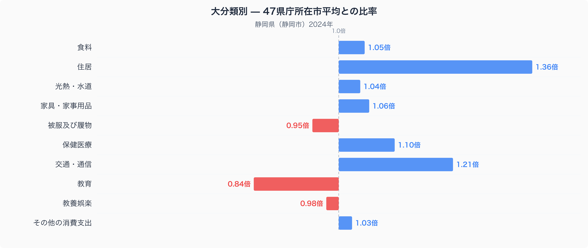
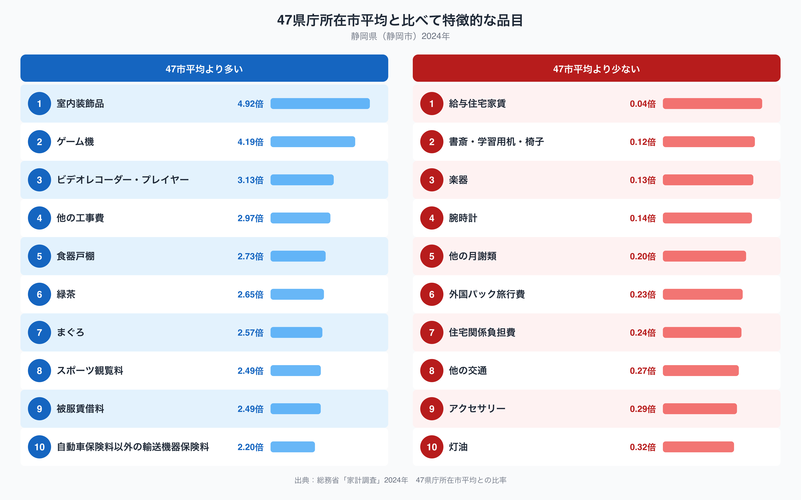

静岡県静岡市の家計調査データを見ると、十大費目のうち「住居」が47市平均の1.36倍と、もっとも大きく乖離しています。二人以上世帯の家計で、住まいにこれだけお金をかけている都市はそう多くありません。なぜ静岡市の家計はこれほど住居にお金を割いているのでしょうか。費目別の内訳と、突出して支出が多い品目を手がかりに、その背景を探ってみます。

## 住居費が突出して高い静岡市の家計

十大費目を47都道府県庁所在市の単純平均(=1.00)と比べると、住居が1.36倍で最も高く、次いで交通・通信が1.21倍、保健医療が1.10倍と続いています。一方で教育は0.84倍、被服及び履物は0.95倍と、47市平均を下回る費目もあります。住居費の1.36倍という数字は、単なる家賃の水準だけでは説明しづらいものです。持ち家の維持や修繕、増改築など、住まいに関わる支出全体が全国よりも大きく積み上がっていると考えられます。交通・通信が高いのも、公共交通機関が限られた地域で自家用車を維持する世帯が多いことと関係しているのかもしれません。

## 室内装飾品や工事費に表れる住まいへのこだわり

品目単位で見ると、47市平均との差がさらに際立ちます。室内装飾品が4.92倍、ゲーム機が4.19倍、ビデオレコーダー・プレイヤーが3.13倍、そして「他の工事費」が2.97倍、食器戸棚が2.73倍と、上位10品目のうち複数が住まいの内装や修繕に関わるものです。室内装飾品や食器戸棚、工事費がそろって高いということは、家を建てたり買い替えたりする際に、内装や造作にもお金をかける世帯が多いことを示しているのかもしれません。ゲーム機やビデオレコーダー・プレイヤーが高いのも、自宅で過ごす時間を充実させたいという同じ志向の表れと見ることもできそうです。一方で、緑茶やまぐろも47市平均を上回る品目に入っており、静岡ならではの産地の近さが食卓に反映されている様子もうかがえます。

## なぜ静岡市は住居関連支出が多いのか

静岡県は東海地震の想定震源域に近く、住宅の耐震化や老朽化した住宅の建て替えが長年にわたって課題とされてきました。「他の工事費」の高さは、こうした住まいの安全性を高めるための修繕や改築が進んでいることと関係している可能性があります。また、比較的温暖な気候のため、灯油の支出は47市平均の0.32倍と際立って低くなっています。暖房に頼る度合いが小さい分、その余力が住まいそのものへの投資に回っているという見方もできそうです。詳しい食の内容については、[静岡市の食卓を数量と価格で見た記事](https://stats47.jp/blog/shizuoka-food-culture)でも取り上げていますので、あわせてご覧ください。

## データの出典

このデータは総務省統計局「家計調査」(2024年、二人以上の世帯)をもとにしています。都道府県全体の数値ではなく、県庁所在市である静岡市の世帯を対象とした調査である点に注意が必要です。また、ここで示した比率は家計調査が公表する全国平均ではなく、47都道府県庁所在市の単純平均を1.00とした場合の相対値です。静岡県のより詳しい統計は、[stats47の静岡県データブック](https://stats47.jp/areas/22000)でランキング形式で確認できます。
