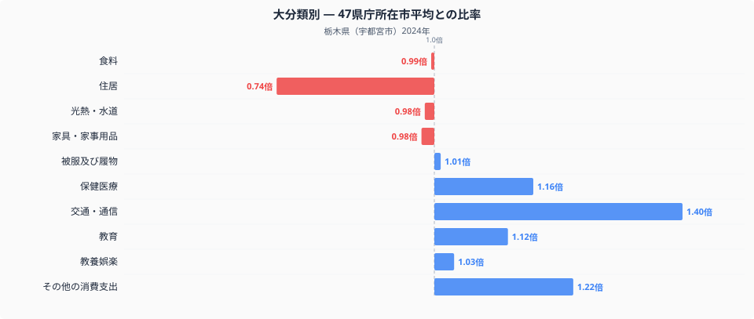
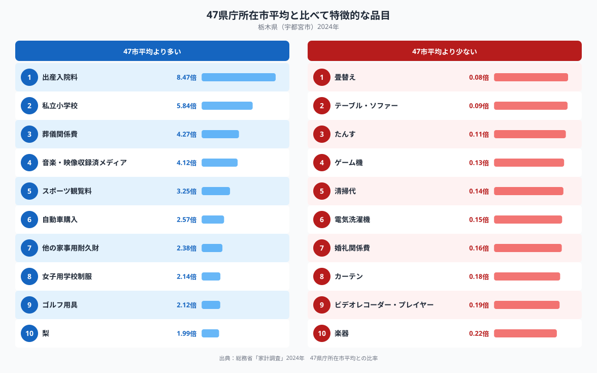

栃木県宇都宮市の家計を十大費目で見ると、最も全国平均から離れているのは「交通・通信」です。47都道府県庁所在市の単純平均を1.00とした場合、宇都宮市は1.40倍で、10費目の中で突出した水準にあります。同じ家計の中で、なぜこの費目だけがここまで膨らんでいるのでしょうか。

## 十大費目でみる、宇都宮市の支出の型

グラフのとおり、交通・通信(1.40倍)に続いてその他の消費支出(1.22倍)、保健医療(1.16倍)、教育(1.12倍)が全国平均を上回っています。反対に住居(0.74倍)は10費目の中で最も低く、家具・家事用品(0.98倍)や光熱・水道(0.98倍)、食料(0.99倍)、被服及び履物(1.01倍)はほぼ全国並みの水準です。栃木県の[食卓を数量と価格で分解した記事](https://stats47.jp/blog/tochigi-food-culture)もありますが、費目全体で見る限り食料は特徴的な項目ではなく、この家計の重心は交通・通信の高さと住居の低さのコントラストにあるといえます。

## 特徴的な品目に表れる暮らしの輪郭

全国平均より特に多い品目には、出産入院料(8.47倍)、私立小学校(5.84倍)、葬儀関係費(4.27倍)、音楽・映像収録済メディア(4.12倍)、スポーツ観覧料(3.25倍)、自動車購入(2.57倍)、他の家事用耐久財(2.38倍)、女子用学校制服(2.14倍)、ゴルフ用具(2.12倍)、梨(1.99倍)が並んでいます。出産や葬儀のように発生頻度が低い支出は、家計調査という限られた世帯の抽出調査の性質上、たまたま該当する出来事があった世帯が含まれるだけで比率が大きく跳ね上がりやすい項目です。一方で自動車購入(2.57倍)は、後述する交通・通信費全体の高さと重なる品目として読み取れます。逆に少ない品目には畳替え(0.08倍)、テーブル・ソファー(0.09倍)、たんす(0.11倍)、ゲーム機(0.13倍)、清掃代(0.14倍)、電気洗濯機(0.15倍)、婚礼関係費(0.16倍)、カーテン(0.18倍)、ビデオレコーダー・プレイヤー(0.19倍)、楽器(0.22倍)が並びますが、これらの多くは買い替え頻度の低い耐久財であり、調査対象の世帯がたまたま購入しなかった時期だった可能性を考慮する必要があります。

## 交通費の高さと住居費の低さの理由

栃木県は関東地方の内陸に位置し、都市間の移動や郊外・近隣市町への移動は自動車が前提になりやすい地域です。自動車購入(2.57倍)の高さは、こうした移動手段の構造を反映している可能性があります。交通・通信という費目には自動車の維持費や通信費も含まれるため、車を中心とした生活パターンが費目全体を押し上げているのかもしれません。一方で住居(0.74倍)の低さは、東京圏など大都市に比べて地価や家賃の水準が抑えられている地方都市に共通する傾向と関係していると考えられます。教育費で目立つ私立小学校(5.84倍)や女子用学校制服(2.14倍)は、進学先の選択が一部の世帯に偏りやすい教育関連費目の特徴が表れたものと考えられ、栃木県全体の教育方針を示すものではありません。

## データの出典

本記事は総務省統計局「家計調査」(2024年、二人以上の世帯)を基にしています。都道府県の家計調査値は県全体ではなく県庁所在市の値である点にご注意ください。また、ここでの比率は家計調査が公表する全国値ではなく、47都道府県庁所在市の単純平均を1.00とした場合の相対値です。宇都宮市を含む栃木県の他の指標は、[栃木県データブック](https://stats47.jp/areas/09000)でも確認できます。
