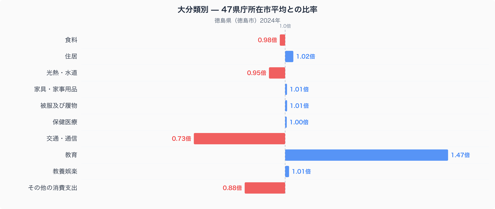
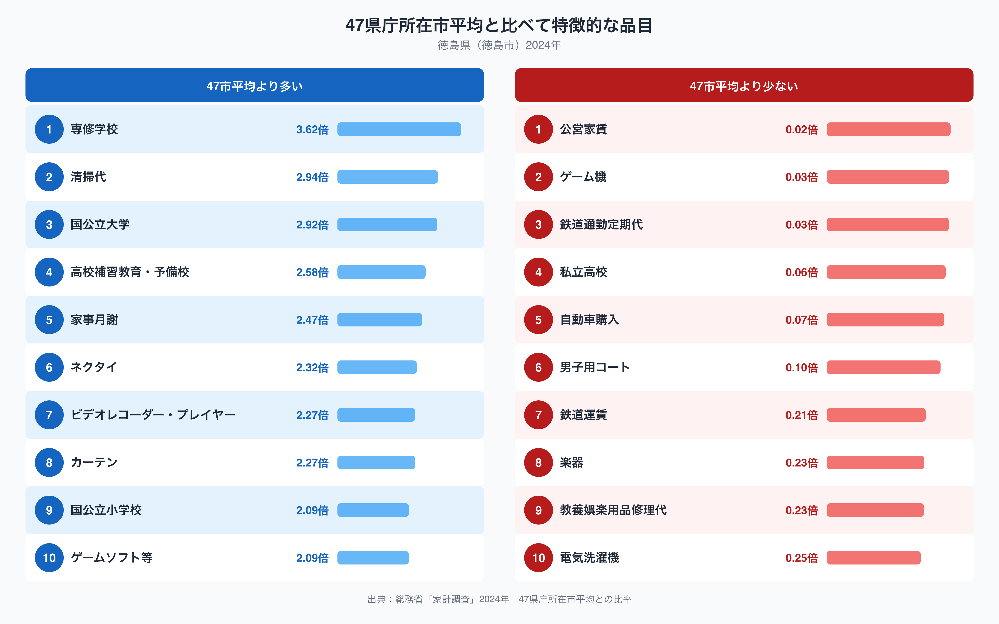

徳島市の家計を47都道府県庁所在市の平均と比べたとき、もっとも大きく開いているのは教育費です。徳島市の教育費は平均の1.47倍にのぼり、十大費目のなかで唯一4割以上も上振れしています。なぜ徳島の家計は、これほど教育にお金をかけているのでしょうか。逆に支出が少ない費目に目を向けると、また違った徳島市の暮らしぶりが見えてきます。総務省の家計調査から、徳島市の家計がどこに偏っているのかを見ていきます。

## 十大費目で見る徳島市の家計

上のグラフは、十大費目それぞれの支出額を47都道府県庁所在市の平均と比べた比率です。もっとも高いのは教育費の1.47倍で、次いで住居費が1.02倍とわずかに上回ります。逆にもっとも低いのは交通・通信費の0.73倍で、その他の消費支出も0.88倍にとどまっています。食料は0.98倍とほぼ平均並みで、目立った偏りは見られません。食料の内訳を数量と価格で細かく見ていくと、また別の徳島らしさが見えてきます。詳しくは[徳島市の食卓を数量と価格で読み解く記事](https://stats47.jp/blog/tokushima-food-culture)もあわせてご覧ください。光熱・水道も0.95倍とやや低めで、教育費と交通・通信費の対照的な動きが、徳島市の家計全体の形を作っています。

## 徳島市で際立つ支出品目

品目単位で見ると、教育費の高さは専修学校が3.62倍、国公立大学が2.92倍、高校補習教育・予備校が2.58倍、家事月謝が2.47倍と、進学や習い事に関わる支出が軒並み上位を占めていることからも裏づけられます。清掃代も2.94倍と高く、家事代行やクリーニングにお金をかける家庭が多いこともうかがえます。反対に支出が少ない品目を見ると、鉄道通勤定期代は0.03倍、鉄道運賃も0.21倍と、鉄道利用に関わる支出が47市平均を大きく下回っています。私立高校も0.06倍にとどまり、進学先として公立を選ぶ傾向が強いことも読み取れます。上位10品目と下位10品目を見比べると、教育・習い事にお金をかける一方で鉄道利用にはあまりお金をかけないという、徳島市ならではの支出パターンが浮かび上がります。

## なぜ教育費に偏るのか

教育費が突出して高い背景には、徳島市が地方都市であり、大学や専修学校への進学にあたって県外への通学や下宿を選ぶ家庭が多いことが関係している可能性があります。国公立大学や専修学校の学費・仕送りがまとまってかかることが、47市平均を大きく押し上げているのかもしれません。一方で鉄道関連の支出が少ないのは、市内の移動が自動車中心になっていることを反映しているのかもしれません。鉄道路線網が限られる地域では、通勤・通学の足として鉄道よりも自動車やバスが選ばれやすい傾向があります。教育費と交通・通信費という、一見つながりのなさそうな二つの費目が、徳島市という一つの地方都市の家計のなかで対照的に現れている点は興味深いところです。ただし、これらはあくまで支出データから読み取れる傾向であり、断定はできません。

## データの出典

本記事の数値は、総務省統計局「家計調査」(2024年、二人以上の世帯)をもとに、47都道府県庁所在市の単純平均を1.00として算出した比率です。徳島県全体ではなく徳島市という一つの県庁所在市の値である点、また家計調査が公表する全国平均とは基準が異なる点にご注意ください。徳島県のより詳しいデータは[stats47の徳島県データブック](https://stats47.jp/areas/36000)でご覧いただけます。
