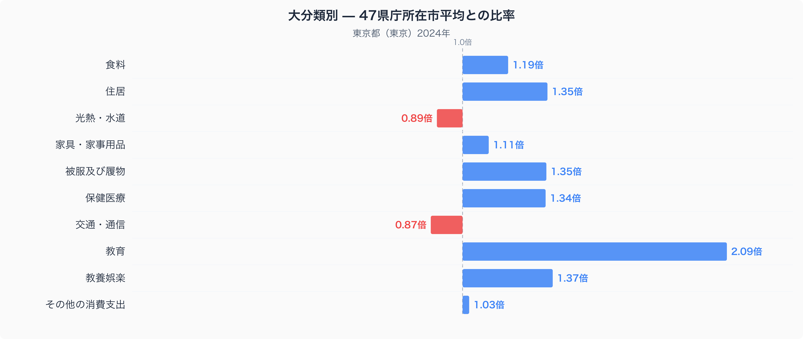
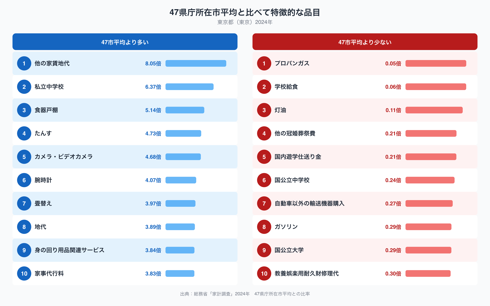

十大費目の中で、47都道府県庁所在市の平均からもっとも離れているのは教育です。東京都区部の教育費は平均の2.09倍に達しており、ほかのどの費目よりも突出しています。なぜ東京都区部の家計はここまで教育に支出を割いているのでしょうか。十大費目の内訳と、特に際立った品目から見ていきます。

## 十大費目で見る支出の偏り

十大費目のうち47市平均を上回っているのは、教育（2.09倍）、教養娯楽（1.37倍）、被服及び履物（1.35倍）、住居（1.35倍）、保健医療（1.34倍）、食料（1.19倍）、家具・家事用品（1.11倍）、その他の消費支出（1.03倍）の8費目です。反対に光熱・水道（0.89倍）と交通・通信（0.87倍）は47市平均を下回っています。教育だけが際立って高いだけでなく、住居や被服、教養娯楽といった生活コストに関わる費目もまとまって高めに出ていることから、東京都区部の家計は日々の生活コストの高さと教育投資の両方によって支出が押し上げられていると読み取れます。食料についても平均の1.19倍と高めですが、品目別の数量や価格まで踏み込んだ内容は[東京都区部の食卓データ](https://stats47.jp/blog/tokyo-food-culture)で紹介しています。

## 品目レベルで際立つ支出

品目単位で見ると、偏りはさらにはっきりします。もっとも47市平均から離れているのは「他の家賃地代」で8.05倍、次いで「私立中学校」が6.37倍です。一方で「国公立中学校」は0.24倍にとどまり、私立と公立で支出の重心が大きく入れ替わっています。住まいまわりでは「食器戸棚」5.14倍、「たんす」4.73倍のように、家具への支出も目立ちます。反対に支出が少ないのは「プロパンガス」0.05倍、「灯油」0.11倍、「ガソリン」0.29倍で、いずれもエネルギーや移動に関わる品目です。

## なぜこうした偏りが生まれるのか

教育費と家賃・地代の高さは、都心の地価水準と、私立の学校や中学受験を選ぶ世帯が多いという地域特性を反映しているのかもしれません。私立中学校への支出が国公立中学校を大きく上回っているのは、こうした選択の違いが表れた結果と考えられます。一方でプロパンガスや灯油の支出が全国最少水準にとどまっているのは、都市部の集合住宅では都市ガスや電気による給湯・暖房設備が主流で、灯油暖房やプロパンガスをそもそも使う世帯が少ないことと関係している可能性があります。ガソリン支出の低さも、鉄道網が発達し自家用車を持たない世帯が多いことを反映しているのかもしれません。

## データについて

このデータは総務省統計局「家計調査」（2024年）をもとにしています。都道府県別の値は、県全体ではなく県庁所在市（東京都は都区部）の二人以上世帯の平均であることにご注意ください。また、ここでの比率は47都道府県庁所在市の単純平均を1.00とした相対値であり、家計調査が公表する全国平均の値とは異なります。東京都のほかの指標も含めた全体像は[県データブック](https://stats47.jp/areas/13000)で確認できます。
