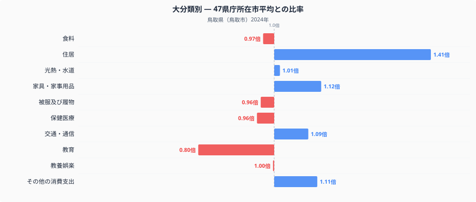
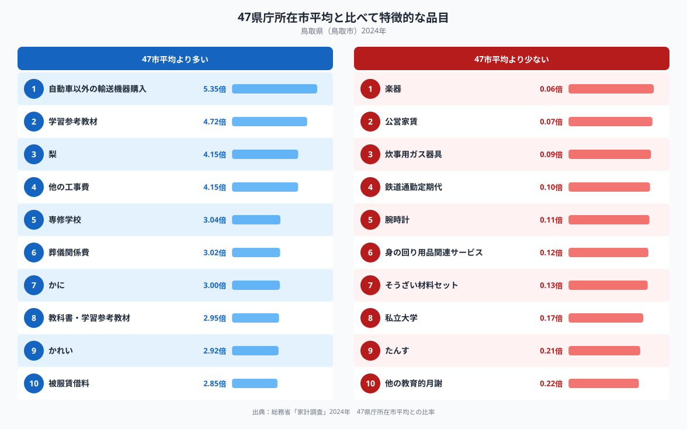

鳥取県鳥取市の家計を十大費目で分解すると、もっとも際立つのは住居費です。47都道府県庁所在市の単純平均を1.00としたとき、鳥取市の住居費は1.41倍に達し、十大費目のなかで平均からもっとも離れた項目になっています。人口が少なく地価も特別高いわけではない地方都市で、なぜ住居費だけがここまで突出するのでしょうか。品目レベルのデータをあわせて見ていくと、鳥取市らしい暮らしの姿が見えてきます。

## 十大費目で見る鳥取市の偏り

住居費の1.41倍に次いで目立つのは、家具・家事用品の1.12倍、その他の消費支出の1.11倍、交通・通信の1.09倍です。逆に低いのは教育の0.80倍で、十大費目のなかでもっとも低い数値です。食料は0.97倍、被服及び履物は0.96倍、保健医療は0.96倍と、この3項目はほぼ全国並みに収まっています。全体として、鳥取市の家計は「住まいまわり」にお金がかかり、「教育」には相対的にお金をかけていない構造だと読み取れます。ただし教育費の低さは支出額の違いであって、教育熱心さの違いを直接示すものではありません。進学先の選び方や周辺の学校数など、支出以外の事情が背景にあると考えたほうが自然です。

## 特徴的な品目に見る産業と暮らし

品目単位で見ると、自動車以外の輸送機器購入が5.35倍ともっとも高く、学習参考教材が4.72倍、梨が4.15倍、他の工事費が4.15倍で続きます。専修学校が3.04倍、葬儀関係費が3.02倍、かにが3.00倍、教科書・学習参考教材が2.95倍、かれいが2.92倍と、暮らしと地場産業の両方を映す品目が上位に並んでいます。一方で低い側を見ると、公営家賃が0.07倍、鉄道通勤定期代が0.10倍と際立って低く、私立大学は0.17倍にとどまります。鉄道通勤定期代の低さは自動車以外の輸送機器購入の高さとあわせて読むと、通勤や日常の移動が鉄道以外の乗り物に偏っていることを示しているのかもしれません。

## なぜこの偏りが生まれるのか

住居費の高さは、他の工事費が4.15倍にのぼっていることと関係している可能性があります。持ち家比率が高い地方都市では、新築よりも既存住宅のリフォームや修繕にお金がかかる傾向があり、鳥取市の住居費の高さもこうした維持・修繕コストを反映しているのかもしれません。かにやかれいの支出が高いのは、日本海に面した鳥取市ならではの漁業との結びつきを反映していると考えられます。梨についても、鳥取県は梨の産地として知られており、地場産品が食卓に直結している様子がうかがえます。教育費の低さと私立大学の少なさは、都市部の私立大学への進学よりも、専修学校を含む別の進路が選ばれやすい地域事情を反映しているのかもしれません。

品目ごとの数量や価格まで踏み込んだ分析は、[鳥取県の食卓を数字で見る記事](https://stats47.jp/blog/tottori-food-culture)で詳しく取り上げています。あわせて読むと、鳥取市の家計をより立体的に理解できます。

## データの出典と読み方の注意

このデータは総務省統計局の家計調査（2024年、二人以上の世帯）をもとにしています。ここでいう都道府県の値は、県全体の平均ではなく県庁所在市である鳥取市の値である点にご注意ください。また、比率の基準は家計調査が公表する全国平均ではなく、47都道府県庁所在市を単純平均した値を1.00としたものです。鳥取市の家計を他の指標とあわせて見たい方は、[鳥取県のデータブック](https://stats47.jp/areas/31000)もご覧ください。
