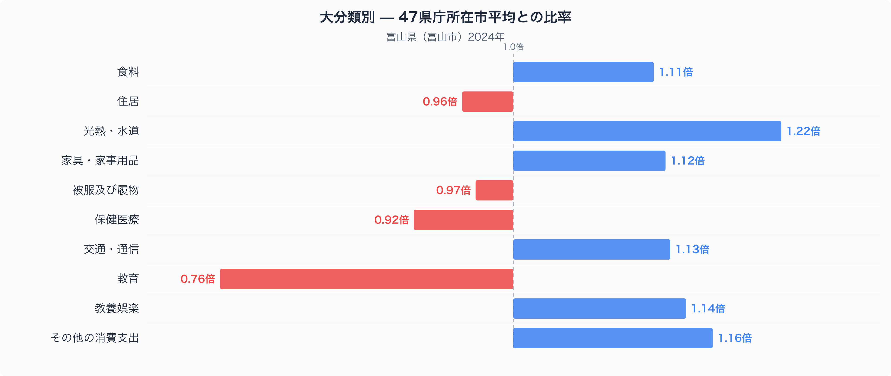
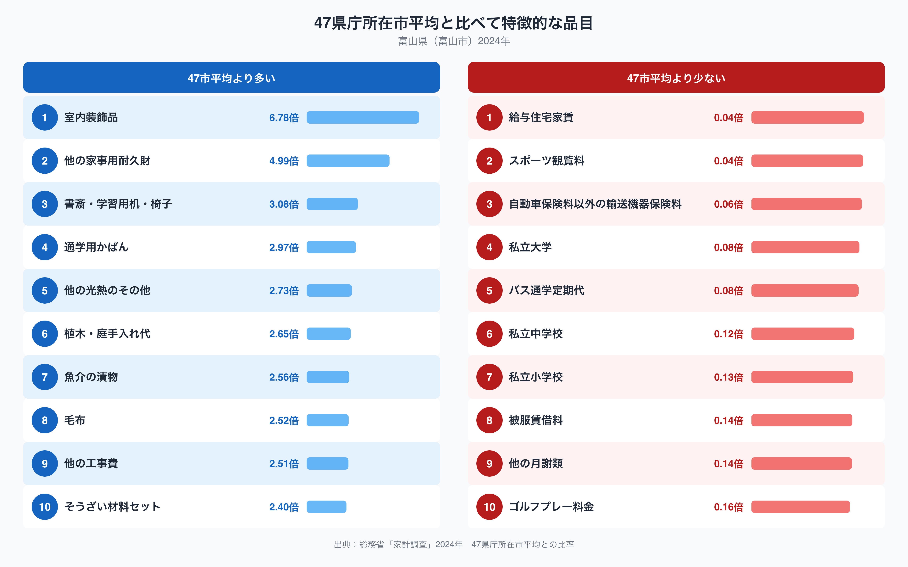

富山県富山市の家計簿を、全国の県庁所在市と比べてみると、いちばん目立つのは教育費の少なさです。総務省「家計調査」(2024年、二人以上の世帯)をもとに、47都道府県庁所在市の単純平均を1.00として指数化すると、富山市の教育費は0.76倍にとどまり、十大費目のうちもっとも平均から離れた項目になっています。反対の方向でもっとも際立つのは光熱・水道費で、こちらは1.22倍です。同じ家計の中に、なぜこれほど対照的な偏りが同居しているのでしょうか。

## 十大費目で見る全国との差

十大費目を47市平均と比べると、富山市は光熱・水道が1.22倍でもっとも高く、その他の消費支出が1.16倍、教養娯楽が1.14倍、交通・通信が1.13倍、家具・家事用品が1.12倍、食料が1.11倍と続きます。逆に低いのは教育の0.76倍で、保健医療も0.92倍、住居も0.96倍、被服及び履物も0.97倍と、生活の基盤に関わる費目がそろって47市平均を下回っています。住居費が低めなのは、持ち家であれば家賃という形の支出が発生しにくいことと関係している可能性があります。一方で光熱・水道費の高さは、冬場の暖房や除雪関連の使用量が影響していると考えられます。

## 突出した品目に見る暮らしぶり

47市平均からもっとも離れた品目を見ると、室内装飾品が6.78倍、他の家事用耐久財が4.99倍、書斎・学習用机・椅子が3.08倍、通学用かばんが2.97倍、他の光熱のその他が2.73倍と並びます。植木・庭手入れ代の2.65倍や他の工事費の2.51倍も高く、住まいに手をかける支出が目立ちます。食に関しては魚介の漬物が2.56倍、そうざい材料セットが2.40倍と、地域ならではの食材や調理の仕方を反映していそうな項目が上位に入っています。反対に低いのは私立大学の0.08倍、私立中学校の0.12倍、私立小学校の0.13倍で、教育費全体の低さは私立学校への支出がほとんど発生していないことが大きく関わっていそうです。バス通学定期代も0.08倍と低く、ゴルフプレー料金は0.16倍、スポーツ観覧料は0.04倍にとどまっています。

## なぜこの偏りが生まれるのか

富山県は日本海側に位置し、冬季に積雪が多い地域です。暖房を長い期間使うことや、灯油・電気の使用量が増えることが、光熱・水道費の高さにつながっている可能性があります。植木・庭手入れ代や他の工事費が高いことも、戸建て住宅を持つ世帯が多い地域性を映しているのかもしれません。教育面では、私立小学校・私立中学校・私立大学への支出がいずれも47市平均の1割前後にとどまっており、公立学校を中心とした教育環境が定着していることを反映している可能性があります。書斎・学習用机・椅子や通学用かばんへの支出が高い一方でバス通学定期代が低いことは、通学の手段として自家用車や自転車が主体になっている地域性と関係しているのかもしれません。もちろんこれらはデータから読み取れる傾向であり、断定できる因果関係ではない点には注意が必要です。

食に関する数量や価格の違いをもっと詳しく知りたい方は、[富山市の食卓を数字で見る記事](https://stats47.jp/blog/toyama-food-culture)もあわせてご覧ください。富山県のほかの統計指標は、[富山県のデータブック](https://stats47.jp/areas/16000)でまとめて確認できます。

## データの出典

このグラフは総務省統計局「家計調査」(2024年、二人以上の世帯、492品目)をもとに作成しています。ここで示した数値は富山県全体ではなく、県庁所在市である富山市の値である点にご注意ください。また、比率の基準は家計調査が公表する全国平均ではなく、47都道府県庁所在市の値を単純平均して1.00としたstats47独自の集計です。全国の公表値とは一致しませんので、あわせてご確認ください。
