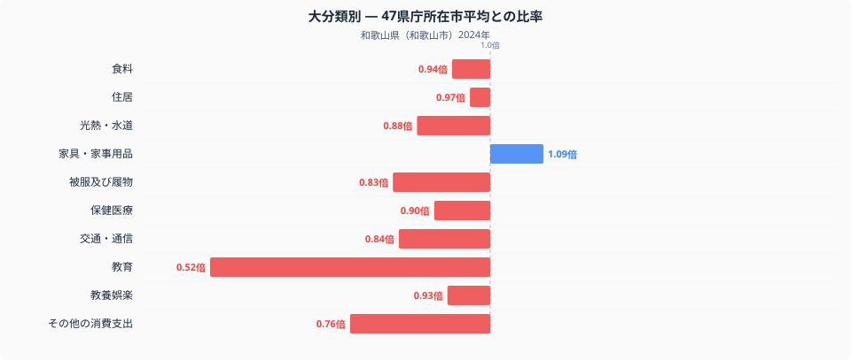
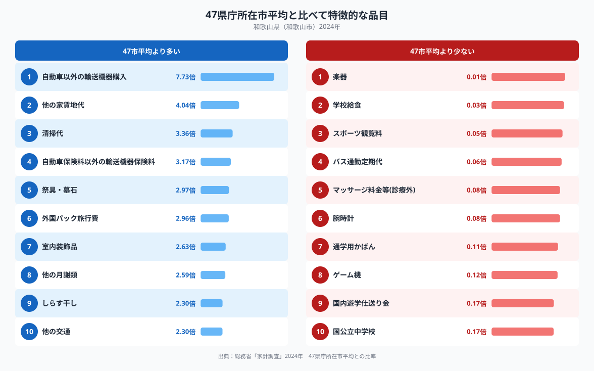

和歌山県和歌山市の家計簿を全国の県庁所在市と比べると、いちばん際立って違うのは教育費です。和歌山市の教育費は47都道府県庁所在市の単純平均を1.00とした場合0.52倍にとどまり、十大費目のなかで平均から最も離れています。一方で家具・家事用品は1.09倍とわずかに平均を上回っています。同じ家計のなかで、なぜこれほどの偏りが生まれるのでしょうか。十大費目の内訳と、平均から特に離れた品目のデータから見ていきます。

## 十大費目で見る、和歌山市の支出の偏り

図のとおり、教育（0.52倍）は十大費目のなかで際立って低い水準にあり、他の費目から大きく離れています。次いで低いのはその他の消費支出（0.76倍）で、被服及び履物（0.83倍）、交通・通信（0.84倍）、光熱・水道（0.88倍）もいずれも平均を下回ります。食料（0.94倍）、保健医療（0.90倍）、教養娯楽（0.93倍）、住居（0.97倍）は平均をやや下回る程度にとどまり、十大費目のうち平均を上回るのは家具・家事用品（1.09倍）のみです。ほぼすべての費目で支出が平均を下回るなかで、教育費だけが突出して低いという構図が和歌山市の家計の特徴といえます。

## 品目に見る、教育関連支出の低さと輸送機器・しらす干しへの支出

品目単位で見ると、教育費の低さを裏付けるように、学校給食（0.03倍）や通学用かばん（0.11倍）、国内遊学仕送り金（0.17倍）、国公立中学校（0.17倍）といった教育関連の品目が軒並み低い水準にあります。全品目のなかで最も低いのは楽器（0.01倍）で、スポーツ観覧料（0.05倍）、バス通勤定期代（0.06倍）、マッサージ料金等(診療外)（0.08倍）、腕時計（0.08倍）、ゲーム機（0.12倍）も平均を大きく下回っています。

一方、支出が特に多いのは自動車以外の輸送機器購入（7.73倍）で、他の家賃地代（4.04倍）、清掃代（3.36倍）、自動車保険料以外の輸送機器保険料（3.17倍）が続きます。祭具・墓石（2.97倍）や外国パック旅行費（2.96倍）、室内装飾品（2.63倍）、他の月謝類（2.59倍）も平均を上回り、食材ではしらす干し（2.30倍）が全国平均の2倍を超えています（和歌山市の食卓を数量と価格で詳しく見た記事は[こちら](https://stats47.jp/blog/wakayama-food-culture)にまとめています）。他の交通（2.30倍）も同水準です。

## なぜこうした偏りが生まれるのか

教育関連支出の低さについては、学習塾や補習教育の選択肢が都市部に比べて限られていることや、通学用品への支出が抑えられていることが背景にあるのかもしれません。自動車以外の輸送機器購入や輸送機器保険料の高さは、紀伊半島の長い海岸線を持つ和歌山県で、漁業や海のレジャーに関わる船舶への支出が一定程度あることと関係している可能性があります。外国パック旅行費の高さは、関西国際空港に近い立地が海外旅行のしやすさにつながっているのかもしれません。祭具・墓石への支出の高さは、高野山や熊野三山など寺社文化が根付いた土地柄を反映している可能性があります。しらす干しへの支出の高さは、黒潮が近づく紀伊水道沿岸でしらす漁が盛んな地域性を映しているのかもしれませんが、これらはいずれも推測であり、断定できるものではありません。

## データの出典

この記事の数値は、総務省統計局「家計調査」（2024年）をもとにした、二人以上の世帯の品目別支出額を使っています。ここでの比率は47都道府県庁所在市の単純平均を1.00とした値で、家計調査が公表する全国平均そのものとは異なります。また都道府県のデータとして扱っていますが、実際の集計対象は県庁所在市である和歌山市の世帯であり、県全体の平均ではない点にご注意ください。和歌山県のランキングデータをまとめた[県データブック](https://stats47.jp/areas/30000)では、家計以外の指標も含めて和歌山県の特徴を確認できます。
