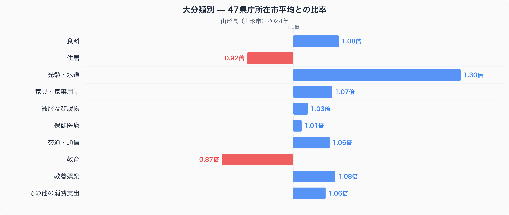
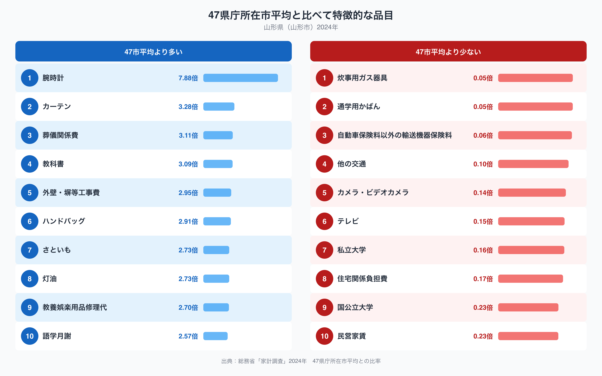

家計調査のデータを都道府県間で比べると、山形市の家計には一つだけはっきりとした偏りが見えてきます。十大費目のうち、47都道府県庁所在市の平均を1.00としたとき、山形市がもっとも1.00から離れているのは「光熱・水道」で、比率は1.30倍です。ほかの費目がおおむね0.9〜1.1倍のあたりに収まっているのに対して、光熱・水道だけが突出して高く、山形の暮らしを特徴づけています。この記事では、その中身を具体的な品目まで掘り下げながら、山形市の家計がどこにお金を使っているのかを見ていきます。

## 十大費目で見る山形市の家計

十大費目の比率を見ると、光熱・水道が1.30倍で最も高く、食料が1.08倍、教養娯楽が1.08倍、家具・家事用品が1.07倍と続きます。反対に低いのは教育で0.87倍、次いで住居が0.92倍です。教育費が47市平均より1割強低いことと、光熱・水道費が3割ほど高いことをあわせて見ると、山形市の家計は教育よりも住まいの維持にお金がかかる構造になっていそうです。住居費そのものは低めですが、これは家賃の支払いが少ないことの裏返しで、その分、暖房や給湯にかかる光熱費が重くのしかかっている構図が浮かび上がります。

## 特に多い品目・少ない品目

品目単位で見ると、光熱・水道の突出をより具体的に裏づける結果が出ています。灯油は47市平均の2.73倍、カーテンは3.28倍、外壁・塀等工事費は2.95倍と、いずれも住まいを冬に備えて整えるための支出です。教科書も3.09倍と高く、教育費全体は低めでも、必需品にあたる支出はしっかり出ている様子がうかがえます。また、さといもへの支出は2.73倍で、山形の郷土料理「芋煮」に欠かせない食材であることと関係していると考えられます。この文化的背景については[山形県の食卓ランキング](https://stats47.jp/blog/yamagata-food-culture)でも詳しく取り上げているので、あわせて読むと山形の食文化がより立体的に見えてきます。

反対に少ないのは民営家賃で0.23倍、私立大学の学費は0.16倍、国公立大学は0.23倍にとどまります。民営家賃の低さは、先ほどの住居費の低さと符合しており、賃貸暮らしよりも持ち家暮らしが一般的であることを裏づけています。大学の学費が低いのは、進学先の大学が県外にある家庭が多く、家計調査上の支出として計上されにくいことと関係している可能性があります。

## 雪国の暮らしがつくる支出構造

山形県は盆地状の地形と内陸性の気候の影響で、冬の冷え込みと積雪が厳しい地域です。灯油やカーテンへの支出の多さは、こうした寒さに対応するための暖房需要や、窓からの冷気を防ぐ工夫を反映しているのかもしれません。外壁・塀等工事費が高いのも、積雪や凍結による住宅の傷みに対応する修繕需要を映している可能性があります。持ち家比率の高さは、こうした住まいへの投資を「借りる」よりも「所有して手入れする」形で積み重ねていることと関係していそうです。統計データだけでは断定できませんが、これらの数字は雪国ならではの暮らし方を映し出していると言えるでしょう。県全体の統計を幅広く確認したい方は[山形県のデータブック](https://stats47.jp/areas/06000)もあわせてご覧ください。

## データについて

この記事で使っている数値は、総務省統計局「家計調査」の二人以上の世帯を対象にした2024年のデータです。都道府県のデータといっても実際には県庁所在市である山形市の値であり、県全体を代表する数値ではない点にご注意ください。また、比率の基準は家計調査が公表する全国平均ではなく、47都道府県庁所在市の単純平均を1.00としたものです。数値の見方を誤らないよう、この2点を踏まえたうえで読んでいただければと思います。
