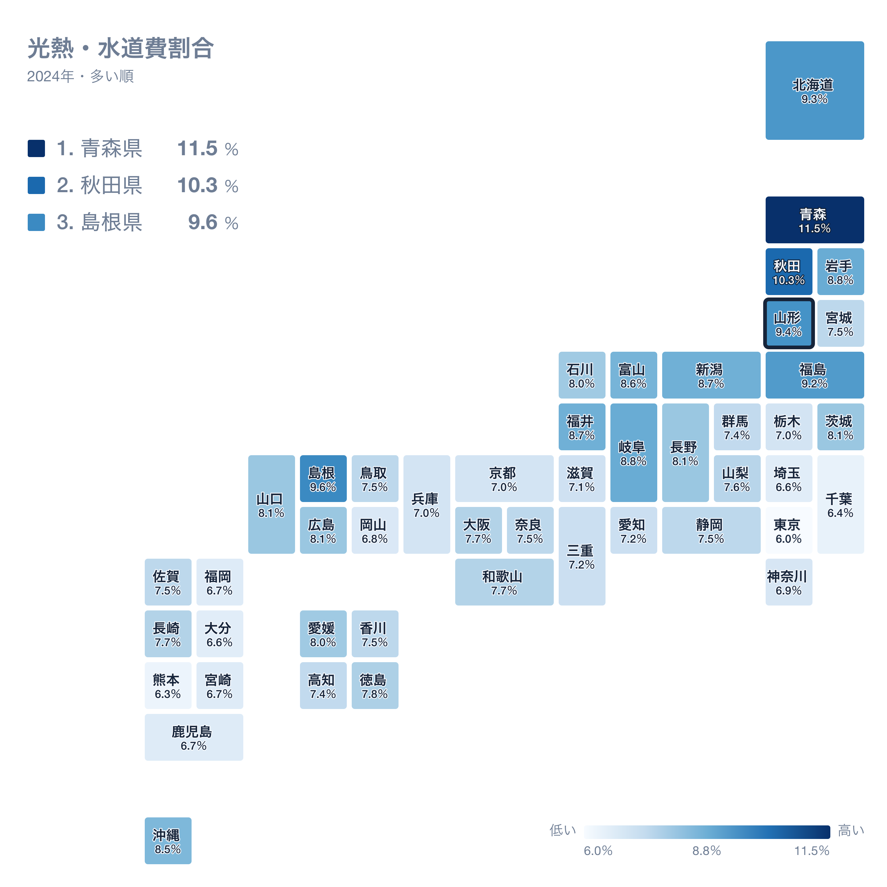
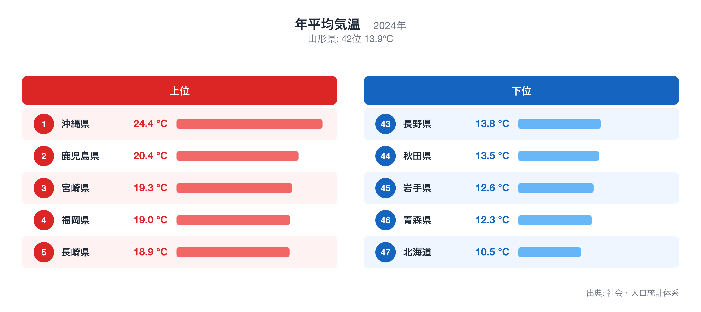
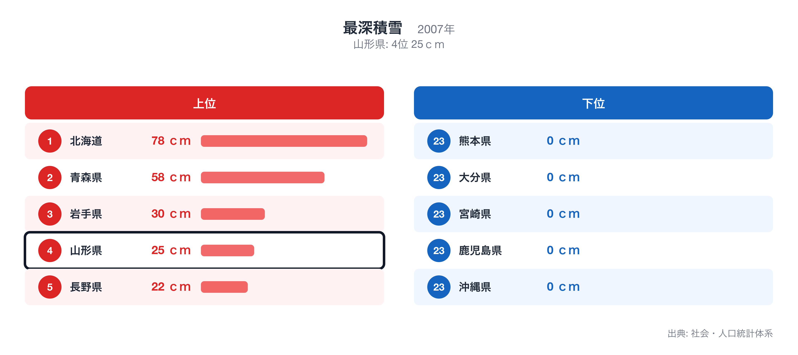

山形県の県庁所在地・山形市の家計を、総務省「家計調査」(2024年・二人以上の世帯)で十大費目に分けて見ると、47都道府県庁所在市の単純平均を1.00としたとき、最も乖離が大きいのは光熱・水道の1.30倍です。

この記事では、十大費目の偏り、47県の中での山形市の位置、突出した個別品目、そして光熱・水道が高くなる背景を他の都道府県統計で確かめる、という順で山形市の家計を読み解きます。比率はすべて47市平均に対する倍率で、家計調査が公表する全国平均とは基準が異なります。

十大費目とは食料、住居、光熱・水道、家具・家事用品、被服及び履物、保健医療、交通・通信、教育、教養娯楽、その他の消費支出の10区分で、家計調査が消費支出を分類する最上位の区分です。

## 十大費目にみる山形市の家計の偏り

47市平均を上回るのは8費目で、光熱・水道(1.30倍)、食料(1.08倍)、教養娯楽(1.08倍)、家具・家事用品(1.07倍)、交通・通信(1.06倍)、その他の消費支出(1.06倍)、被服及び履物(1.03倍)、保健医療(1.01倍)です。下回るのは2費目で、教育(0.87倍)、住居(0.92倍)です。最も大きく離れているのは光熱・水道の1.30倍、最も平均に近いのは保健医療の1.01倍で、山形市の家計は光熱・水道が高いほうに偏った構造だとわかります。

上の地図は、消費支出に占める光熱・水道の割合(光熱・水道費割合)を47都道府県で比べたもので、山形県は4位(9.4%)です。割合が最も高いのは青森県(11.5%)、次いで秋田県(10.3%)、島根県(9.6%)で、最も低いのは東京都(6.0%)です。倍率は「47市平均に対して何倍か」、地図の順位は「支出全体に占める割合が大きい順」なので、同じ費目でも見方が違います。倍率が高くても割合の順位が中位にとどまる場合は、他の費目も同じように多いことを意味します。全国ランキングの詳細は[光熱・水道費割合](https://stats47.jp/ranking/utilities-expenditure-ratio-multi-person-households)で確認できます。

## 突出した品目にみる暮らしの実像

品目別に見ると、47市平均より多い側の上位10品目は腕時計(7.88倍)、カーテン(3.28倍)、葬儀関係費(3.11倍)、教科書(3.09倍)、外壁・塀等工事費(2.95倍)、ハンドバッグ(2.91倍)、さといも(2.73倍)、灯油(2.73倍)、教養娯楽用品修理代(2.70倍)、語学月謝(2.57倍)です。少ない側の10品目は炊事用ガス器具(0.05倍)、通学用かばん(0.05倍)、自動車保険料以外の輸送機器保険料(0.06倍)、他の交通(0.10倍)、カメラ・ビデオカメラ(0.14倍)、テレビ(0.15倍)、私立大学(0.16倍)、住宅関係負担費(0.17倍)、国公立大学(0.23倍)、民営家賃(0.23倍)で、平均の5%程度にとどまる品目もあります。多い側の1位である腕時計と、少ない側の1位である炊事用ガス器具が、山形市の暮らしを最も端的に表す品目です。品目の倍率は世帯あたりの年間支出額を47市平均で割ったもので、購入頻度の低い品目ほど年ごとの振れが大きい点には注意が必要です。

## 光熱・水道の高さを他の統計で確かめる

年平均気温は山形県が全国42位(13.9℃、2024年)で、光熱・水道が高くなることと整合します。全国1位は沖縄県(24.4℃)、最下位は北海道(10.5℃)です。順位は値が大きい順で、全国ランキングは[年平均気温](https://stats47.jp/ranking/average-temperature)で確認できます。

最深積雪は山形県が全国4位(25ｃｍ、2007年)で、光熱・水道が高くなることと整合します。全国1位は北海道(78ｃｍ)、最下位は沖縄県(0ｃｍ)です。順位は値が大きい順で、全国ランキングは[最深積雪](https://stats47.jp/ranking/maximum-snow-depth)で確認できます。

ここで示した対応関係は同じ年次の都道府県統計を並べた相関であり、因果の証明ではありません。家計調査の県庁所在市データは標本が小さく、年ごとの変動も大きいため、複数年・複数指標で確かめることを前提に読んでください。倍率の分母は47都道府県庁所在市の単純平均で、東京都区部や政令市の重みづけはしていません。順位は同じ値の県を小さい方の順位にそろえています。

## データの出典

本記事の数値は総務省統計局「家計調査」(2024年、二人以上の世帯)にもとづきます。都道府県の値は県全体ではなく県庁所在市である山形市の世帯を対象にした数値で、比率の基準は47都道府県庁所在市の単純平均を1.00としたものです。裏付けに使った年平均気温と最深積雪は stats47 のランキングページ(出典は各ページに記載)から取得しました。
