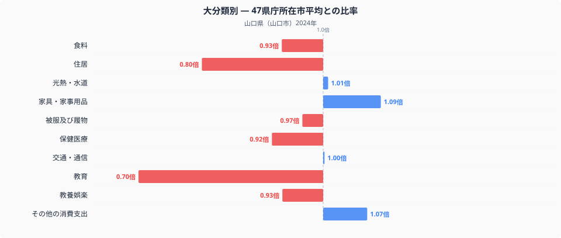
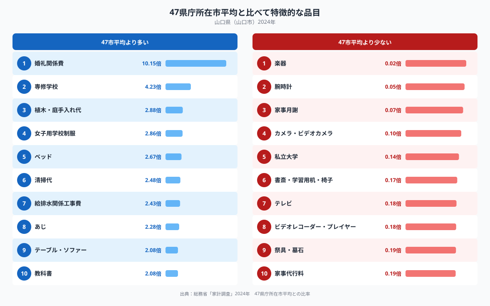

総務省の家計調査から山口県山口市の家計を、47都道府県庁所在市の平均と比べてみると、もっとも際立つのは教育です。山口市の教育費は平均の0.70倍にとどまり、十大費目のなかで全国平均からもっとも離れた費目になっています。教育にお金をかけない街なのかと思いきや、婚礼関係費は平均の10倍を超えるなど、教育以外の項目には突出した支出も見られます。山口市の家計は、いったいどこに偏っているのでしょうか。

## 十大費目で見る山口市家計の偏り

上のグラフは、山口市の消費支出を十大費目ごとに見て、47都道府県庁所在市の単純平均を1.00としたときの比率を示したものです。もっとも低いのは教育で0.70倍、次いで住居が0.80倍と、住まいと教育にかけるお金が全国平均より明確に少ないことがわかります。反対に、家具・家事用品は1.09倍、その他の消費支出は1.07倍とやや高めで、光熱・水道は1.01倍、交通・通信は1.00倍と、どちらもほぼ全国平均どおりです。食料や被服及び履物、教養娯楽も0.93〜0.97倍とやや低めにとどまり、山口市の家計は「突出して使いすぎている費目はないが、住居費と教育費だけがはっきり低い」という構造になっています。食料の中身を数量と価格に分けて見た記事は[こちら](https://stats47.jp/blog/yamaguchi-food-culture)でも紹介しています。

## 突出する品目からわかること

品目レベルで見ると、全国平均をもっとも上回っているのは婚礼関係費で10.15倍、次いで専修学校が4.23倍、植木・庭手入れ代が2.88倍、女子用学校制服が2.86倍と続きます。教育費の総額は全国最低水準なのに、専修学校や女子用学校制服、教科書(2.08倍)といった教育に関わる個別品目は、逆に全国平均を大きく上回っているのが特徴的です。反対に、私立大学は0.14倍、書斎・学習用机・椅子は0.17倍と際立って低く、楽器(0.02倍)や腕時計(0.05倍)、カメラ・ビデオカメラ(0.10倍)といった趣味・嗜好品への支出も全国平均の1割前後にとどまっています。全体を通して、家庭の中の「学び」にはお金をかける一方、進学先や余暇の道具は選択的に絞り込んでいるような姿が見えてきます。

## なぜ教育費だけ低いのか

教育費の総額が低く、なかでも私立大学への支出が0.14倍と際立って少ない背景には、山口県から都市部の私立大学へ進学する世帯の割合が全国平均より少ないことが関係している可能性があります。一方で専修学校や女子用学校制服、教科書への支出が高いのは、地元の学校や専門学校を選ぶ世帯が多いことを反映しているのかもしれません。婚礼関係費が10倍を超えて突出しているのは、対象となる世帯数がもともと少ない品目ほど平均値が振れやすいという、家計調査のサンプル構造の影響も考えられます。植木・庭手入れ代や清掃代、給排水関係工事費が上位に並ぶのは、戸建て住宅の比率や住まいを長く維持していく暮らし方と関係している可能性があります。これらはいずれもデータから読み取れる傾向であり、断定できる因果関係ではありません。

## データについて

本記事の数値は、総務省統計局「家計調査」(2024年、二人以上の世帯)に基づいています。ここで扱う都道府県の家計調査値は、県全体の平均ではなく、山口市など県庁所在市の値である点にご注意ください。また比率の基準は、家計調査が公表する全国平均ではなく、47都道府県庁所在市の単純平均を1.00としたものです。山口県の指標をもっと詳しく見たい方は、[山口県のデータブック](https://stats47.jp/areas/35000)もあわせてご覧ください。
