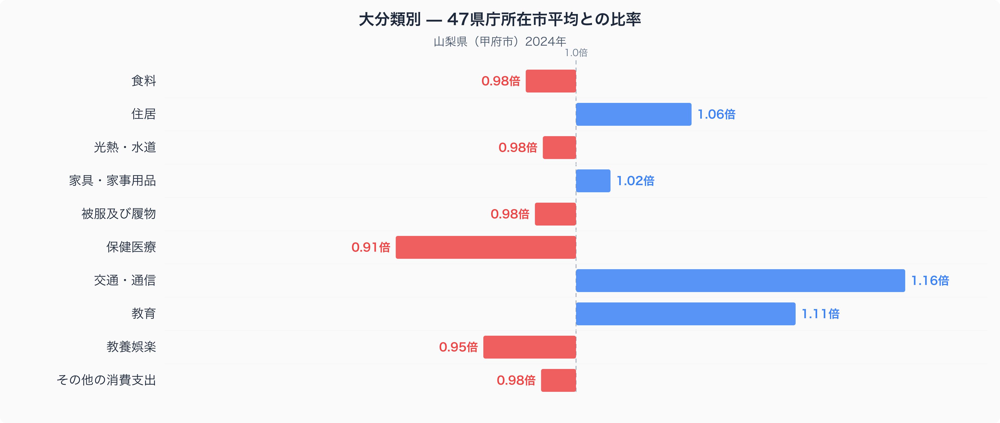
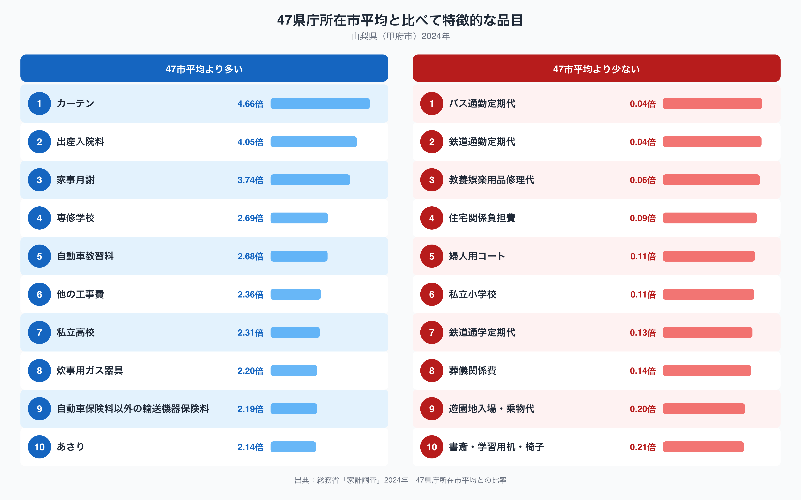

## 交通・通信費が47市平均の1.16倍という甲府市の家計

甲府市の家計を十大費目でみると、47都道府県庁所在市の平均(=1.00)から最も離れているのは交通・通信費です。甲府市の交通・通信費は平均の1.16倍で、十大費目のなかで唯一「1割5分以上多い」水準にあります。ただし品目別に見ていくと、電車やバスの通勤定期代はむしろ全国で最も低い水準にあり、単純に公共交通の利用が多いわけではないことがわかります。甲府市の家計は、どこに交通費を使い、どこを削っているのでしょうか。

## 十大費目の偏り ── 交通・通信と教育は高く、保健医療は低い

十大費目の比率を見ると、交通・通信(1.16倍)に次いで教育(1.11倍)も47市平均を上回っています。一方、住居(1.06倍)や家具・家事用品(1.02倍)はわずかに高い程度で、際立った差ではありません。反対に保健医療は0.91倍と十大費目のなかで最も低く、教養娯楽も0.95倍とやや低めです。食料(0.98倍)や光熱・水道(0.98倍)、被服及び履物(0.98倍)、その他の消費支出(0.98倍)は軒並み47市平均に近く、突出しているのは交通・通信と教育の高さ、そして保健医療の低さという構図です。

## 品目に見る「カーテンと自動車教習」の対比

品目レベルではさらに具体的な対比が見えます。交通・通信に関わる品目のうち、鉄道通勤定期代は47市平均の0.04倍、バス通勤定期代も0.04倍にとどまり、いずれも全国最低水準です。ところが自動車教習料は2.68倍、自動車保険料以外の輸送機器保険料は2.19倍と上位に入り、公共交通よりも自動車そのものへの支出が目立ちます。教育でも似た偏りがあり、専修学校は2.69倍、私立高校は2.31倍、家事月謝は3.74倍と高い一方、私立小学校は0.11倍、鉄道通学定期代は0.13倍にとどまります。全品目のなかで最も比率が高いのはカーテンの4.66倍で、出産入院料の4.05倍が続きます。甲府市の食卓を数量と価格の面から見た記事は[こちら](https://stats47.jp/blog/yamanashi-food-culture)にまとめています。反対に婦人用コートは0.11倍、住宅関係負担費は0.09倍と、支出が少ない品目にも幅があります。

## なぜこの偏りが生まれるのか、そしてデータの出典

山梨県は盆地状の地形にJR中央本線が通る一方、市街地を離れると路線バスの本数が限られる地域が多く、通勤や日常の移動に自家用車を使う世帯が多いことが、通勤定期代の低さと自動車教習料・輸送機器保険料の高さの両方に関係している可能性があります。また、東京都心への通勤・通学者が一定数いる地域では、地元での通学より進学塾や専修学校、私立高校といった選択肢に支出が向かいやすいのかもしれません。一方で、カーテンや出産入院料のように比率が突出して大きい品目は、家計調査のサンプル世帯数が少ない品目ほど年による振れが大きくなりやすく、必ずしも山梨県特有の消費傾向を示すとは限らない点にも注意が必要です。

なお、ここでの都道府県の家計調査値は山梨県全体ではなく、甲府市(県庁所在市)の二人以上世帯の値です。また、比率の基準は家計調査が公表する全国値ではなく、47都道府県庁所在市の単純平均を1.00としたものである点にご注意ください。データは総務省統計局「家計調査」(2024年)にもとづきます。山梨県の統計データをまとめて見るなら、[山梨県データブック](https://stats47.jp/areas/19000)もあわせてご覧ください。
