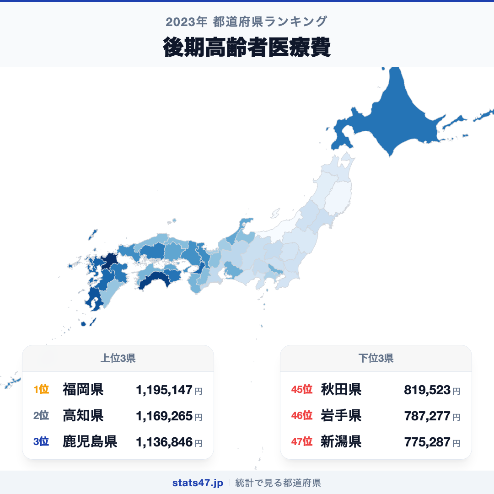
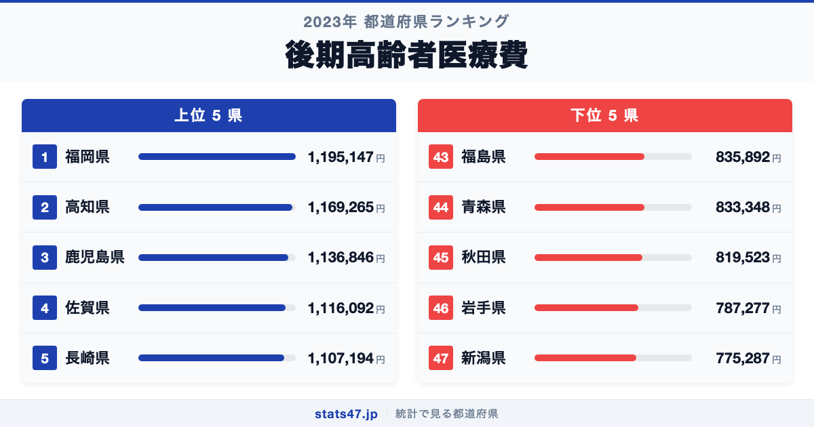
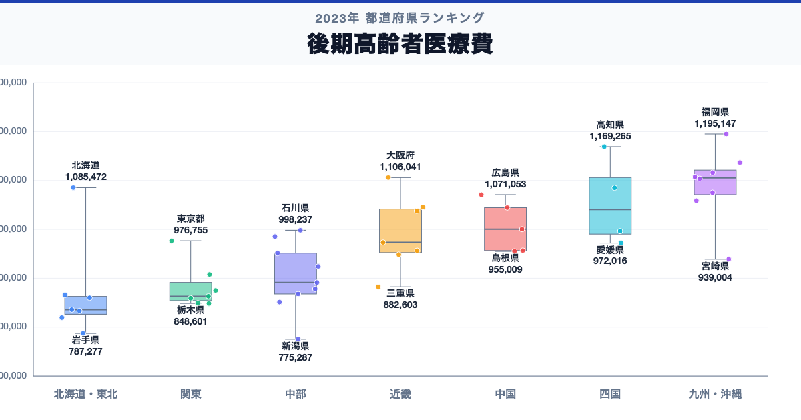

福岡県が全国1位、新潟県が47位。後期高齢者医療費には、同じ日本の中でも1.5倍の開きがあります。

首位の福岡県は1,195,147円で偏差値71.6、最下位の新潟県は775,287円で偏差値32.3です。なぜこれほど差があるのでしょうか。

「後期高齢者医療費」は、後期高齢者医療制度の医療費を被保険者1人あたりに換算した年額です。医療費の高低を地域の健康度や医療の質の順位に置き換えることはできません。

## データハイライト

全国平均: 964,350.53円

1位: 福岡県　1,195,147円 / 偏差値 71.6

47位: 新潟県　775,287円 / 偏差値 32.3

上位5県と下位5県の間には明確な開きがあります。一方、順位が近い県では値の差が小さい場合もあるため、一つの順位差を地域の優劣として扱わないことが大切です。

## 【コロプレス地図】日本全国の分布

<!-- note投稿時: この画像行を削除し、images/choropleth-map-1080x1080.png をアップロード -->

地域中央値が最も高いのは九州・沖縄で1,105,531円、最も低いのは東北で834,620円です。県別の順位だけでなく、まとまりとして見ると分布の偏りを捉えやすくなります。

ただし、地域内にもばらつきがあります。受診量、入院・外来の構成、医療提供体制、加入者の年齢構成などが重なります。低い値だけで健康状態が良いとは判断できず、必要な医療へのアクセスも確認が必要です。地図の色を原因の地図とみなさず、観測された分布として読みます。

## 上位5：分析

<!-- note投稿時: この画像行を削除し、images/chart-x-1200x630.png をアップロード -->

全国首位の福岡県は1位で、1,195,147円、偏差値は71.6です。全国平均を230,796.47円上回ります。受診量、入院・外来の構成、医療提供体制、加入者の年齢構成などが重なります。この順位だけで原因を決めず、入院・外来別医療費、受診率、1件あたり日数、年齢構成、健康寿命を確認すると背景を分解できます。

続く高知県は2位で、1,169,265円、偏差値は69.2です。全国平均を204,914.47円上回ります。四国に位置し、同じ地域内の県と比べる視点も必要です。この順位だけで原因を決めず、入院・外来別医療費、受診率、1件あたり日数、年齢構成、健康寿命を確認すると背景を分解できます。

上位に入った鹿児島県は3位で、1,136,846円、偏差値は66.1です。全国平均を172,495.47円上回ります。九州・沖縄に位置し、同じ地域内の県と比べる視点も必要です。この順位だけで原因を決めず、入院・外来別医療費、受診率、1件あたり日数、年齢構成、健康寿命を確認すると背景を分解できます。

4番手の佐賀県は4位で、1,116,092円、偏差値は64.2です。全国平均を151,741.47円上回ります。九州・沖縄に位置し、同じ地域内の県と比べる視点も必要です。この順位だけで原因を決めず、入院・外来別医療費、受診率、1件あたり日数、年齢構成、健康寿命を確認すると背景を分解できます。

上位5県を締める長崎県は5位で、1,107,194円、偏差値は63.3です。全国平均を142,843.47円上回ります。九州・沖縄に位置し、同じ地域内の県と比べる視点も必要です。この順位だけで原因を決めず、入院・外来別医療費、受診率、1件あたり日数、年齢構成、健康寿命を確認すると背景を分解できます。

## 下位5：分析

下位側を見ると、福島県は43位で、835,892円、偏差値は38.0です。全国平均を128,458.53円下回ります。東北の中でも、この県の位置を周辺県と見比べることが次の手がかりです。医療費の高低を地域の健康度や医療の質の順位に置き換えることはできません。

次に青森県は44位で、833,348円、偏差値は37.8です。全国平均を131,002.53円下回ります。東北の中でも、この県の位置を周辺県と見比べることが次の手がかりです。医療費の高低を地域の健康度や医療の質の順位に置き換えることはできません。

45位の秋田県は45位で、819,523円、偏差値は36.5です。全国平均を144,827.53円下回ります。東北の中でも、この県の位置を周辺県と見比べることが次の手がかりです。医療費の高低を地域の健康度や医療の質の順位に置き換えることはできません。

46位の岩手県は46位で、787,277円、偏差値は33.5です。全国平均を177,073.53円下回ります。東北の中でも、この県の位置を周辺県と見比べることが次の手がかりです。医療費の高低を地域の健康度や医療の質の順位に置き換えることはできません。

最下位の新潟県は47位で、775,287円、偏差値は32.3です。全国平均を189,063.53円下回ります。低い値だけで健康状態が良いとは判断できず、必要な医療へのアクセスも確認が必要です。医療費の高低を地域の健康度や医療の質の順位に置き換えることはできません。

## あなたの県は何位？

ここまで上位・下位の10県を見てきましたが、残る37県の順位も気になるはずです。全47都道府県の順位は、色分け地図と並べ替え可能なグラフ付きでstats47から確認できます。

### 後期高齢者医療費ランキング 全47都道府県版

https://stats47.jp/ranking/late-elderly-medical-expense-per-insured

## 地域別の傾向

<!-- note投稿時: この画像行を削除し、images/boxplot-1200x630.png をアップロード -->

箱ひげ図では、九州・沖縄の中央値が高く、東北が低い配置です。ただし、箱の重なりや外れた県も確認し、地域名だけで各県の値を決めつけないようにします。

## このランキングを正しく読む3つの視点

**総数と比率を混同しない**

受診量、入院・外来の構成、医療提供体制、加入者の年齢構成などが重なります。低い値だけで健康状態が良いとは判断できず、必要な医療へのアクセスも確認が必要です。

**順位だけで原因を決めない**

このデータから直接分かるのは、2023年の47都道府県の値と順位です。背景を確かめるには、入院・外来別医療費、受診率、1件あたり日数、年齢構成、健康寿命が必要です。

**対象年と定義を確認する**

医療費の高低を地域の健康度や医療の質の順位に置き換えることはできません。別年や別調査と比べるときは、対象となる世帯・人・施設と単位をそろえます。

## まとめ

後期高齢者医療費の地域差は、単純な県の優劣ではなく、指標の対象と地域条件の違いを映しています。

**首位と最下位には1.5倍の開き**

福岡県の1,195,147円に対し、新潟県は775,287円でした。まずは差の大きさを事実として押さえます。

**地域のまとまりと県内差は両方見る**

地域中央値には違いがありますが、同じ地域のすべての県が同じ傾向とは限りません。地図と全47県の順位を併用すると例外も見つけられます。

**次のデータで理由を分解する**

入院・外来別医療費、受診率、1件あたり日数、年齢構成、健康寿命を重ねれば、総数・割合・価格・人口構成など、順位を動かす要素を切り分けられます。

## もっと詳しく知りたい方へ

全47都道府県の順位や、グラフ・地図での可視化はstats47で確認できます。

### 後期高齢者医療費ランキング 全都道府県版

https://stats47.jp/ranking/late-elderly-medical-expense-per-insured

### 人工妊娠中絶実施率

https://stats47.jp/ranking/abortion-rate

### はり・きゅう師数

https://stats47.jp/ranking/acupuncture-moxibustion-count

### 人口10万対はり師数

https://stats47.jp/ranking/acupuncturist-rate

---

**stats47** は、e-Statなどの公的統計データを47都道府県別に可視化するサービスです。ランキング・散布図・時系列チャートで、地域の違いがひと目で分かります。

https://stats47.jp
