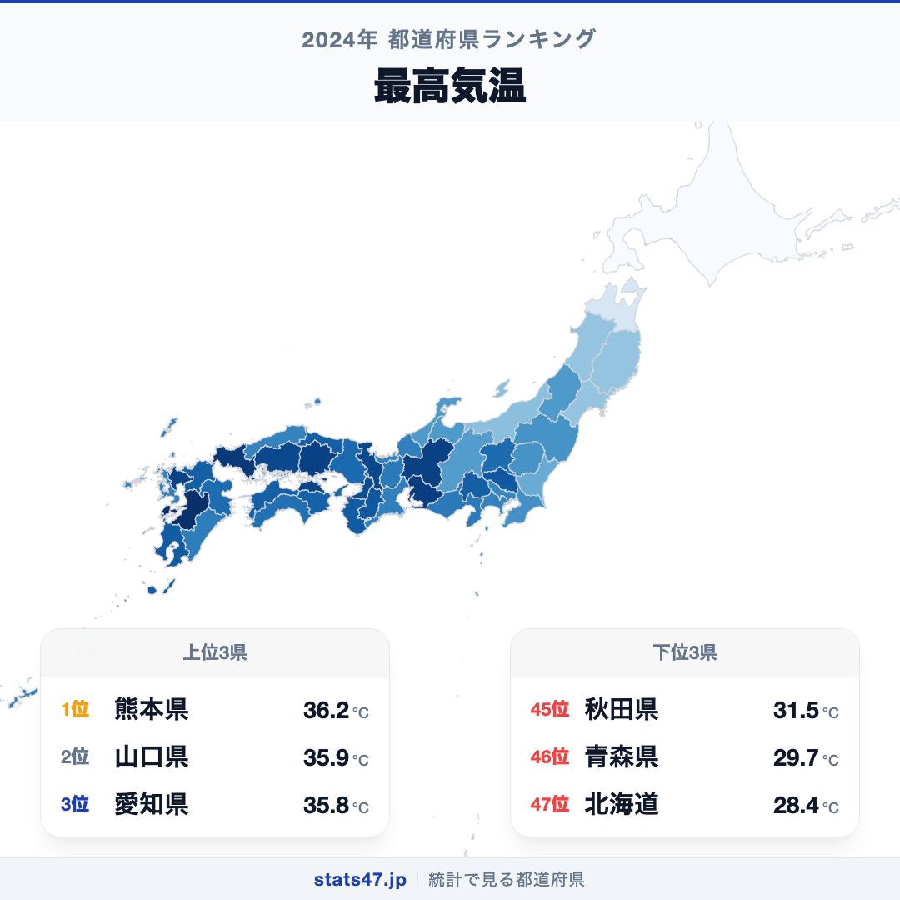
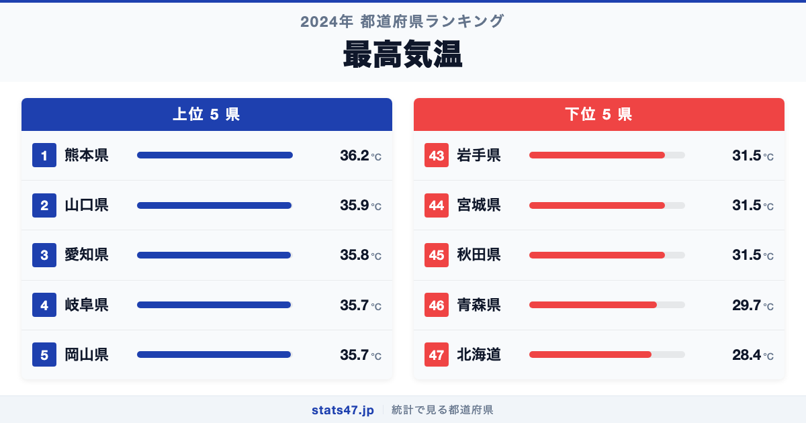
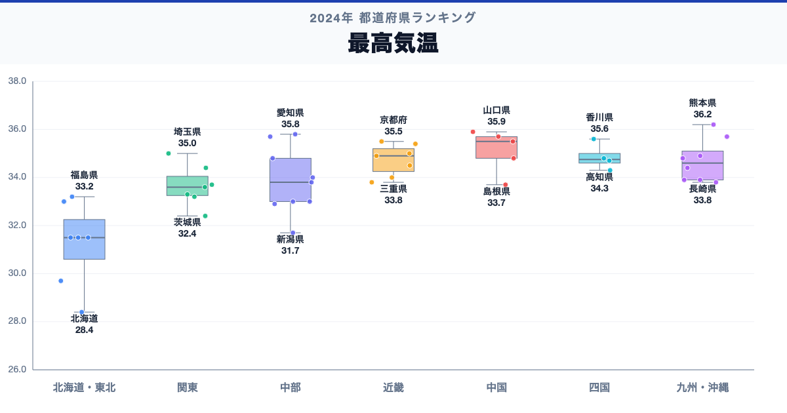

2024年、最も気温が上がった都道府県は熊本県でした。36.2℃を記録し、偏差値64.2で全国1位。一方、最下位の北海道は28.4℃で偏差値15.3と、その差は7.8℃にのぼります。

猛暑のニュースでは埼玉県の熊谷や岐阜県の多治見がよく取り上げられますが、県庁所在地の観測値で見ると、実は九州勢が上位に並んでいます。盆地特有の気候や内陸性気候がどう影響しているのか、47都道府県の最高気温を比べてみました。

「最高気温」は、各都道府県の県庁所在地における年間最高気温の観測値です。気象庁のデータに基づく2024年度の記録を使用しています。

## データハイライト

全国平均: 33.93℃

1位: 熊本県（36.2℃ / 偏差値 64.2）

47位: 北海道（28.4℃ / 偏差値 15.3）

標準偏差は1.59℃と小さく、大多数の都道府県が33〜36℃の範囲に収まっています。ただし北海道と青森県だけが30℃を下回っており、北の地域が明確に分かれる分布です。倍率ではなく絶対値の差で見るべき指標で、7.8℃の差は体感としてはかなり大きな違いです。

## 【コロプレス地図】日本全国の分布

<!-- note投稿時: この画像行を削除し、images/choropleth-map-1080x1080.png をアップロード -->

地図を見ると、西日本から東海にかけて濃い色が広がり、東北・北海道にかけて徐々に薄くなるグラデーションが鮮明です。九州全体が赤く染まり、中国地方の瀬戸内海側も高い値を示しています。

興味深いのは関東地方です。内陸の群馬県や栃木県が比較的高い一方、海に面した千葉県や神奈川県はやや低めになっています。海風の影響で沿岸部は気温上昇が抑えられる傾向がはっきり表れています。

日本海側は太平洋側と比べて最高気温がやや低い傾向がありますが、新潟県のように内陸部ではフェーン現象の影響で高温になる地域もあります。

## 上位5：分析

<!-- note投稿時: この画像行を削除し、images/chart-x-1200x630.png をアップロード -->

熊本市は有明海に面した盆地状の地形に位置し、夏場は熱がこもりやすい環境です。36.2℃、偏差値64.2で全国1位。九州の中でも特に暑くなりやすい地形条件を備えています。

2位は山口県の35.9℃、偏差値62.3。瀬戸内海に面した山口市周辺は夏場に晴天が続きやすく、海からの風も弱いため気温が上昇しやすい地域です。

35.8℃で偏差値61.7の愛知県が3位につけています。名古屋市は濃尾平野の奥に位置し、都市化によるヒートアイランド現象も加わって夏の暑さが際立ちます。

岐阜県も35.7℃、偏差値61.1で4位。岐阜市は内陸の盆地に位置しており、太平洋からの暖かい風が山を越えて吹き下ろすフェーン現象の影響を受けやすい地域として知られています。

同じく35.7℃で4位タイの岡山県は偏差値61.1。「晴れの国」と呼ばれるほど晴天日数が多く、日射量の多さが最高気温を押し上げています。

## 下位5：分析

北海道は28.4℃で偏差値15.3。全国で唯一30℃に届かず、他の46都道府県と大きく離れています。札幌市は冷涼な気候で知られ、日本の主要都市の中では圧倒的に夏が過ごしやすい場所です。

46位の青森県は29.7℃、偏差値23.4。本州最北端に位置し、太平洋側は「やませ」と呼ばれる冷たい海風の影響で気温が上がりにくい気候特性を持っています。

秋田県は31.5℃で偏差値34.7の45位。日本海側に位置し、冬の豪雪で知られますが、夏場も比較的涼しい気候が続きます。

同じく31.5℃で45位タイは宮城県と岩手県です。宮城県の仙台市は「杜の都」の名の通り緑が多く、親潮の影響で沿岸部の気温が抑えられています。岩手県も北上山地を抱える広大な県で、内陸部でも標高の高さが気温を下げる要因となっています。

## 地域別の傾向

<!-- note投稿時: この画像行を削除し、images/boxplot-1200x630.png をアップロード -->

九州・中国・東海が高く、北海道・東北が低い、南北の緯度差がそのまま反映された傾向です。全47都道府県の順位は stats47 で確認できます。

## まとめ

最高気温の地域差は、緯度だけでなく地形や海流が複雑に絡み合った結果です。このデータから以下の洞察が得られます。

**猛暑日の常連は盆地・内陸型の都市**

熊本・岐阜・愛知など上位に入る県は、盆地や内陸に県庁所在地がある場合が多く、熱がこもりやすい地形条件を共有しています。
海風が届きにくい地形が、猛暑日を生み出す大きな要因です。

**北海道だけが別世界の涼しさ**

28.4℃という北海道の最高気温は、2位の青森県よりさらに1.3℃低く、全国46都道府県とは明らかに異なる気候帯に属しています。
近年の温暖化で北海道も暑くなっていると言われますが、本州以南との差は依然として大きいままです。

**瀬戸内海沿岸は晴天日数の多さが気温を押し上げる**

岡山県や山口県のように、瀬戸内海式気候で晴天が多い地域は日射量が豊富で、最高気温も高くなる傾向があります。

## もっと詳しく知りたい方へ

全47都道府県の順位や、グラフ・地図での可視化は stats47 で見ることができます。

### 最高気温ランキング 全都道府県版

https://stats47.jp/ranking/maximum-temperature

### 年平均気温ランキング

https://stats47.jp/ranking/average-temperature

### 最低気温ランキング

https://stats47.jp/ranking/lowest-temperature

### 年間日照時間ランキング

https://stats47.jp/ranking/annual-sunshine-duration

### 気温と降水量の地域格差（stats47ブログ）

https://stats47.jp/blog/temperature-extremes-map

---

**stats47** は、e-Stat の公的統計データを47都道府県別に可視化するサービスです。
ランキング・散布図・時系列チャートで、地域の違いがひと目でわかります。

https://stats47.jp
