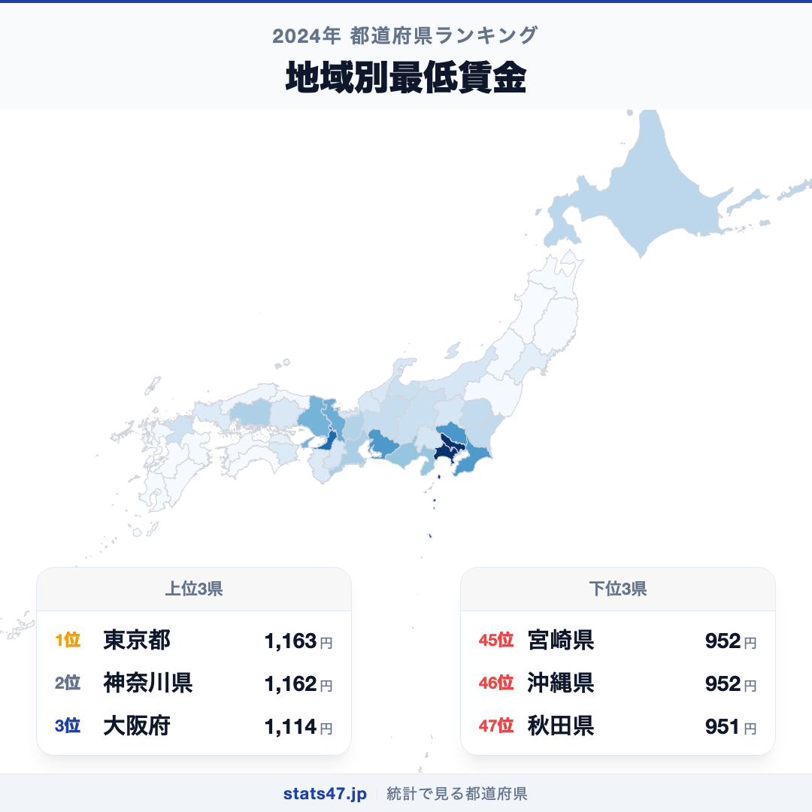
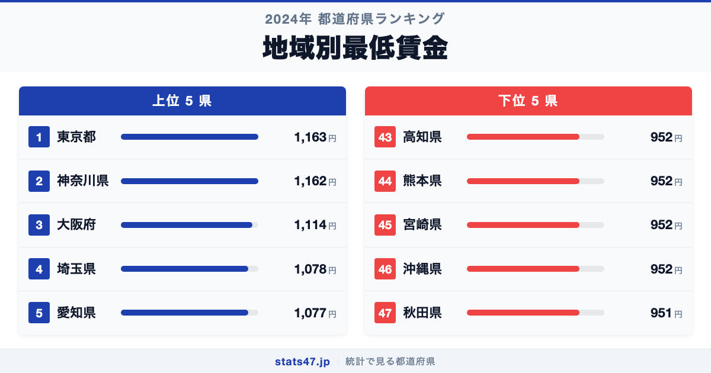
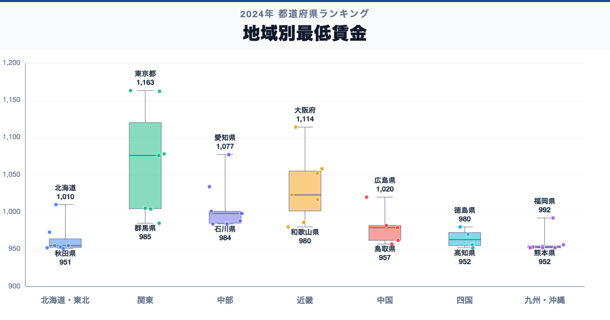

東京都が全国1位、秋田県が47位。地域別最低賃金には、同じ日本の中でも1.2倍の開きがあります。

首位の東京都は1,163円で偏差値81.2、最下位の秋田県は951円で偏差値41.0です。なぜこれほど差があるのでしょうか。

「地域別最低賃金」は、都道府県ごとに定められる労働者1時間あたりの最低賃金額です。適用開始日が地域で異なるため、年次比較では同じ改定年度の金額をそろえます。

## データハイライト

全国平均: 998.36円

1位: 東京都　1,163円 / 偏差値 81.2

47位: 秋田県　951円 / 偏差値 41.0

上位5県と下位5県の間には明確な開きがあります。一方、順位が近い県では値の差が小さい場合もあるため、一つの順位差を地域の優劣として扱わないことが大切です。

## 【コロプレス地図】日本全国の分布

<!-- note投稿時: この画像行を削除し、images/choropleth-map-1080x1080.png をアップロード -->

地域中央値が最も高いのは関東で1,076円、最も低いのは九州・沖縄で953円です。県別の順位だけでなく、まとまりとして見ると分布の偏りを捉えやすくなります。

ただし、地域内にもばらつきがあります。金額は地域の賃金・生計費・雇用事情などを踏まえた制度上の下限で、平均賃金とは異なります。低い県でも実際の賃金が全員この額という意味ではなく、産業別・職種別の賃金分布があります。地図の色を原因の地図とみなさず、観測された分布として読みます。

## 上位5：分析

<!-- note投稿時: この画像行を削除し、images/chart-x-1200x630.png をアップロード -->

全国首位の東京都は1位で、1,163円、偏差値は81.2です。全国平均を164.64円上回ります。金額は地域の賃金・生計費・雇用事情などを踏まえた制度上の下限で、平均賃金とは異なります。この順位だけで原因を決めず、平均時給、求人賃金、物価、家賃、産業構成、最低賃金近傍の労働者割合を確認すると背景を分解できます。

続く神奈川県は2位で、1,162円、偏差値は81.1です。全国平均を163.64円上回ります。関東に位置し、同じ地域内の県と比べる視点も必要です。この順位だけで原因を決めず、平均時給、求人賃金、物価、家賃、産業構成、最低賃金近傍の労働者割合を確認すると背景を分解できます。

上位に入った大阪府は3位で、1,114円、偏差値は71.9です。全国平均を115.64円上回ります。近畿に位置し、同じ地域内の県と比べる視点も必要です。この順位だけで原因を決めず、平均時給、求人賃金、物価、家賃、産業構成、最低賃金近傍の労働者割合を確認すると背景を分解できます。

4番手の埼玉県は4位で、1,078円、偏差値は65.1です。全国平均を79.64円上回ります。関東に位置し、同じ地域内の県と比べる視点も必要です。この順位だけで原因を決めず、平均時給、求人賃金、物価、家賃、産業構成、最低賃金近傍の労働者割合を確認すると背景を分解できます。

上位5県を締める愛知県は5位で、1,077円、偏差値は64.9です。全国平均を78.64円上回ります。中部に位置し、同じ地域内の県と比べる視点も必要です。この順位だけで原因を決めず、平均時給、求人賃金、物価、家賃、産業構成、最低賃金近傍の労働者割合を確認すると背景を分解できます。

## 下位5：分析

下位側を見ると、高知県は43位で、952円、偏差値は41.2です。全国平均を46.36円下回ります。四国の中でも、この県の位置を周辺県と見比べることが次の手がかりです。適用開始日が地域で異なるため、年次比較では同じ改定年度の金額をそろえます。

次に熊本県は44位で、952円、偏差値は41.2です。全国平均を46.36円下回ります。九州・沖縄の中でも、この県の位置を周辺県と見比べることが次の手がかりです。適用開始日が地域で異なるため、年次比較では同じ改定年度の金額をそろえます。

45位の宮崎県は45位で、952円、偏差値は41.2です。全国平均を46.36円下回ります。九州・沖縄の中でも、この県の位置を周辺県と見比べることが次の手がかりです。適用開始日が地域で異なるため、年次比較では同じ改定年度の金額をそろえます。

46位の沖縄県は46位で、952円、偏差値は41.2です。全国平均を46.36円下回ります。九州・沖縄の中でも、この県の位置を周辺県と見比べることが次の手がかりです。適用開始日が地域で異なるため、年次比較では同じ改定年度の金額をそろえます。

最下位の秋田県は47位で、951円、偏差値は41.0です。全国平均を47.36円下回ります。低い県でも実際の賃金が全員この額という意味ではなく、産業別・職種別の賃金分布があります。適用開始日が地域で異なるため、年次比較では同じ改定年度の金額をそろえます。

## あなたの県は何位？

ここまで上位・下位の10県を見てきましたが、残る37県の順位も気になるはずです。全47都道府県の順位は、色分け地図と並べ替え可能なグラフ付きでstats47から確認できます。

### 地域別最低賃金ランキング 全47都道府県版

https://stats47.jp/ranking/minimum-wage-by-region

## 地域別の傾向

<!-- note投稿時: この画像行を削除し、images/boxplot-1200x630.png をアップロード -->

箱ひげ図では、関東の中央値が高く、九州・沖縄が低い配置です。ただし、箱の重なりや外れた県も確認し、地域名だけで各県の値を決めつけないようにします。

## このランキングを正しく読む3つの視点

**総数と比率を混同しない**

金額は地域の賃金・生計費・雇用事情などを踏まえた制度上の下限で、平均賃金とは異なります。低い県でも実際の賃金が全員この額という意味ではなく、産業別・職種別の賃金分布があります。

**順位だけで原因を決めない**

このデータから直接分かるのは、2024年の47都道府県の値と順位です。背景を確かめるには、平均時給、求人賃金、物価、家賃、産業構成、最低賃金近傍の労働者割合が必要です。

**対象年と定義を確認する**

適用開始日が地域で異なるため、年次比較では同じ改定年度の金額をそろえます。別年や別調査と比べるときは、対象となる世帯・人・施設と単位をそろえます。

## まとめ

地域別最低賃金の地域差は、単純な県の優劣ではなく、指標の対象と地域条件の違いを映しています。

**首位と最下位には1.2倍の開き**

東京都の1,163円に対し、秋田県は951円でした。まずは差の大きさを事実として押さえます。

**地域のまとまりと県内差は両方見る**

地域中央値には違いがありますが、同じ地域のすべての県が同じ傾向とは限りません。地図と全47県の順位を併用すると例外も見つけられます。

**次のデータで理由を分解する**

平均時給、求人賃金、物価、家賃、産業構成、最低賃金近傍の労働者割合を重ねれば、総数・割合・価格・人口構成など、順位を動かす要素を切り分けられます。

## もっと詳しく知りたい方へ

全47都道府県の順位や、グラフ・地図での可視化はstats47で確認できます。

### 地域別最低賃金ランキング 全都道府県版

https://stats47.jp/ranking/minimum-wage-by-region

### 公認会計士・税理士の平均年収

https://stats47.jp/ranking/accountant-annual-income

### 有効求人倍率

https://stats47.jp/ranking/active-job-opening-ratio

### 自動車整備・修理従事者の平均年収

https://stats47.jp/ranking/auto-mechanic-annual-income

---

**stats47** は、e-Statなどの公的統計データを47都道府県別に可視化するサービスです。ランキング・散布図・時系列チャートで、地域の違いがひと目で分かります。

https://stats47.jp
