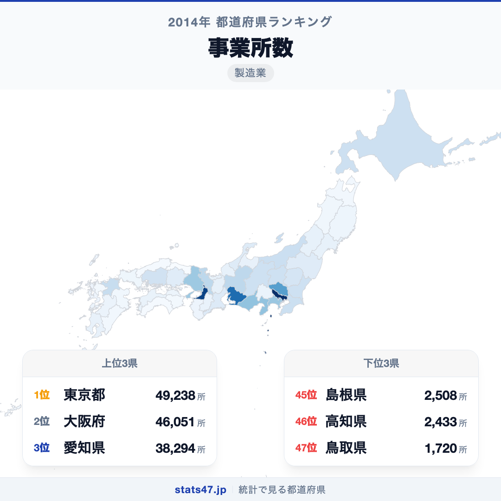
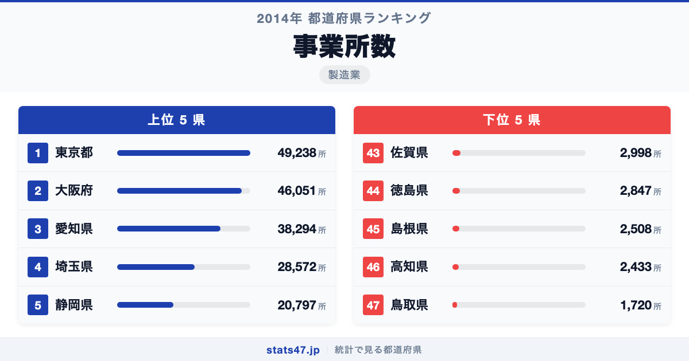
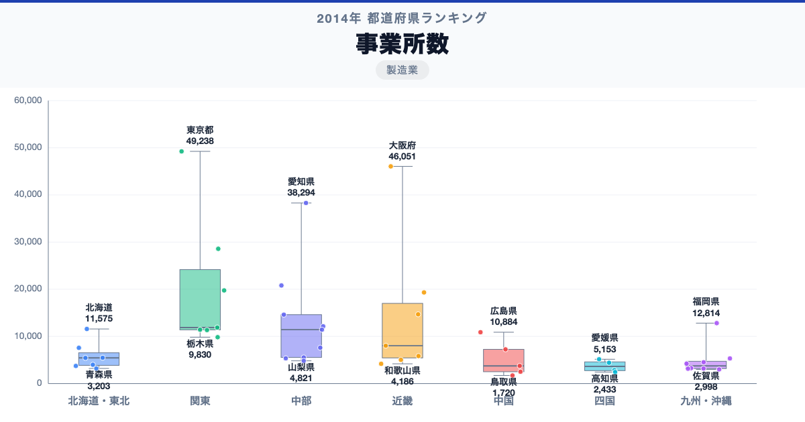

東京都が全国1位、鳥取県が47位。事業所数には、同じ日本の中でも28.6倍の開きがあります。

首位の東京都は49,238所で偏差値86.7、最下位の鳥取県は1,720所で偏差値41.8です。なぜこれほど差があるのでしょうか。

「事業所数」は、製造業の事業所数は、製造業に分類される工場や加工拠点などの数です。企業数や生産額とは一致しません。2014年の過去データなので、現在の立地判断には最新の経済構造実態調査などを確認します。

## データハイライト

全国平均: 10,365.77所

1位: 東京都　49,238所 / 偏差値 86.7

47位: 鳥取県　1,720所 / 偏差値 41.8

上位5県と下位5県の間には明確な開きがあります。一方、順位が近い県では値の差が小さい場合もあるため、一つの順位差を地域の優劣として扱わないことが大切です。

## 【コロプレス地図】日本全国の分布

<!-- note投稿時: この画像行を削除し、images/choropleth-map-1080x1080.png をアップロード -->

地域中央値が最も高いのは関東で11,885所、最も低いのは四国で3,628.5所です。県別の順位だけでなく、まとまりとして見ると分布の偏りを捉えやすくなります。

ただし、地域内にもばらつきがあります。大都市圏の市場規模と、部品・加工を含む産業集積の裾野が総数に表れます。少数の大規模工場が高い生産額を生む地域もあるため、事業所数だけで産業の強さは決まりません。地図の色を原因の地図とみなさず、観測された分布として読みます。

## 上位5：分析

<!-- note投稿時: この画像行を削除し、images/chart-x-1200x630.png をアップロード -->

全国首位の東京都は1位で、49,238所、偏差値は86.7です。全国平均を38,872.23所上回ります。大都市圏の市場規模と、部品・加工を含む産業集積の裾野が総数に表れます。この順位だけで原因を決めず、製造品出荷額、付加価値額、従業者数、事業所あたり規模、最新年の事業所数を確認すると背景を分解できます。

続く大阪府は2位で、46,051所、偏差値は83.7です。全国平均を35,685.23所上回ります。近畿に位置し、同じ地域内の県と比べる視点も必要です。この順位だけで原因を決めず、製造品出荷額、付加価値額、従業者数、事業所あたり規模、最新年の事業所数を確認すると背景を分解できます。

上位に入った愛知県は3位で、38,294所、偏差値は76.4です。全国平均を27,928.23所上回ります。中部に位置し、同じ地域内の県と比べる視点も必要です。この順位だけで原因を決めず、製造品出荷額、付加価値額、従業者数、事業所あたり規模、最新年の事業所数を確認すると背景を分解できます。

4番手の埼玉県は4位で、28,572所、偏差値は67.2です。全国平均を18,206.23所上回ります。関東に位置し、同じ地域内の県と比べる視点も必要です。この順位だけで原因を決めず、製造品出荷額、付加価値額、従業者数、事業所あたり規模、最新年の事業所数を確認すると背景を分解できます。

上位5県を締める静岡県は5位で、20,797所、偏差値は59.8です。全国平均を10,431.23所上回ります。中部に位置し、同じ地域内の県と比べる視点も必要です。この順位だけで原因を決めず、製造品出荷額、付加価値額、従業者数、事業所あたり規模、最新年の事業所数を確認すると背景を分解できます。

## 下位5：分析

下位側を見ると、佐賀県は43位で、2,998所、偏差値は43.0です。全国平均を7,367.77所下回ります。九州・沖縄の中でも、この県の位置を周辺県と見比べることが次の手がかりです。2014年の過去データなので、現在の立地判断には最新の経済構造実態調査などを確認します。

次に徳島県は44位で、2,847所、偏差値は42.9です。全国平均を7,518.77所下回ります。四国の中でも、この県の位置を周辺県と見比べることが次の手がかりです。2014年の過去データなので、現在の立地判断には最新の経済構造実態調査などを確認します。

45位の島根県は45位で、2,508所、偏差値は42.6です。全国平均を7,857.77所下回ります。中国の中でも、この県の位置を周辺県と見比べることが次の手がかりです。2014年の過去データなので、現在の立地判断には最新の経済構造実態調査などを確認します。

46位の高知県は46位で、2,433所、偏差値は42.5です。全国平均を7,932.77所下回ります。四国の中でも、この県の位置を周辺県と見比べることが次の手がかりです。2014年の過去データなので、現在の立地判断には最新の経済構造実態調査などを確認します。

最下位の鳥取県は47位で、1,720所、偏差値は41.8です。全国平均を8,645.77所下回ります。少数の大規模工場が高い生産額を生む地域もあるため、事業所数だけで産業の強さは決まりません。2014年の過去データなので、現在の立地判断には最新の経済構造実態調査などを確認します。

## あなたの県は何位？

ここまで上位・下位の10県を見てきましたが、残る37県の順位も気になるはずです。全47都道府県の順位は、色分け地図と並べ替え可能なグラフ付きでstats47から確認できます。

### 事業所数ランキング 全47都道府県版

https://stats47.jp/ranking/number-of-establishments-manufacturing

## 地域別の傾向

<!-- note投稿時: この画像行を削除し、images/boxplot-1200x630.png をアップロード -->

箱ひげ図では、関東の中央値が高く、四国が低い配置です。ただし、箱の重なりや外れた県も確認し、地域名だけで各県の値を決めつけないようにします。

## このランキングを正しく読む3つの視点

**総数と比率を混同しない**

大都市圏の市場規模と、部品・加工を含む産業集積の裾野が総数に表れます。少数の大規模工場が高い生産額を生む地域もあるため、事業所数だけで産業の強さは決まりません。

**順位だけで原因を決めない**

このデータから直接分かるのは、2014年の47都道府県の値と順位です。背景を確かめるには、製造品出荷額、付加価値額、従業者数、事業所あたり規模、最新年の事業所数が必要です。

**対象年と定義を確認する**

2014年の過去データなので、現在の立地判断には最新の経済構造実態調査などを確認します。別年や別調査と比べるときは、対象となる世帯・人・施設と単位をそろえます。

## まとめ

事業所数の地域差は、単純な県の優劣ではなく、指標の対象と地域条件の違いを映しています。

**首位と最下位には28.6倍の開き**

東京都の49,238所に対し、鳥取県は1,720所でした。まずは差の大きさを事実として押さえます。

**地域のまとまりと県内差は両方見る**

地域中央値には違いがありますが、同じ地域のすべての県が同じ傾向とは限りません。地図と全47県の順位を併用すると例外も見つけられます。

**次のデータで理由を分解する**

製造品出荷額、付加価値額、従業者数、事業所あたり規模、最新年の事業所数を重ねれば、総数・割合・価格・人口構成など、順位を動かす要素を切り分けられます。

## もっと詳しく知りたい方へ

全47都道府県の順位や、グラフ・地図での可視化はstats47で確認できます。

### 事業所数ランキング 全都道府県版

https://stats47.jp/ranking/number-of-establishments-manufacturing

### 商業年間商品販売額

https://stats47.jp/ranking/annual-sales-amount-per-employee

### 商業年間商品販売額

https://stats47.jp/ranking/annual-sales-amount-per-establishment

### 商業年間商品販売額

https://stats47.jp/ranking/annual-sales-amount

### IT企業の数も東京に103倍集中｜情報通信業の事業所が少ない県で、エンジニアはどう戦うか (2014)（stats47ブログ）

https://stats47.jp/blog/it-establishments-prefecture

---

**stats47** は、e-Statなどの公的統計データを47都道府県別に可視化するサービスです。ランキング・散布図・時系列チャートで、地域の違いがひと目で分かります。

https://stats47.jp
