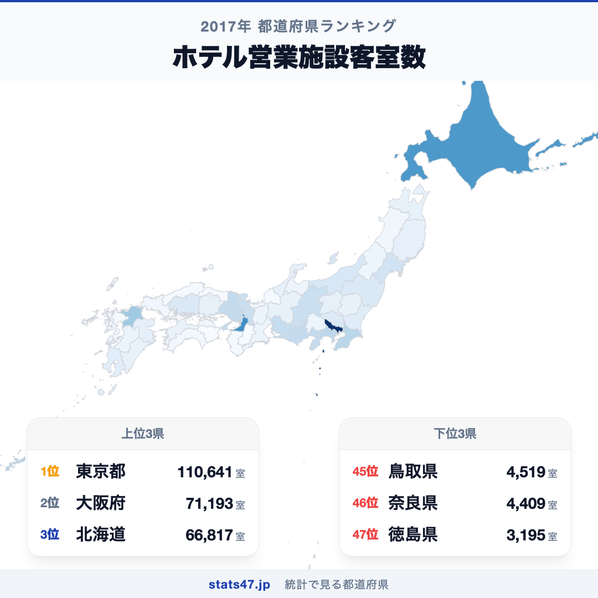
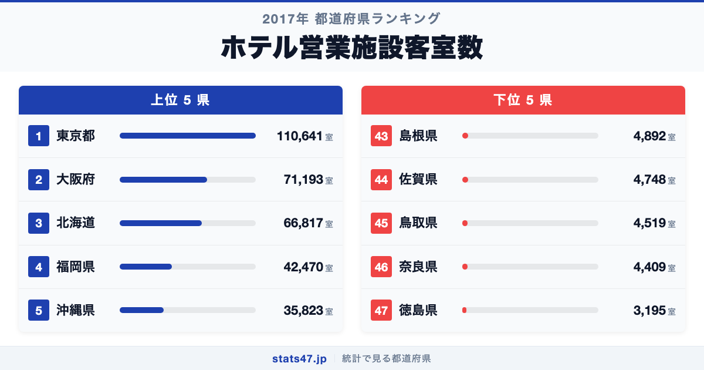
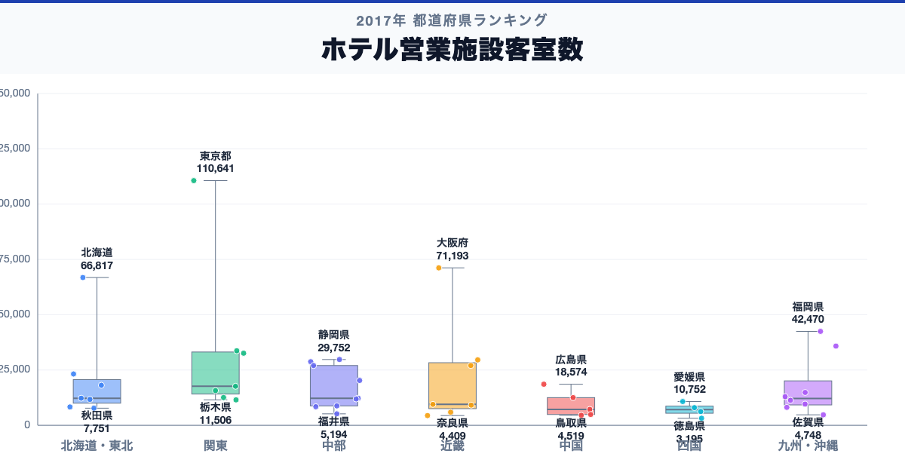

11万室。東京都のホテル客室数は、47位の徳島県の約35倍にのぼります。偏差値96.2という圧倒的な数字で全国1位に立つ東京都と、3195室で偏差値41.8の徳島県。34.6倍という格差は、都道府県ランキングの中でも際立って大きい部類に入ります。

「ホテルが多い都道府県」と聞けば東京や大阪を想像するでしょう。しかし3位に北海道、5位に沖縄が入ってくるあたりに、観光需要という別の力学が見えてきます。

「ホテル営業施設客室数」は、旅館業法に基づくホテル営業の許可を受けた施設が保有する客室の総数です。衛生行政報告例に基づく2017年度のデータを使用しています。

## データハイライト

全国平均: 19308.51室

1位: 東京都（110641室 / 偏差値 96.2）

47位: 徳島県（3195室 / 偏差値 41.8）

標準偏差が19759.26室と非常に大きく、東京都と大阪府が突出して上位に位置しています。全国平均の19308.51室を上回る都道府県はわずか10程度で、大多数の県は平均以下に集まるという偏った分布が特徴です。

## 【コロプレス地図】日本全国の分布

<!-- note投稿時: この画像行を削除し、images/choropleth-map-1080x1080.png をアップロード -->

地図を見ると、東京都・大阪府の色が突出して濃く、次いで北海道・福岡県・沖縄県が目立ちます。三大都市圏とリゾート・観光地に客室が集中している構図がひと目でわかります。

中国・四国地方は全体的に淡い色で、特に鳥取県・島根県・徳島県が薄くなっています。ビジネス需要も観光需要も限られる小規模県では、ホテル客室の総数が3000〜5000室台にとどまっています。

一方、愛知県や福岡県のようにビジネス出張の需要が大きい県は、観光地ではなくても客室数が多い傾向があります。ホテル客室数は、その都道府県の経済規模と観光資源の両方を反映する指標といえます。

## 上位5：分析

<!-- note投稿時: この画像行を削除し、images/chart-x-1200x630.png をアップロード -->

日本の首都であり、ビジネス・観光・国際会議の集積地である東京都が110641室、偏差値96.2で圧倒的な1位です。2位の大阪府に約1.6倍の差をつけており、宿泊施設の一極集中ぶりが際立っています。

大阪府は71193室で偏差値76.3。関西圏のハブとして、インバウンド需要の急増に伴いホテルの新設ラッシュが続いてきた地域です。

3位の北海道は66817室、偏差値74.0。札幌のビジネス需要に加え、ニセコ・富良野・函館といった観光地が広域に分散しており、道内各地にホテルが展開されています。面積の広さゆえに宿泊施設の絶対数が多いのも特徴的です。

福岡県が42470室、偏差値61.7で4位に入っています。九州の玄関口として福岡市を中心にビジネスホテルの集積が進み、アジアからの近距離インバウンドも客室需要を押し上げてきました。

そして5位は沖縄県で35823室、偏差値58.4。人口は約145万人と小規模ながら、国内屈指のリゾート地として大型リゾートホテルが林立しています。観光特化型の客室構成が沖縄の特徴です。

## 下位5：分析

徳島県は3195室、偏差値41.8で全国最下位です。四国の中でも観光入込客数が少なく、ビジネス需要も限られています。阿波おどりの時期を除くと宿泊需要が安定しにくい点が、客室数の少なさにつながっています。

46位の奈良県は4409室で偏差値42.5。日本有数の観光地でありながら、大阪から日帰り圏内であることが宿泊需要を限定してきました。「奈良に泊まらない問題」は長年指摘されてきた課題です。

鳥取県が4519室、偏差値42.5で45位。日本で最も人口が少ない県であり、ホテルの絶対数も少なくなっています。砂丘観光はあるものの、宿泊を伴う滞在型観光への転換が課題となっています。

44位は佐賀県の4748室、偏差値42.6。隣接する福岡県に宿泊拠点が集中しやすく、佐賀県内での宿泊需要が限られています。

島根県も4892室で偏差値42.7の43位。出雲大社や松江城といった観光資源はあるものの、アクセスの難しさから宿泊客の伸びが緩やかな状況です。

## 地域別の傾向

<!-- note投稿時: この画像行を削除し、images/boxplot-1200x630.png をアップロード -->

関東と近畿が突出して高く、中国・四国が低い傾向です。北海道は単独で上位に位置し、九州・沖縄は沖縄と福岡が平均を引き上げています。全47都道府県の順位は stats47 で確認できます。

## まとめ

ホテル客室数の地域差は、経済規模と観光資源という2つの力が重なり合った結果です。このデータから以下の洞察が得られます。

**東京一極集中はホテルでも顕著**

11万室を超える東京都の偏差値は96.2。2位の大阪府にも約4万室の差をつけており、ビジネス・観光ともに東京への集中が宿泊インフラにも色濃く表れています。

**観光県は人口に比べてホテルが多い**

沖縄県や北海道は人口規模に対してホテル客室数が多く、観光産業が宿泊インフラを押し上げています。
人口ランキングでは中位〜下位でも、ホテル客室数では上位に入る「観光型」のパターンです。

**奈良の「泊まらない問題」は数字にも表れている**

日本を代表する観光地でありながら客室数は全国46位。大阪からの日帰り圏であることが宿泊需要を制限し、客室の少なさにつながっています。

## もっと詳しく知りたい方へ

全47都道府県の順位や、グラフ・地図での可視化は stats47 で見ることができます。

### ホテル客室数ランキング 全都道府県版

https://stats47.jp/ranking/number-of-hotel-rooms

### ホテル営業施設数ランキング

https://stats47.jp/ranking/number-of-hotel-facilities

### コンビニエンスストア数ランキング

https://stats47.jp/ranking/convenience-store-count-per-100k

### 大型小売店数ランキング

https://stats47.jp/ranking/large-retail-store-count-per-100k

### 旅館vsホテル 宿泊シフトの実態（stats47ブログ）

https://stats47.jp/blog/ryokan-vs-hotel-overnight-shift

---

**stats47** は、e-Stat の公的統計データを47都道府県別に可視化するサービスです。
ランキング・散布図・時系列チャートで、地域の違いがひと目でわかります。

https://stats47.jp
