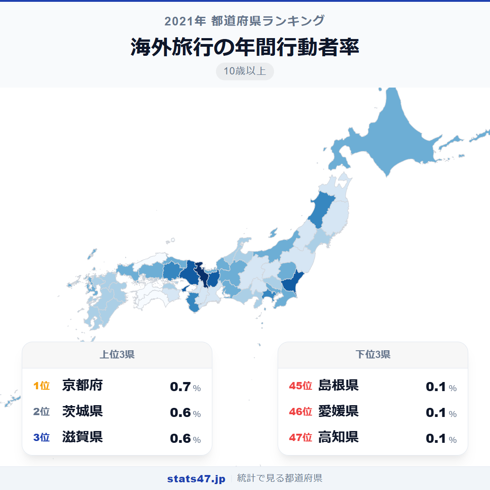
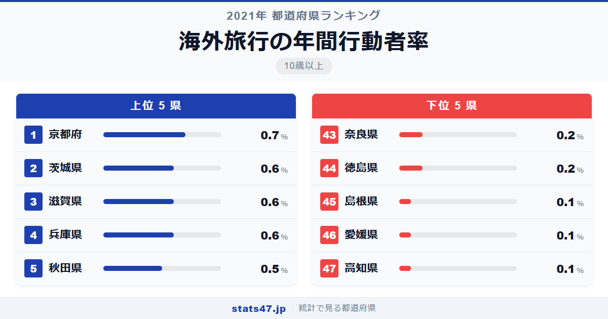
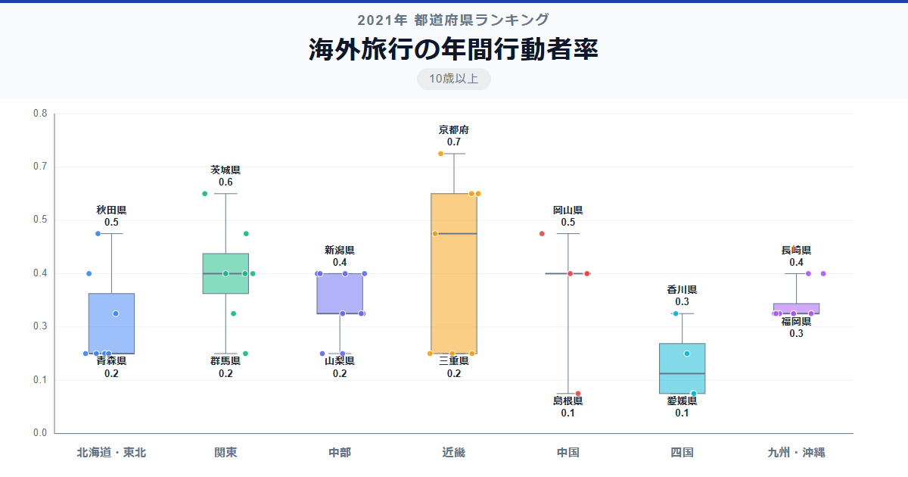

全国平均わずか0.34％。2021年の海外旅行行動者率は、コロナ禍による渡航制限でほぼ壊滅的な数字になりました。2001年の15歳以上版では全国平均9.98％だったことを考えると、その落差は凄まじいものがあります。

そんな中で1位に立ったのは京都府で、偏差値76.5の0.7％。2001年版では東京都が圧倒的1位でしたが、コロナ禍では顔ぶれが大きく変わりました。最下位は高知県で0.1％、1位との差は実に7.0倍です。

「海外旅行の年間行動者率」は、過去1年間に海外旅行を行った10歳以上の人の割合です。総務省「社会生活基本調査」の2021年データに基づいています。

## データハイライト

全国平均: 0.34％

1位: 京都府（0.7％ / 偏差値 76.5）

47位: 高知県（0.1％ / 偏差値 32.8）

数値が極端に小さく、0.1％刻みで多数の県が同順位に並んでいます。2位タイに茨城県・滋賀県・兵庫県の3県、5位タイにも5県が並ぶなど、統計的な差は非常に小さい点に注意が必要です。

## 【コロプレス地図】日本全国の分布

<!-- note投稿時: この画像行を削除し、images/choropleth-map-1080x1080.png をアップロード -->

地図を見ると、2001年版のような三大都市圏一極集中のパターンは崩れています。京都府・茨城県・滋賀県・秋田県など、通常は上位に来ない県がトップ5に入り、東京都は12位タイにとどまっています。

これはコロナ禍で海外旅行者がほぼゼロに近い水準まで減少し、わずかな差で順位が大きく入れ替わったためです。統計的なノイズの影響が大きく、この年のランキングを額面通りに解釈するのは難しい面があります。

下位では島根県・愛媛県・高知県が0.1％で並び、いずれも地方で国際空港から遠い地域です。

## 上位5：分析

<!-- note投稿時: この画像行を削除し、images/chart-x-1200x630.png をアップロード -->

京都府が偏差値76.5で0.7％と単独1位。国際的な学術都市として留学生との交流が盛んで、研究者やビジネスパーソンの国際的な往来がコロナ禍でもわずかに残ったことが背景にある可能性があります。

茨城県が偏差値69.2の0.6％で2位タイに入ったのは意外でしょう。つくば研究学園都市の存在が大きく、研究機関に勤務する人材の国際的な活動が反映されていると考えられます。

同じく2位タイの滋賀県も偏差値69.2で0.6％。製造業の集積する県で、海外工場との業務渡航が一定数残ったのかもしれません。

兵庫県も2位タイで偏差値69.2の0.6％。神戸は古くからの国際港湾都市であり、外資系企業や国際機関の拠点があることが影響していそうです。

5位タイの秋田県は偏差値61.9で0.5％。2001年版では47位の最下位でしたから、まさに下剋上です。ただし0.5％と0.1％の差は統計的に非常に小さく、サンプル数のばらつきによる偶然の可能性も高い点は留意が必要です。

## 下位5：分析

高知県は偏差値32.8で0.1％と最下位タイ。四国の中でも交通の便が最も厳しい地域で、国際空港への距離も遠い。コロナ禍でなくとも海外旅行のハードルが高い県です。

同じく0.1％で最下位タイの愛媛県も偏差値32.8。松山空港に国際線はありますが便数が限られ、渡航制限下ではほぼ機能停止の状態でした。

島根県も偏差値32.8の0.1％で最下位タイ。出雲空港・萩・石見空港とも国際線は就航しておらず、関西や福岡を経由する必要があります。

44位タイの徳島県は偏差値40.1で0.2％。徳島空港に国際線はなく、関西空港までのアクセスが必要です。

同じく0.2％の奈良県も44位タイ。2001年版では3位でしたが、コロナ禍ではこの水準まで低下しました。空港を持たない奈良県にとって、渡航制限の影響は特に大きかったのでしょう。

## 地域別の傾向

<!-- note投稿時: この画像行を削除し、images/boxplot-1200x630.png をアップロード -->

コロナ禍のため地域差は通常時より小さく、全体的に0.1〜0.7％の極めて狭い範囲に収まっています。通常時の傾向を読み取るのは困難です。

## まとめ

海外旅行の年間行動者率の地域差は、2021年のコロナ禍で通常とは異なる様相を見せました。このデータから以下の洞察が得られます。

**コロナ禍で全国平均が10％から0.34％に激減**

2001年の15歳以上版では全国平均9.98％だった海外旅行率が、2021年には0.34％へ。
渡航制限の影響がいかに甚大だったかを物語る数字です。

**順位の逆転が多発、統計的ノイズに注意**

0.1％刻みで多数の県が同順位に並び、2001年版とは顔ぶれが大きく異なります。
極端に小さい数値での比較であるため、サンプル誤差による偶然の変動も含まれています。

**コロナ禍でも海外渡航が残った理由**

上位に入った京都府や茨城県は、研究機関や国際的なビジネス拠点を持つ地域です。
業務や研究目的の渡航が、わずかながら参加率を押し上げたと考えられます。

## もっと詳しく知りたい方へ

全47都道府県の順位や、グラフ・地図での可視化は stats47 で見ることができます。

### 海外旅行の年間行動者率ランキング（10歳以上） 全都道府県版

https://stats47.jp/ranking/overseas-travel-annual-participation-rate-10plus

### 海外旅行の年間行動者率ランキング（15歳以上）

https://stats47.jp/ranking/overseas-travel-annual-participation-rate-15plus

### 旅行・行楽の年間行動者率ランキング（10歳以上）

https://stats47.jp/ranking/travel-leisure-annual-participation-rate-10plus

### 旅行・行楽の年間行動者率ランキング（15歳以上）

https://stats47.jp/ranking/travel-leisure-annual-participation-rate-15plus

### スポーツの年間行動者率ランキング

https://stats47.jp/ranking/sports-annual-participation-rate-10plus

### ボランティア活動の年間行動者率ランキング（10歳以上）

https://stats47.jp/ranking/volunteer-activity-annual-participation-rate-10plus

---

**stats47** は、e-Stat の公的統計データを47都道府県別に可視化するサービスです。
ランキング・散布図・時系列チャートで、地域の違いがひと目でわかります。

https://stats47.jp
