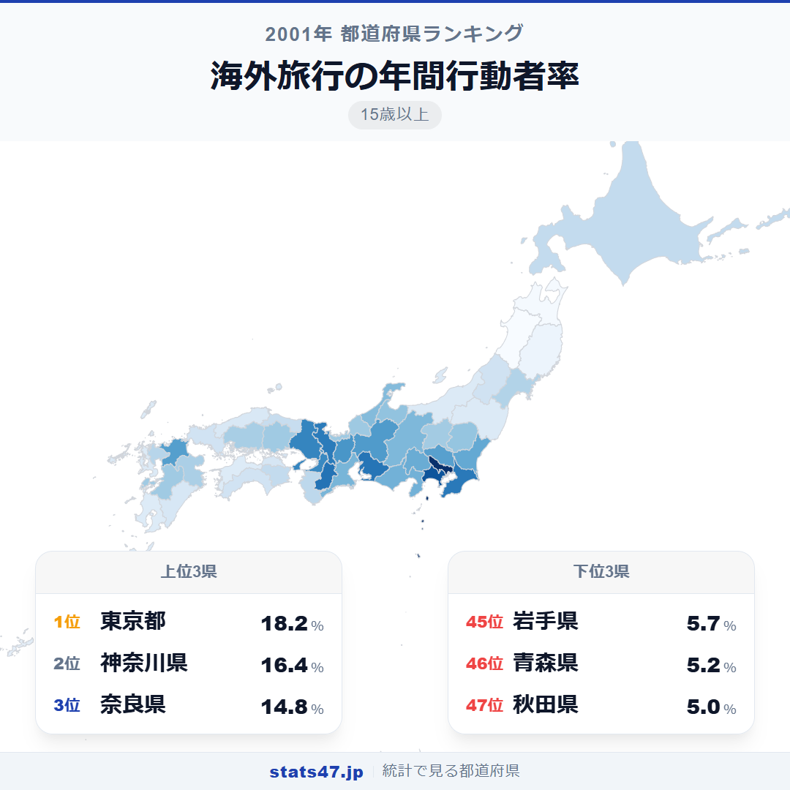
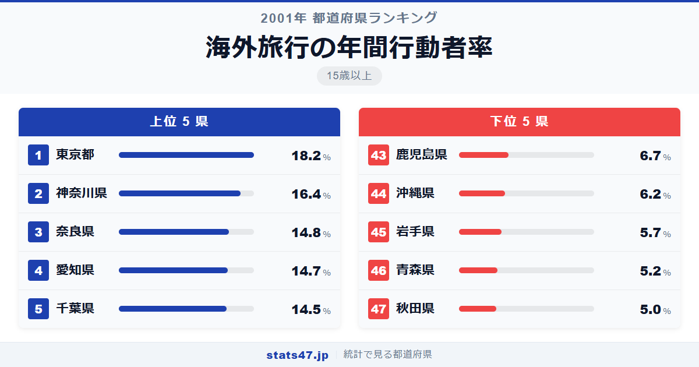
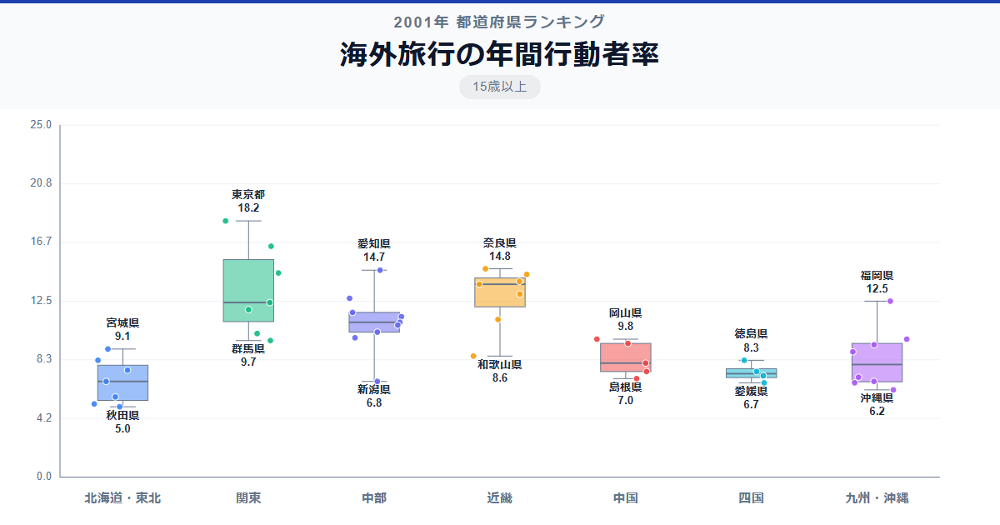

2001年、東京都民のほぼ5人に1人が海外旅行に行っていました。偏差値76.5の18.2％で全国1位。一方、秋田県はわずか5.0％。その差は3.6倍にのぼります。

同じ日本に住んでいても、海外旅行に行ける人と行けない人の差はこれほど大きい。空港へのアクセス、所得、そして海外への心理的距離が、この格差を生み出しています。

「海外旅行の年間行動者率」は、過去1年間に海外旅行を行った15歳以上の人の割合です。総務省「社会生活基本調査」の2001年データに基づいています。

## データハイライト

全国平均: 9.98％

1位: 東京都（18.2％ / 偏差値 76.5）

47位: 秋田県（5.0％ / 偏差値 34.0）

上位は東京都・神奈川県・奈良県・愛知県・千葉県と、国際空港へのアクセスが良い大都市圏が独占しています。下位には秋田県・青森県・岩手県と東北北部が集中しています。

## 【コロプレス地図】日本全国の分布

<!-- note投稿時: この画像行を削除し、images/choropleth-map-1080x1080.png をアップロード -->

三大都市圏が濃く、地方が薄い。国内旅行以上に鮮明な格差が地図に表れています。

首都圏と中京圏、近畿圏がはっきりと浮かび上がります。成田・関西・中部の国際空港に近い県ほど値が高く、空港アクセスが海外旅行参加率を左右していることが一目瞭然です。

東北は全体的に低いですが、特に太平洋側の岩手県と秋田県が45位・47位。仙台空港のある宮城県は27位と中位にとどまっており、空港の有無が地域差を生む典型例です。

## 上位5：分析

<!-- note投稿時: この画像行を削除し、images/chart-x-1200x630.png をアップロード -->

東京都は偏差値76.5で18.2％と2位に1.8ポイント差をつけています。成田空港・羽田空港という2つの国際空港へのアクセスに加え、所得水準の高さ、国際的なビジネス環境が海外渡航を後押ししています。

神奈川県が偏差値70.7の16.4％で2位。東京に隣接し、空港アクセスは東京都とほぼ同等。外資系企業の多い横浜を抱え、業務渡航も含めた海外旅行率が高くなっています。

3位は意外にも奈良県で偏差値65.5の14.8％。関西国際空港への距離が近く、所得水準も近畿圏では高い方。歴史ある観光地の県民は、海外の歴史文化にも関心が高いのかもしれません。

愛知県は4位で偏差値65.2の14.7％。中部国際空港の開港は2005年ですが、2001年時点でも名古屋空港からの国際線が充実しており、製造業の海外取引に伴う業務渡航も多い地域です。

千葉県が5位で偏差値64.6の14.5％。成田国際空港のお膝元であり、空港へのアクセスは全国随一。空港が近いという物理的な利便性が参加率を押し上げています。

## 下位5：分析

秋田県は偏差値34.0でわずか5.0％と最下位。県内に国際線のある空港がなく、海外旅行に出るためには仙台や東京まで移動する必要があります。冬の厳しさも加わり、旅行そのものへのハードルが高い地域です。

46位の青森県は偏差値34.6で5.2％。秋田県と同様に国際空港へのアクセスが悪く、東京まで新幹線で3時間以上かかる立地が海外旅行率の低さに直結しています。

岩手県が45位で偏差値36.2の5.7％。面積の広さから県内移動にも時間がかかり、空港までの距離が旅行の第一関門となっています。

沖縄県は44位、偏差値37.8で6.2％。那覇空港から国際線は出ていますが、アジアの近距離路線が中心で、欧米への便は限られていた時代です。所得水準の低さも影響しています。

43位の鹿児島県は偏差値39.4の6.7％。鹿児島空港から一部国際線はありましたが、本数は限られていました。南九州の地理的な位置が海外旅行のハードルを上げています。

## 地域別の傾向

<!-- note投稿時: この画像行を削除し、images/boxplot-1200x630.png をアップロード -->

関東・近畿・東海が突出して高く、東北・九州が低い傾向です。国際空港へのアクセスが地域差の最大要因であることが読み取れます。

## まとめ

海外旅行の年間行動者率の地域差は、国際空港へのアクセスと所得水準で大部分が説明できます。このデータから以下の洞察が得られます。

**空港アクセスが海外旅行率を決める**

上位5県はすべて国際空港の近くに位置しています。
空港まで気軽に行ける環境が、海外旅行を「特別なイベント」から「選択肢のひとつ」に変えています。

**東北北部は海外が遠い**

秋田県・青森県・岩手県が45位〜47位。
国際空港までの移動だけで半日がかりとなり、海外旅行のハードルが物理的に高くなっています。

**1位と47位の差は3.6倍**

東京都18.2％に対し秋田県5.0％。
国内旅行の1.5倍よりもはるかに大きな格差であり、海外旅行は「住む場所」で決まる部分が大きいことがわかります。

## もっと詳しく知りたい方へ

全47都道府県の順位や、グラフ・地図での可視化は stats47 で見ることができます。

### 海外旅行の年間行動者率ランキング（15歳以上） 全都道府県版

https://stats47.jp/ranking/overseas-travel-annual-participation-rate-15plus

### 海外旅行の年間行動者率ランキング（10歳以上）

https://stats47.jp/ranking/overseas-travel-annual-participation-rate-10plus

### 旅行・行楽の年間行動者率ランキング（15歳以上）

https://stats47.jp/ranking/travel-leisure-annual-participation-rate-15plus

### 旅行・行楽の年間行動者率ランキング（10歳以上）

https://stats47.jp/ranking/travel-leisure-annual-participation-rate-10plus

### スポーツの年間行動者率ランキング

https://stats47.jp/ranking/sports-annual-participation-rate-10plus

### ボランティア活動の年間行動者率ランキング（15歳以上）

https://stats47.jp/ranking/volunteer-activity-annual-participation-rate-15plus

---

**stats47** は、e-Stat の公的統計データを47都道府県別に可視化するサービスです。
ランキング・散布図・時系列チャートで、地域の違いがひと目でわかります。

https://stats47.jp
