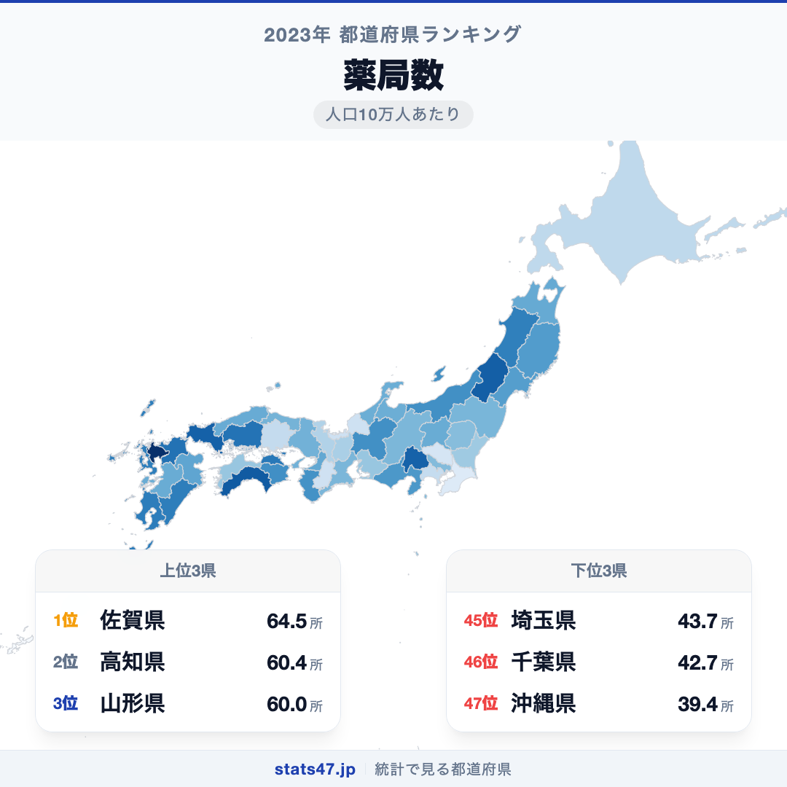
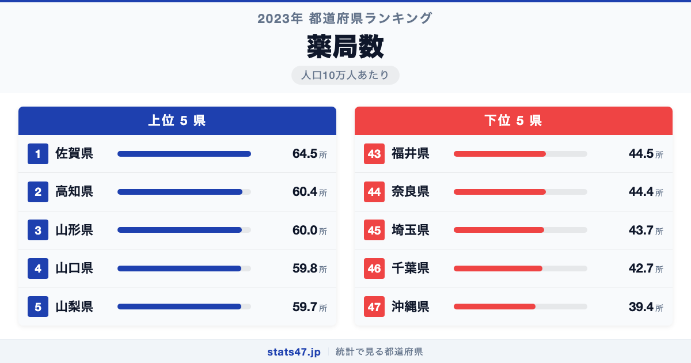
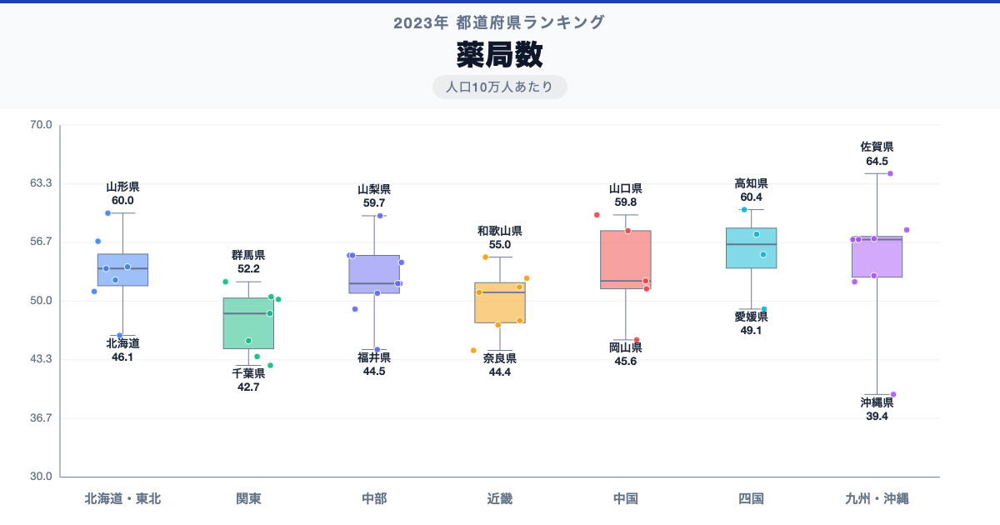

人口10万人あたりの薬局数が最も多い都道府県はどこか。東京や大阪のような大都市を思い浮かべるかもしれません。しかし、全国1位は佐賀県です。人口10万人あたり64.5所で偏差値73.3。一方、最下位の沖縄県は39.4所で偏差値25.4にとどまり、その差は約1.6倍に広がっています。

なぜ九州の小さな県がトップに立ち、沖縄がこれほど少ないのか。そこには高齢化率や医療提供体制、地域に根づいた「かかりつけ薬局」文化の違いが見えてきます。

「薬局数」は、人口10万人あたりの薬局施設数を都道府県別に集計したものです。厚生労働省の衛生行政報告例に基づく2023年度のデータを使用しています。

## データハイライト

全国平均: 52.29所

1位: 佐賀県（64.5所 / 偏差値 73.3）

47位: 沖縄県（39.4所 / 偏差値 25.4）

全国平均は52.29所で、標準偏差は5.23所。1位と47位の差が1.6倍と比較的小さく、都道府県間の格差が穏やかな指標です。ただし、上位には地方の県が並び、下位には都市近郊や沖縄が集まるという独特のパターンが見られます。

## 【コロプレス地図】日本全国の分布

<!-- note投稿時: この画像行を削除し、images/choropleth-map-1080x1080.png をアップロード -->

地図を見ると、東北から中国地方にかけての日本海側と四国で薬局密度が高い傾向が読み取れます。佐賀県・高知県・山形県・山口県・山梨県と、いずれも人口規模が小さく高齢化が進んだ地域が上位に並んでいます。

一方、首都圏の埼玉県や千葉県は人口増加に薬局の開設が追いついていない面があり、下位に沈んでいます。沖縄県は全国で唯一40所を下回り、突出して少ない状況です。

「薬局が多い＝都会」というイメージとは裏腹に、地方ほど人口あたりの薬局密度が高いのは興味深いパターンです。高齢者が多い地域では処方箋の需要が高く、門前薬局が病院のそばに集中的に開設されてきた歴史的な経緯が影響していると考えられます。

## 上位5：分析

<!-- note投稿時: この画像行を削除し、images/chart-x-1200x630.png をアップロード -->

九州で最も面積が小さい佐賀県が、人口10万人あたり64.5所で偏差値73.3の全国1位です。佐賀県は高齢化率が高く、個人経営の小規模薬局が地域に根づいてきた歴史があります。大型チェーンよりも地元密着型の薬局が多いことが、この数字を押し上げています。

2位の高知県は60.4所で偏差値65.5。四国の中でも特に高齢化が進んだ県で、中山間地域に散在する診療所と連携する形で薬局が配置されています。

山形県は60.0所、偏差値64.7で3位につけています。東北地方は冬場の通院が困難になりやすく、身近な場所に薬局があることが住民の生活を支える重要なインフラとなっています。

意外に思えるのが4位の山口県です。59.8所で偏差値64.3。本州の西端に位置し、下関市を中心に古くから医療機関が充実してきた県で、それに比例して薬局も多く開設されてきました。

5位は山梨県の59.7所、偏差値64.1。甲府盆地を中心にコンパクトな都市構造の中で、人口規模に対して薬局が手厚く配置されている地域です。

## 下位5：分析

沖縄県が39.4所、偏差値25.4で全国最下位です。沖縄は本土復帰後に医療制度が整備された経緯から、薬局の開設ペースが他県より遅れました。また、若年人口の割合が高いことも人口あたりの薬局需要を抑える要因になっています。

千葉県は42.7所で偏差値31.7の46位。東京のベッドタウンとして人口が急増したエリアでは、薬局の数が住民の増加に追いついていない状況が続いています。

43位の埼玉県も同様の構図で、43.7所、偏差値33.6。東京通勤圏として人口が集中する一方、医療機関や薬局の開設は都心に偏りがちです。

奈良県は44.4所で偏差値34.9の44位。大阪への通勤者が多いベッドタウン型の県で、医療機関の利用自体が隣接する大阪府に流出している面もあります。

そして福井県が44.5所、偏差値35.1で43位です。北陸地方では珍しく薬局密度が低い県ですが、これは大規模な調剤薬局チェーンへの集約が進んでいることが一因と見られます。

## 地域別の傾向

<!-- note投稿時: この画像行を削除し、images/boxplot-1200x630.png をアップロード -->

東北・四国・中国地方が高く、関東と沖縄が低い傾向です。全47都道府県の順位は stats47 で確認できます。

## まとめ

薬局数の地域差は、単なる医療施設の多寡ではなく、地域の高齢化や都市構造を映し出す指標です。このデータから以下の洞察が得られます。

**地方ほど薬局が身近にある逆転現象**

大都市圏よりも地方の県のほうが人口あたりの薬局数が多いのは、高齢者の処方箋需要と門前薬局の歴史的蓄積が反映された結果です。

**ベッドタウン型の県は薬局が手薄**

埼玉県・千葉県・奈良県のように、大都市のベッドタウンとして人口が増えた県では薬局の開設が追いついていません。
医療機関の利用が隣接する大都市に流出していることも影響しています。

**沖縄県の突出した少なさには歴史的背景がある**

本土復帰後に医療制度が整備された沖縄は、薬局の開設も遅れてスタートしました。
若い人口構成も薬局需要を抑える要因になっており、全国平均を大きく下回る結果となっています。

## もっと詳しく知りたい方へ

全47都道府県の順位や、グラフ・地図での可視化は stats47 で見ることができます。

### 薬局数ランキング 全都道府県版

https://stats47.jp/ranking/pharmacy-count-per-100k

### 一般診療所数ランキング

https://stats47.jp/ranking/general-clinic-count-per-100k

### 医師数ランキング

https://stats47.jp/ranking/physicians-in-medical-facilities-per-100k

### 国民医療費ランキング

https://stats47.jp/ranking/national-medical-expense-per-person

### 理容・美容所数の地域格差（stats47ブログ）

https://stats47.jp/blog/barber-beauty-salon-regional-gap

---

**stats47** は、e-Stat の公的統計データを47都道府県別に可視化するサービスです。
ランキング・散布図・時系列チャートで、地域の違いがひと目でわかります。

https://stats47.jp
