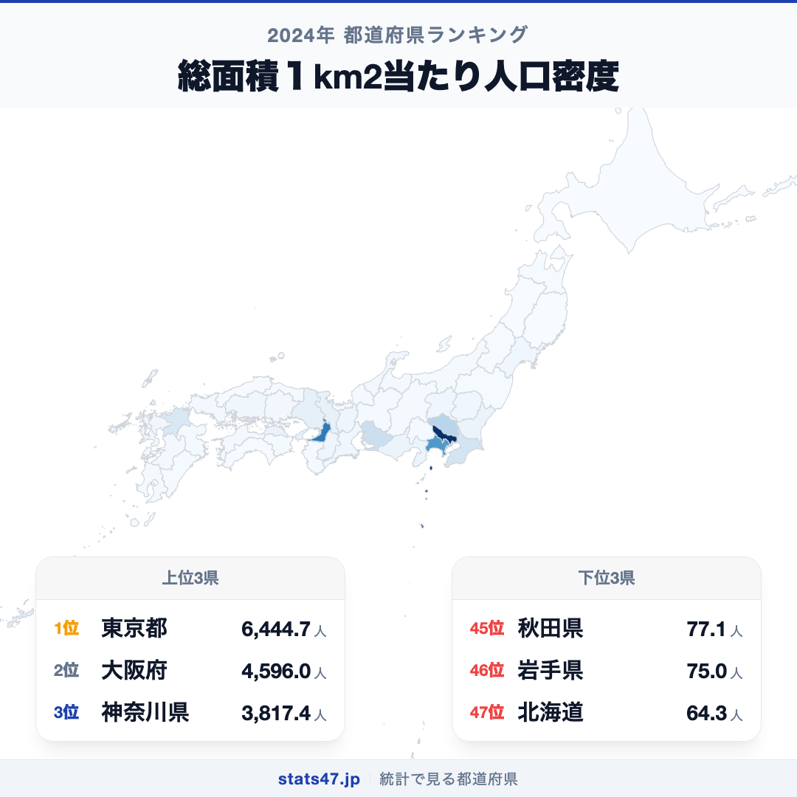
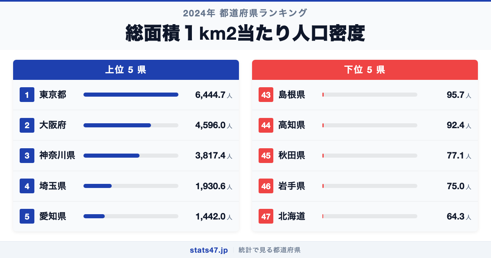
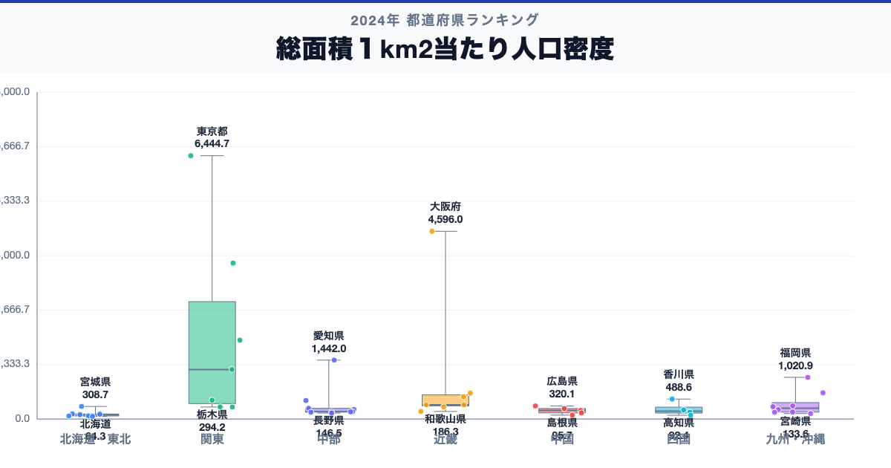

1平方キロメートルに6445人が暮らす東京都と、わずか64人の北海道。同じ日本でありながら、人口密度の差は実に100倍を超えます。偏差値97.8の東京都に対し、最下位の北海道は偏差値45.2。この圧倒的な格差は、日本の国土利用がいかに偏っているかを物語っています。

上位4県はすべて首都圏・関西圏に集中し、下位には広大な面積を持つ東北や中国地方の県が並びます。面積と人口のバランスが生む「密度」の違いには、各地域の歴史と産業構造が凝縮されています。

「総面積1km2あたり人口密度」は、各都道府県の総人口を総面積で割った値です。総務省の人口推計に基づく2024年度のデータを使用しています。

## データハイライト

全国平均: 649.56人

1位: 東京都（6444.7人 / 偏差値 97.8）

47位: 北海道（64.3人 / 偏差値 45.2）

標準偏差は1212.57人と極めて大きく、東京都・大阪府・神奈川県の3都府県が突出しています。全国平均の649.56人を上回るのは10都府県に満たず、大多数の道県は平均以下に集まっています。1位と47位の差が100.2倍という、都道府県ランキングの中でも最大級の格差を持つ指標です。

## 【コロプレス地図】日本全国の分布

<!-- note投稿時: この画像行を削除し、images/choropleth-map-1080x1080.png をアップロード -->

地図を見ると、太平洋ベルト地帯に沿って人口密度の高い都府県が帯状に連なる様子がわかります。東京を中心に神奈川・埼玉が濃く染まり、大阪・愛知もくっきりと浮かび上がっています。

対照的に、北海道・東北・山陰・四国南部は広く薄い色が広がっています。特に北海道は83,424km2という圧倒的な面積が人口密度を押し下げ、全国最下位となっています。

九州では福岡県だけが濃い色を示しており、九州の人口が福岡一極に集中している構図も読み取れます。

## 上位5：分析

<!-- note投稿時: この画像行を削除し、images/chart-x-1200x630.png をアップロード -->

わずか2,194km2の面積に約1,400万人がひしめく東京都は、6444.7人で偏差値97.8。2位の大阪府にも1.4倍の差をつけ、日本の人口集中を象徴する存在です。23区内に限れば密度はさらに跳ね上がり、世界でも有数の過密都市として知られています。

大阪府は4596.0人、偏差値82.5で2位。面積は全国で2番目に小さい1,905km2ですが、約880万人が暮らしています。面積の小ささと人口の多さが掛け合わさって高い密度を生んでいます。

3位の神奈川県は3817.4人で偏差値76.1。横浜市・川崎市という巨大都市を抱え、東京のベッドタウンとしても機能する県です。県の面積は2,416km2と決して大きくありません。

意外にも4位は埼玉県です。1930.6人、偏差値60.6。東京への通勤圏として南部を中心に人口が密集していますが、北部の秩父地域は山間部で人口が希薄であり、県全体としては神奈川の約半分の密度にとどまります。

5位の愛知県は1442.0人で偏差値56.5。名古屋市を中心とする中京圏の核であり、自動車産業を軸にした雇用吸引力が人口集中を支えています。

## 下位5：分析

広大な大地が広がる北海道は、64.3人で偏差値45.2の全国最下位です。面積は全国の約22%を占める83,424km2ですが、人口は約510万人。札幌市に人口の3分の1以上が集中しており、それ以外の地域は極めて人口密度が低い状態です。

46位の岩手県は75.0人、偏差値45.3。本州で最も面積が大きい県であり、北上山地が県の大部分を占めています。人口減少も進んでおり、密度の低下が続いています。

秋田県は77.1人で偏差値45.3の45位。人口減少率が全国トップクラスで、毎年のように密度が低下しています。

高知県は92.4人、偏差値45.4で44位。四国山地に囲まれた地形のため可住地が限られていますが、総面積ベースでは密度が低くなっています。

そして島根県が95.7人、偏差値45.4で43位です。山陰地方特有の過疎化が長年続き、人口減少に歯止めがかからない状況にあります。

## 地域別の傾向

<!-- note投稿時: この画像行を削除し、images/boxplot-1200x630.png をアップロード -->

関東と近畿が突出して高く、北海道・東北が低い傾向です。関東は東京・神奈川・埼玉が平均を大きく引き上げています。全47都道府県の順位は stats47 で確認できます。

## まとめ

人口密度の地域差は、日本の国土がいかに不均一に利用されているかを数字で示す鏡のような指標です。このデータから以下の洞察が得られます。

**100倍の格差は先進国でも異例**

東京都と北海道の人口密度差は100.2倍。国土面積の約7割を森林が占める日本では、可住地への人口集中が極端に進んでおり、この格差は先進国の中でも際立っています。

**上位5はすべて三大都市圏**

東京・大阪・神奈川・埼玉・愛知と、三大都市圏がそのまま上位を占めています。
経済活動と人口が特定の都市圏に集中する構造が、人口密度ランキングにも如実に表れています。

**下位5はすべて面積の広い道県**

北海道・岩手・秋田・高知・島根と、面積が広いか山地が多い道県が下位に並びます。
人口減少が加速する地域では、今後さらに密度の低下が進むと見込まれています。

## もっと詳しく知りたい方へ

全47都道府県の順位や、グラフ・地図での可視化は stats47 で見ることができます。

### 人口密度ランキング 全都道府県版

https://stats47.jp/ranking/population-density-per-km2-total-area

### 総人口ランキング

https://stats47.jp/ranking/total-population

### 65歳以上人口割合ランキング

https://stats47.jp/ranking/ratio-65-plus

### 合計特殊出生率ランキング

https://stats47.jp/ranking/total-fertility-rate

### 人口密度と都市化の関係（stats47ブログ）

https://stats47.jp/blog/population-density-urbanization

---

**stats47** は、e-Stat の公的統計データを47都道府県別に可視化するサービスです。
ランキング・散布図・時系列チャートで、地域の違いがひと目でわかります。

https://stats47.jp

---

## 公開時にコピーするハッシュタグ

<!-- 公開時に下のハッシュタグ行をカット → 公開設定のタグ欄にペースト → 本セクションを削除 -->

#都道府県ランキング #人口密度 #人口 #人口分布 #人口集中 #過疎 #過疎化 #都市化 #都市 #田舎 #地方 #地方創生 #地方消滅 #国土利用 #可住地 #面積 #人口減少 #人口動態 #総務省 #人口推計 #東京都 #東京 #大阪府 #大阪 #神奈川県 #横浜 #川崎 #埼玉県 #愛知県 #名古屋 #北海道 #札幌 #岩手県 #秋田県 #高知県 #島根県 #首都圏 #近畿圏 #三大都市圏 #太平洋ベルト #東京一極集中 #首都圏一極集中 #ベッドタウン #山間部 #47都道府県 #都道府県比較 #統計データ #データ分析 #公的統計 #e-Stat #地域格差 #地域間格差 #2024年 #令和6年 #データで見る日本 #stats47 #政府統計 #都道府県データ #データ可視化 #データジャーナリズム #インフォグラフィック #地域比較 #ランキング #日本 #統計 #可視化 #グラフ #チャート #地図 #コロプレス #都道府県別 #47県 #比較データ #社会統計 #青森県 #宮城県 #山形県 #福島県 #茨城県 #栃木県 #群馬県 #千葉県 #新潟県 #富山県 #石川県 #福井県 #山梨県 #長野県 #岐阜県 #静岡県
