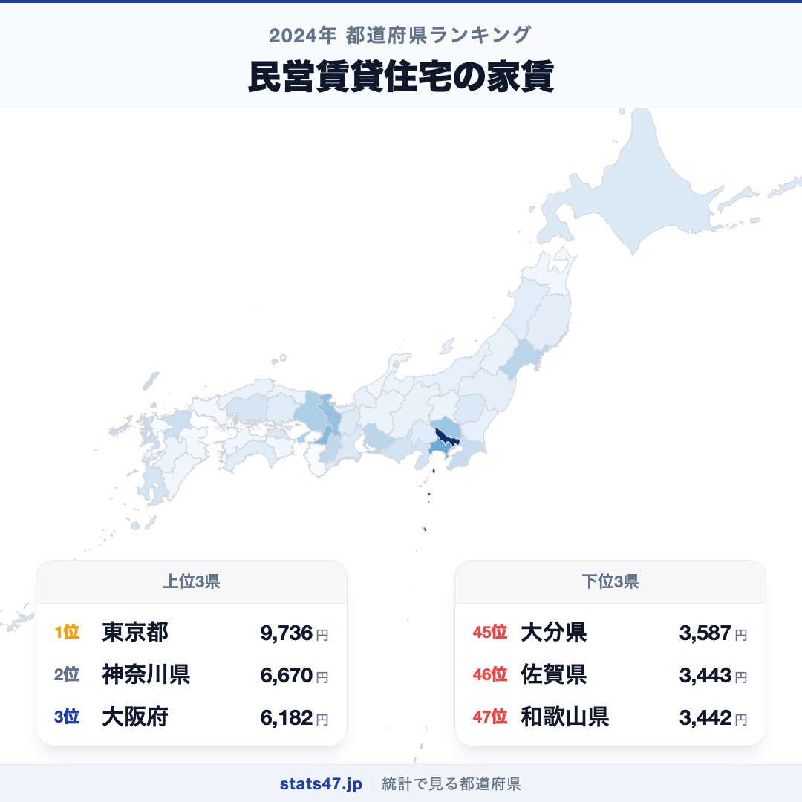
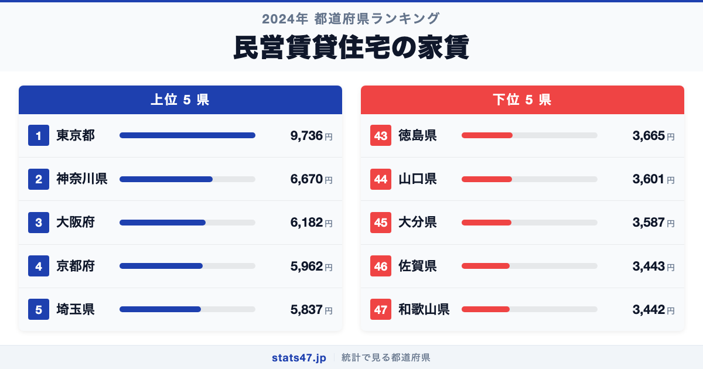
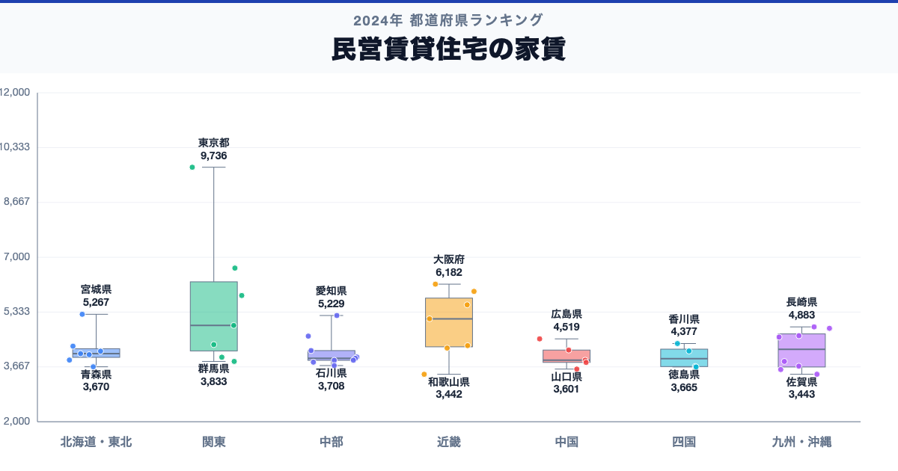

東京都が全国1位、和歌山県が47位。民営賃貸住宅の家賃には、同じ日本の中でも2.8倍の開きがあります。

首位の東京都は9,736円で偏差値98.9、最下位の和歌山県は3,442円で偏差値40.5です。なぜこれほど差があるのでしょうか。

「民営賃貸住宅の家賃」は、民営賃貸住宅の家賃について、都道府県別に同じ定義で集計した値です。単年の順位だけで判断せず、同じ定義の時系列と関連する内訳を併せて確認します。

## データハイライト

全国平均: 4,466.91円

1位: 東京都　9,736円 / 偏差値 98.9

47位: 和歌山県　3,442円 / 偏差値 40.5

上位5県と下位5県の間には明確な開きがあります。一方、順位が近い県では値の差が小さい場合もあるため、一つの順位差を地域の優劣として扱わないことが大切です。

## 【コロプレス地図】日本全国の分布

<!-- note投稿時: この画像行を削除し、images/choropleth-map-1080x1080.png をアップロード -->

地域中央値が最も高いのは近畿で5,129円、最も低いのは中国で3,871円です。県別の順位だけでなく、まとまりとして見ると分布の偏りを捉えやすくなります。

ただし、地域内にもばらつきがあります。総数・比率・平均のどれを測る指標かを確認し、値の大きさを地域の優劣へ置き換えないことが重要です。低い値にも人口規模、分母、対象範囲など複数の要因があり、このランキングだけで原因は決められません。地図の色を原因の地図とみなさず、観測された分布として読みます。

## 上位5：分析

<!-- note投稿時: この画像行を削除し、images/chart-x-1200x630.png をアップロード -->

全国首位の東京都は1位で、9,736円、偏差値は98.9です。全国平均を5,269.09円上回ります。総数・比率・平均のどれを測る指標かを確認し、値の大きさを地域の優劣へ置き換えないことが重要です。この順位だけで原因を決めず、指標の分子・分母、構成内訳、人口規模、同一定義の時系列、一次資料の注記を確認すると背景を分解できます。

続く神奈川県は2位で、6,670円、偏差値は70.5です。全国平均を2,203.09円上回ります。関東に位置し、同じ地域内の県と比べる視点も必要です。この順位だけで原因を決めず、指標の分子・分母、構成内訳、人口規模、同一定義の時系列、一次資料の注記を確認すると背景を分解できます。

上位に入った大阪府は3位で、6,182円、偏差値は65.9です。全国平均を1,715.09円上回ります。近畿に位置し、同じ地域内の県と比べる視点も必要です。この順位だけで原因を決めず、指標の分子・分母、構成内訳、人口規模、同一定義の時系列、一次資料の注記を確認すると背景を分解できます。

4番手の京都府は4位で、5,962円、偏差値は63.9です。全国平均を1,495.09円上回ります。近畿に位置し、同じ地域内の県と比べる視点も必要です。この順位だけで原因を決めず、指標の分子・分母、構成内訳、人口規模、同一定義の時系列、一次資料の注記を確認すると背景を分解できます。

上位5県を締める埼玉県は5位で、5,837円、偏差値は62.7です。全国平均を1,370.09円上回ります。関東に位置し、同じ地域内の県と比べる視点も必要です。この順位だけで原因を決めず、指標の分子・分母、構成内訳、人口規模、同一定義の時系列、一次資料の注記を確認すると背景を分解できます。

## 下位5：分析

下位側を見ると、徳島県は43位で、3,665円、偏差値は42.6です。全国平均を801.91円下回ります。四国の中でも、この県の位置を周辺県と見比べることが次の手がかりです。単年の順位だけで判断せず、同じ定義の時系列と関連する内訳を併せて確認します。

次に山口県は44位で、3,601円、偏差値は42.0です。全国平均を865.91円下回ります。中国の中でも、この県の位置を周辺県と見比べることが次の手がかりです。単年の順位だけで判断せず、同じ定義の時系列と関連する内訳を併せて確認します。

45位の大分県は45位で、3,587円、偏差値は41.8です。全国平均を879.91円下回ります。九州・沖縄の中でも、この県の位置を周辺県と見比べることが次の手がかりです。単年の順位だけで判断せず、同じ定義の時系列と関連する内訳を併せて確認します。

46位の佐賀県は46位で、3,443円、偏差値は40.5です。全国平均を1,023.91円下回ります。九州・沖縄の中でも、この県の位置を周辺県と見比べることが次の手がかりです。単年の順位だけで判断せず、同じ定義の時系列と関連する内訳を併せて確認します。

最下位の和歌山県は47位で、3,442円、偏差値は40.5です。全国平均を1,024.91円下回ります。低い値にも人口規模、分母、対象範囲など複数の要因があり、このランキングだけで原因は決められません。単年の順位だけで判断せず、同じ定義の時系列と関連する内訳を併せて確認します。

## あなたの県は何位？

ここまで上位・下位の10県を見てきましたが、残る37県の順位も気になるはずです。全47都道府県の順位は、色分け地図と並べ替え可能なグラフ付きでstats47から確認できます。

### 民営賃貸住宅の家賃ランキング 全47都道府県版

https://stats47.jp/ranking/private-rental-housing-rent-per-3-3m2

## 地域別の傾向

<!-- note投稿時: この画像行を削除し、images/boxplot-1200x630.png をアップロード -->

箱ひげ図では、近畿の中央値が高く、中国が低い配置です。ただし、箱の重なりや外れた県も確認し、地域名だけで各県の値を決めつけないようにします。

## このランキングを正しく読む3つの視点

**総数と比率を混同しない**

総数・比率・平均のどれを測る指標かを確認し、値の大きさを地域の優劣へ置き換えないことが重要です。低い値にも人口規模、分母、対象範囲など複数の要因があり、このランキングだけで原因は決められません。

**順位だけで原因を決めない**

このデータから直接分かるのは、2024年の47都道府県の値と順位です。背景を確かめるには、指標の分子・分母、構成内訳、人口規模、同一定義の時系列、一次資料の注記が必要です。

**対象年と定義を確認する**

単年の順位だけで判断せず、同じ定義の時系列と関連する内訳を併せて確認します。別年や別調査と比べるときは、対象となる世帯・人・施設と単位をそろえます。

## まとめ

民営賃貸住宅の家賃の地域差は、単純な県の優劣ではなく、指標の対象と地域条件の違いを映しています。

**首位と最下位には2.8倍の開き**

東京都の9,736円に対し、和歌山県は3,442円でした。まずは差の大きさを事実として押さえます。

**地域のまとまりと県内差は両方見る**

地域中央値には違いがありますが、同じ地域のすべての県が同じ傾向とは限りません。地図と全47県の順位を併用すると例外も見つけられます。

**次のデータで理由を分解する**

指標の分子・分母、構成内訳、人口規模、同一定義の時系列、一次資料の注記を重ねれば、総数・割合・価格・人口構成など、順位を動かす要素を切り分けられます。

## もっと詳しく知りたい方へ

全47都道府県の順位や、グラフ・地図での可視化はstats47で確認できます。

### 民営賃貸住宅の家賃ランキング 全都道府県版

https://stats47.jp/ranking/private-rental-housing-rent-per-3-3m2

### 共同住宅比率

https://stats47.jp/ranking/apartment-ratio

### 建築技術者の平均年収

https://stats47.jp/ranking/architect-annual-income

### オートロック付共同住宅率

https://stats47.jp/ranking/autolock-apartment-rate

---

**stats47** は、e-Statなどの公的統計データを47都道府県別に可視化するサービスです。ランキング・散布図・時系列チャートで、地域の違いがひと目で分かります。

https://stats47.jp
