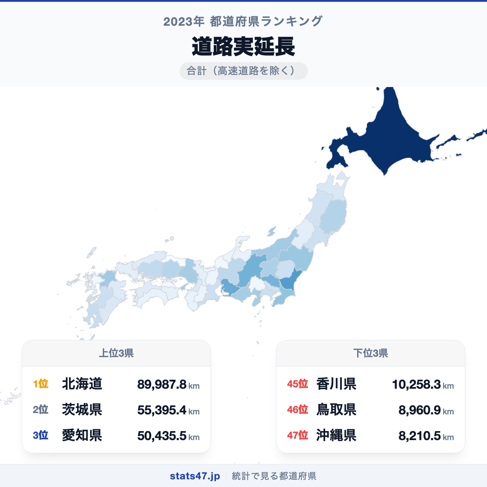
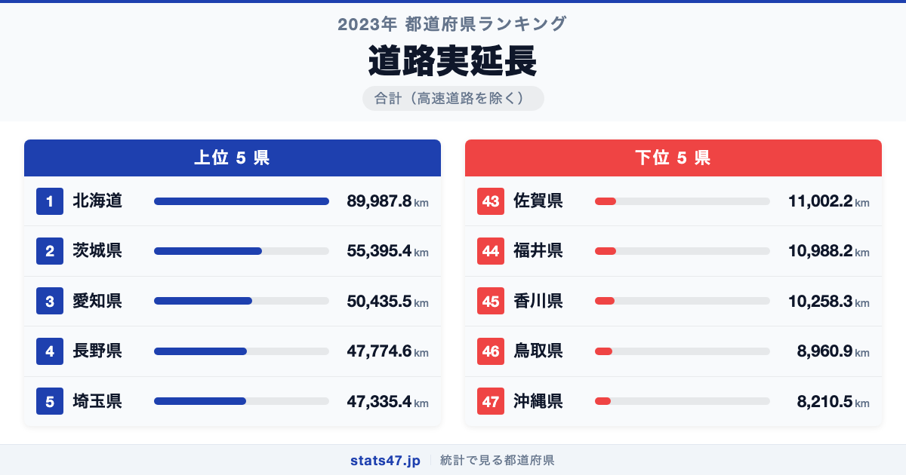
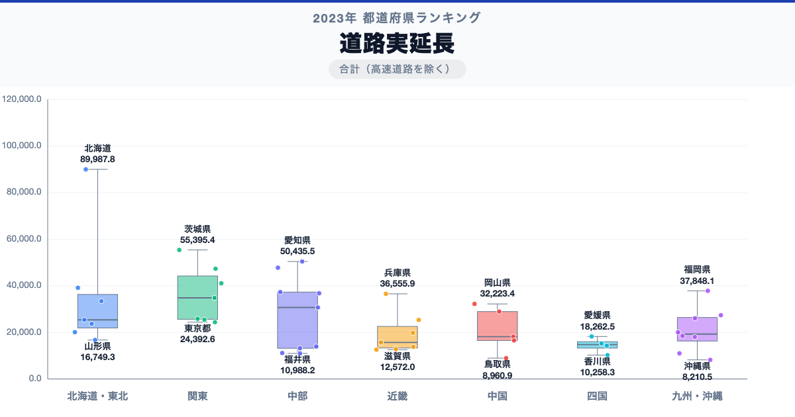

北海道が全国1位、沖縄県が47位。道路実延長には、同じ日本の中でも11倍の開きがあります。

首位の北海道は89,987.8kmで偏差値92.2、最下位の沖縄県は8,210.5kmで偏差値38.3です。なぜこれほど差があるのでしょうか。

「道路実延長」は、道路実延長について、都道府県別に同じ定義で集計した値です。単年の順位だけで判断せず、同じ定義の時系列と関連する内訳を併せて確認します。

## データハイライト

全国平均: 25,996.79km

1位: 北海道　89,987.8km / 偏差値 92.2

47位: 沖縄県　8,210.5km / 偏差値 38.3

上位5県と下位5県の間には明確な開きがあります。一方、順位が近い県では値の差が小さい場合もあるため、一つの順位差を地域の優劣として扱わないことが大切です。

## 【コロプレス地図】日本全国の分布

<!-- note投稿時: この画像行を削除し、images/choropleth-map-1080x1080.png をアップロード -->

地域中央値が最も高いのは北海道で89,987.8km、最も低いのは四国で14,773.45kmです。県別の順位だけでなく、まとまりとして見ると分布の偏りを捉えやすくなります。

ただし、地域内にもばらつきがあります。総数・比率・平均のどれを測る指標かを確認し、値の大きさを地域の優劣へ置き換えないことが重要です。低い値にも人口規模、分母、対象範囲など複数の要因があり、このランキングだけで原因は決められません。地図の色を原因の地図とみなさず、観測された分布として読みます。

## 上位5：分析

<!-- note投稿時: この画像行を削除し、images/chart-x-1200x630.png をアップロード -->

全国首位の北海道は1位で、89,987.8km、偏差値は92.2です。全国平均を63,991.01km上回ります。総数・比率・平均のどれを測る指標かを確認し、値の大きさを地域の優劣へ置き換えないことが重要です。この順位だけで原因を決めず、指標の分子・分母、構成内訳、人口規模、同一定義の時系列、一次資料の注記を確認すると背景を分解できます。

続く茨城県は2位で、55,395.4km、偏差値は69.4です。全国平均を29,398.61km上回ります。関東に位置し、同じ地域内の県と比べる視点も必要です。この順位だけで原因を決めず、指標の分子・分母、構成内訳、人口規模、同一定義の時系列、一次資料の注記を確認すると背景を分解できます。

上位に入った愛知県は3位で、50,435.5km、偏差値は66.1です。全国平均を24,438.71km上回ります。中部に位置し、同じ地域内の県と比べる視点も必要です。この順位だけで原因を決めず、指標の分子・分母、構成内訳、人口規模、同一定義の時系列、一次資料の注記を確認すると背景を分解できます。

4番手の長野県は4位で、47,774.6km、偏差値は64.4です。全国平均を21,777.81km上回ります。中部に位置し、同じ地域内の県と比べる視点も必要です。この順位だけで原因を決めず、指標の分子・分母、構成内訳、人口規模、同一定義の時系列、一次資料の注記を確認すると背景を分解できます。

上位5県を締める埼玉県は5位で、47,335.4km、偏差値は64.1です。全国平均を21,338.61km上回ります。関東に位置し、同じ地域内の県と比べる視点も必要です。この順位だけで原因を決めず、指標の分子・分母、構成内訳、人口規模、同一定義の時系列、一次資料の注記を確認すると背景を分解できます。

## 下位5：分析

下位側を見ると、佐賀県は43位で、11,002.2km、偏差値は40.1です。全国平均を14,994.59km下回ります。九州・沖縄の中でも、この県の位置を周辺県と見比べることが次の手がかりです。単年の順位だけで判断せず、同じ定義の時系列と関連する内訳を併せて確認します。

次に福井県は44位で、10,988.2km、偏差値は40.1です。全国平均を15,008.59km下回ります。中部の中でも、この県の位置を周辺県と見比べることが次の手がかりです。単年の順位だけで判断せず、同じ定義の時系列と関連する内訳を併せて確認します。

45位の香川県は45位で、10,258.3km、偏差値は39.6です。全国平均を15,738.49km下回ります。四国の中でも、この県の位置を周辺県と見比べることが次の手がかりです。単年の順位だけで判断せず、同じ定義の時系列と関連する内訳を併せて確認します。

46位の鳥取県は46位で、8,960.9km、偏差値は38.8です。全国平均を17,035.89km下回ります。中国の中でも、この県の位置を周辺県と見比べることが次の手がかりです。単年の順位だけで判断せず、同じ定義の時系列と関連する内訳を併せて確認します。

最下位の沖縄県は47位で、8,210.5km、偏差値は38.3です。全国平均を17,786.29km下回ります。低い値にも人口規模、分母、対象範囲など複数の要因があり、このランキングだけで原因は決められません。単年の順位だけで判断せず、同じ定義の時系列と関連する内訳を併せて確認します。

## あなたの県は何位？

ここまで上位・下位の10県を見てきましたが、残る37県の順位も気になるはずです。全47都道府県の順位は、色分け地図と並べ替え可能なグラフ付きでstats47から確認できます。

### 道路実延長ランキング 全47都道府県版

https://stats47.jp/ranking/road-total-length

## 地域別の傾向

<!-- note投稿時: この画像行を削除し、images/boxplot-1200x630.png をアップロード -->

箱ひげ図では、北海道の中央値が高く、四国が低い配置です。ただし、箱の重なりや外れた県も確認し、地域名だけで各県の値を決めつけないようにします。

## このランキングを正しく読む3つの視点

**総数と比率を混同しない**

総数・比率・平均のどれを測る指標かを確認し、値の大きさを地域の優劣へ置き換えないことが重要です。低い値にも人口規模、分母、対象範囲など複数の要因があり、このランキングだけで原因は決められません。

**順位だけで原因を決めない**

このデータから直接分かるのは、2023年の47都道府県の値と順位です。背景を確かめるには、指標の分子・分母、構成内訳、人口規模、同一定義の時系列、一次資料の注記が必要です。

**対象年と定義を確認する**

単年の順位だけで判断せず、同じ定義の時系列と関連する内訳を併せて確認します。別年や別調査と比べるときは、対象となる世帯・人・施設と単位をそろえます。

## まとめ

道路実延長の地域差は、単純な県の優劣ではなく、指標の対象と地域条件の違いを映しています。

**首位と最下位には11倍の開き**

北海道の89,987.8kmに対し、沖縄県は8,210.5kmでした。まずは差の大きさを事実として押さえます。

**地域のまとまりと県内差は両方見る**

地域中央値には違いがありますが、同じ地域のすべての県が同じ傾向とは限りません。地図と全47県の順位を併用すると例外も見つけられます。

**次のデータで理由を分解する**

指標の分子・分母、構成内訳、人口規模、同一定義の時系列、一次資料の注記を重ねれば、総数・割合・価格・人口構成など、順位を動かす要素を切り分けられます。

## もっと詳しく知りたい方へ

全47都道府県の順位や、グラフ・地図での可視化はstats47で確認できます。

### 道路実延長ランキング 全都道府県版

https://stats47.jp/ranking/road-total-length

### 空港数

https://stats47.jp/ranking/airport-count

### 街区公園数

https://stats47.jp/ranking/block-park-count-per-100km2

### 街区公園数

https://stats47.jp/ranking/block-park-count

---

**stats47** は、e-Statなどの公的統計データを47都道府県別に可視化するサービスです。ランキング・散布図・時系列チャートで、地域の違いがひと目で分かります。

https://stats47.jp
