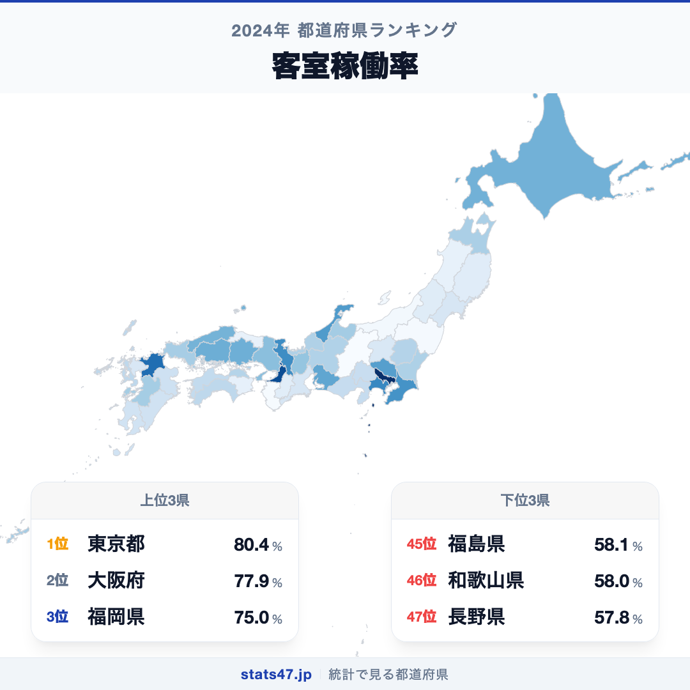
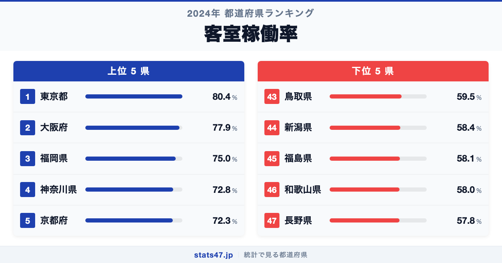
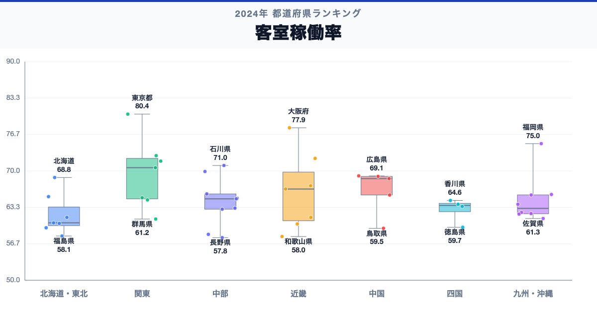

東京都が全国1位、長野県が47位。客室稼働率には、同じ日本の中でも1.4倍の開きがあります。

首位の東京都は80.4％で偏差値79.4、最下位の長野県は57.8％で偏差値35.6です。なぜこれほど差があるのでしょうか。

「客室稼働率」は、利用可能な客室のうち実際に利用された客室の割合です。年間平均は繁忙期と閑散期をならすため、月別・施設タイプ別の違いを隠します。

## データハイライト

全国平均: 65.22％

1位: 東京都　80.4％ / 偏差値 79.4

47位: 長野県　57.8％ / 偏差値 35.6

上位5県と下位5県の間には明確な開きがあります。一方、順位が近い県では値の差が小さい場合もあるため、一つの順位差を地域の優劣として扱わないことが大切です。

## 【コロプレス地図】日本全国の分布

<!-- note投稿時: この画像行を削除し、images/choropleth-map-1080x1080.png をアップロード -->

地域中央値が最も高いのは関東で70.6％、最も低いのは東北で60.45％です。県別の順位だけでなく、まとまりとして見ると分布の偏りを捉えやすくなります。

ただし、地域内にもばらつきがあります。都市観光、業務需要、イベントなど複数の宿泊需要と、供給される客室数の関係が値に表れます。低い値は観光の魅力不足とは限らず、客室供給の多さや季節変動にも左右されます。地図の色を原因の地図とみなさず、観測された分布として読みます。

## 上位5：分析

<!-- note投稿時: この画像行を削除し、images/chart-x-1200x630.png をアップロード -->

全国首位の東京都は1位で、80.4％、偏差値は79.4です。全国平均を15.18％上回ります。都市観光、業務需要、イベントなど複数の宿泊需要と、供給される客室数の関係が値に表れます。この順位だけで原因を決めず、延べ宿泊者数、客室数、月別稼働率、外国人延べ宿泊者数、宿泊施設タイプを確認すると背景を分解できます。

続く大阪府は2位で、77.9％、偏差値は74.5です。全国平均を12.68％上回ります。近畿に位置し、同じ地域内の県と比べる視点も必要です。この順位だけで原因を決めず、延べ宿泊者数、客室数、月別稼働率、外国人延べ宿泊者数、宿泊施設タイプを確認すると背景を分解できます。

上位に入った福岡県は3位で、75％、偏差値は68.9です。全国平均を9.78％上回ります。九州・沖縄に位置し、同じ地域内の県と比べる視点も必要です。この順位だけで原因を決めず、延べ宿泊者数、客室数、月別稼働率、外国人延べ宿泊者数、宿泊施設タイプを確認すると背景を分解できます。

4番手の神奈川県は4位で、72.8％、偏差値は64.7です。全国平均を7.58％上回ります。関東に位置し、同じ地域内の県と比べる視点も必要です。この順位だけで原因を決めず、延べ宿泊者数、客室数、月別稼働率、外国人延べ宿泊者数、宿泊施設タイプを確認すると背景を分解できます。

上位5県を締める京都府は5位で、72.3％、偏差値は63.7です。全国平均を7.08％上回ります。近畿に位置し、同じ地域内の県と比べる視点も必要です。この順位だけで原因を決めず、延べ宿泊者数、客室数、月別稼働率、外国人延べ宿泊者数、宿泊施設タイプを確認すると背景を分解できます。

## 下位5：分析

下位側を見ると、鳥取県は43位で、59.5％、偏差値は38.9です。全国平均を5.72％下回ります。中国の中でも、この県の位置を周辺県と見比べることが次の手がかりです。年間平均は繁忙期と閑散期をならすため、月別・施設タイプ別の違いを隠します。

次に新潟県は44位で、58.4％、偏差値は36.8です。全国平均を6.82％下回ります。中部の中でも、この県の位置を周辺県と見比べることが次の手がかりです。年間平均は繁忙期と閑散期をならすため、月別・施設タイプ別の違いを隠します。

45位の福島県は45位で、58.1％、偏差値は36.2です。全国平均を7.12％下回ります。東北の中でも、この県の位置を周辺県と見比べることが次の手がかりです。年間平均は繁忙期と閑散期をならすため、月別・施設タイプ別の違いを隠します。

46位の和歌山県は46位で、58％、偏差値は36.0です。全国平均を7.22％下回ります。近畿の中でも、この県の位置を周辺県と見比べることが次の手がかりです。年間平均は繁忙期と閑散期をならすため、月別・施設タイプ別の違いを隠します。

最下位の長野県は47位で、57.8％、偏差値は35.6です。全国平均を7.42％下回ります。低い値は観光の魅力不足とは限らず、客室供給の多さや季節変動にも左右されます。年間平均は繁忙期と閑散期をならすため、月別・施設タイプ別の違いを隠します。

## あなたの県は何位？

ここまで上位・下位の10県を見てきましたが、残る37県の順位も気になるはずです。全47都道府県の順位は、色分け地図と並べ替え可能なグラフ付きでstats47から確認できます。

### 客室稼働率ランキング 全47都道府県版

https://stats47.jp/ranking/room-utilization-rate

## 地域別の傾向

<!-- note投稿時: この画像行を削除し、images/boxplot-1200x630.png をアップロード -->

箱ひげ図では、関東の中央値が高く、東北が低い配置です。ただし、箱の重なりや外れた県も確認し、地域名だけで各県の値を決めつけないようにします。

## このランキングを正しく読む3つの視点

**総数と比率を混同しない**

都市観光、業務需要、イベントなど複数の宿泊需要と、供給される客室数の関係が値に表れます。低い値は観光の魅力不足とは限らず、客室供給の多さや季節変動にも左右されます。

**順位だけで原因を決めない**

このデータから直接分かるのは、2024年の47都道府県の値と順位です。背景を確かめるには、延べ宿泊者数、客室数、月別稼働率、外国人延べ宿泊者数、宿泊施設タイプが必要です。

**対象年と定義を確認する**

年間平均は繁忙期と閑散期をならすため、月別・施設タイプ別の違いを隠します。別年や別調査と比べるときは、対象となる世帯・人・施設と単位をそろえます。

## まとめ

客室稼働率の地域差は、単純な県の優劣ではなく、指標の対象と地域条件の違いを映しています。

**首位と最下位には1.4倍の開き**

東京都の80.4％に対し、長野県は57.8％でした。まずは差の大きさを事実として押さえます。

**地域のまとまりと県内差は両方見る**

地域中央値には違いがありますが、同じ地域のすべての県が同じ傾向とは限りません。地図と全47県の順位を併用すると例外も見つけられます。

**次のデータで理由を分解する**

延べ宿泊者数、客室数、月別稼働率、外国人延べ宿泊者数、宿泊施設タイプを重ねれば、総数・割合・価格・人口構成など、順位を動かす要素を切り分けられます。

## もっと詳しく知りたい方へ

全47都道府県の順位や、グラフ・地図での可視化はstats47で確認できます。

### 客室稼働率ランキング 全都道府県版

https://stats47.jp/ranking/room-utilization-rate

### 航空貨物輸送量

https://stats47.jp/ranking/air-cargo-transport

### 航空輸送人員

https://stats47.jp/ranking/air-passenger-transport

### バス事業者

https://stats47.jp/ranking/bus-operators

---

**stats47** は、e-Statなどの公的統計データを47都道府県別に可視化するサービスです。ランキング・散布図・時系列チャートで、地域の違いがひと目で分かります。

https://stats47.jp
