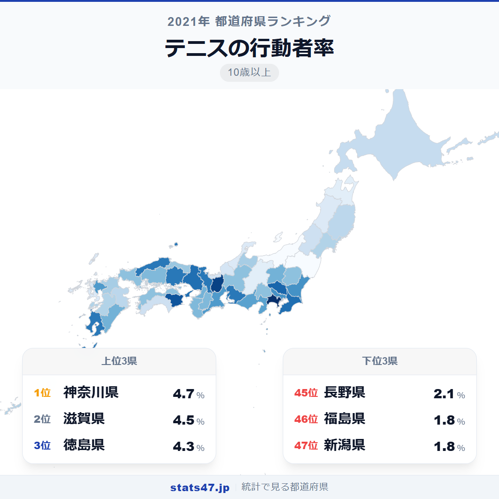
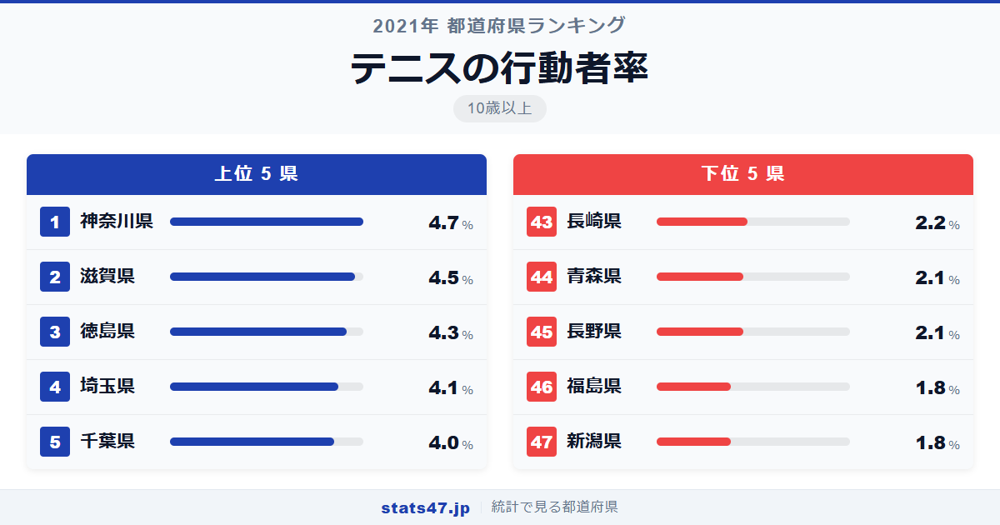
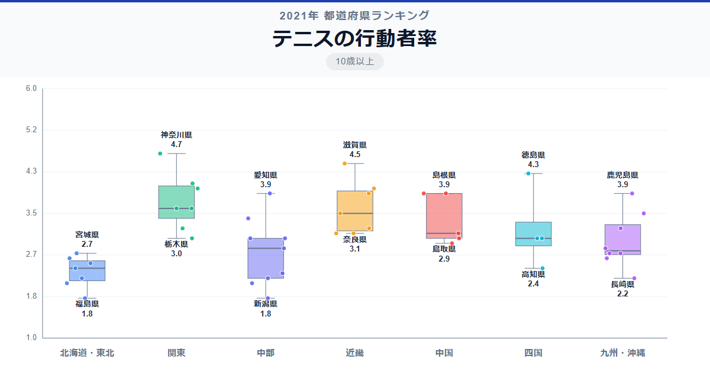

テニスといえば錦織圭や大坂なおみの活躍で一時ブームになりましたが、実際にテニスをしている人が最も多い都道府県はどこでしょうか。答えは神奈川県です。

全国1位の神奈川県は偏差値72.6で4.7%。一方、最下位の新潟県は偏差値31.8で1.8%にとどまり、トップとの差は2.6倍に開いています。首都圏の県が上位に並ぶ一方、日本海側の県が下位に集まる傾向がはっきりと見えます。

なぜ神奈川県にテニス人口が集中するのか。そして新潟県や福島県が下位に沈む理由はどこにあるのでしょうか。

「テニスの行動者率」は、過去1年間にテニス（硬式・軟式を含む）を行った10歳以上の人口の割合です。総務省「社会生活基本調査」2021年のデータに基づいています。

## データハイライト

全国平均: 3.09%

1位: 神奈川県（4.7% / 偏差値 72.6）

47位: 新潟県（1.8% / 偏差値 31.8）

全体的に見ると、テニスの行動者率は全国平均3.09%と比較的低い水準にあります。テニスコートへのアクセスや気候条件が参加率に大きく影響しているようです。上位には首都圏や関西圏の都市部が多く入る一方、意外にも徳島県が3位にランクインしています。

## 【コロプレス地図】日本全国の分布

<!-- note投稿時: この画像行を削除し、images/choropleth-map-1080x1080.png をアップロード -->

地図で見ると、関東南部と近畿の一部が濃い色で目立ちます。神奈川・埼玉・千葉と首都圏が連なるように高い値を示しています。

注目すべきは徳島県の突出した高さです。四国の中でも徳島だけが濃い色を示しており、周囲の県とは明らかに異なるパターンを見せています。

反対に日本海側は全体的に薄い色です。新潟県・福島県・青森県・長野県など、冬季に降雪が多い地域がそのまま下位に並んでおり、積雪期間の長さがテニス参加率に直結していることがうかがえます。

## 上位5：分析

<!-- note投稿時: この画像行を削除し、images/chart-x-1200x630.png をアップロード -->

テニスコートの充実した神奈川県が偏差値72.6、4.7%で全国トップに立ちました。横浜・川崎・湘南エリアには公営・民間を問わず多数のテニスコートがあり、温暖な気候で年間を通してプレーしやすい環境が整っています。

2位の滋賀県は偏差値69.8で4.5%です。琵琶湖周辺にテニス施設が充実しており、人口規模に対してコートの数が多い県として知られています。

意外にも3位に入ったのは徳島県。偏差値67.0の4.3%と、四国の他県を大きく引き離しています。温暖な気候でプレー可能日数が多いことに加え、地域のテニスクラブ活動が活発であることが背景にあると考えられます。

4位の埼玉県は偏差値64.2で4.1%。東京のベッドタウンとして人口が多く、公営テニスコートの数も充実しています。

千葉県が偏差値62.7の4.0%で5位に入りました。埼玉県と同様、首都圏の通勤圏として民間テニススクールが数多く展開されています。

## 下位5：分析

冬の長い新潟県が偏差値31.8の1.8%で全国最下位です。日本有数の豪雪地帯であり、11月から4月頃まで屋外テニスが困難な期間が続くことが大きく影響しています。

同じく1.8%で46位の福島県も偏差値31.8。内陸部を中心に冬季の積雪が多く、屋外スポーツ全般への参加率が低くなりがちな環境です。

45位の長野県は偏差値36.0で2.1%。標高の高い地域が多く冬の寒さが厳しいため、テニスのシーズンが限られます。避暑地のリゾートテニスのイメージとは裏腹に、県全体で見ると低い水準にとどまりました。

青森県も偏差値36.0の2.1%で44位。本州最北端に位置し、冬季は日本海からの季節風と大量の積雪でスポーツ環境が制約されます。

43位の長崎県は偏差値37.4で2.2%。温暖な気候にもかかわらず低い水準であり、坂の多い地形がテニスコートの確保を難しくしている可能性があります。

## 地域別の傾向

<!-- note投稿時: この画像行を削除し、images/boxplot-1200x630.png をアップロード -->

関東が高く、北陸・東北が低い傾向がはっきりしています。近畿は兵庫・京都が上位にいる一方でばらつきが大きく、地域内の差が目立ちます。

## まとめ

テニスの行動者率の地域差は、気候条件とスポーツ施設の充実度が直結していることを示しています。このデータから以下の洞察が得られます。

**積雪地域はテニス参加率が低い**

下位5県のうち4県が日本海側や内陸の積雪地域です。屋外スポーツであるテニスは冬季のプレー環境に大きく左右されます。

**首都圏はテニスコートの多さが強み**

神奈川・埼玉・千葉と首都圏が上位に3県入りました。
人口集積地ほど民間テニススクールや公営コートが充実し、気軽に始めやすい環境が整っています。

**徳島県の健闘は地域スポーツ文化の力**

四国で唯一トップ3入りした徳島県は、温暖な気候と地域のテニスクラブ活動の活発さが参加率を押し上げていると考えられます。

## もっと詳しく知りたい方へ

全47都道府県の順位や、グラフ・地図での可視化は stats47 で見ることができます。

### テニスの行動者率ランキング 全都道府県版

https://stats47.jp/ranking/sports-participation-rate-tennis

### バドミントンの行動者率ランキング

https://stats47.jp/ranking/sports-participation-rate-badminton

### ゴルフの行動者率ランキング

https://stats47.jp/ranking/sports-participation-rate-golf

### 水泳の行動者率ランキング

https://stats47.jp/ranking/sports-participation-rate-swimming

### ジョギング・マラソンの行動者率ランキング

https://stats47.jp/ranking/sports-participation-rate-jogging

### ボウリングの行動者率ランキング

https://stats47.jp/ranking/sports-participation-rate-bowling

---

**stats47** は、e-Stat の公的統計データを47都道府県別に可視化するサービスです。
ランキング・散布図・時系列チャートで、地域の違いがひと目でわかります。

https://stats47.jp
