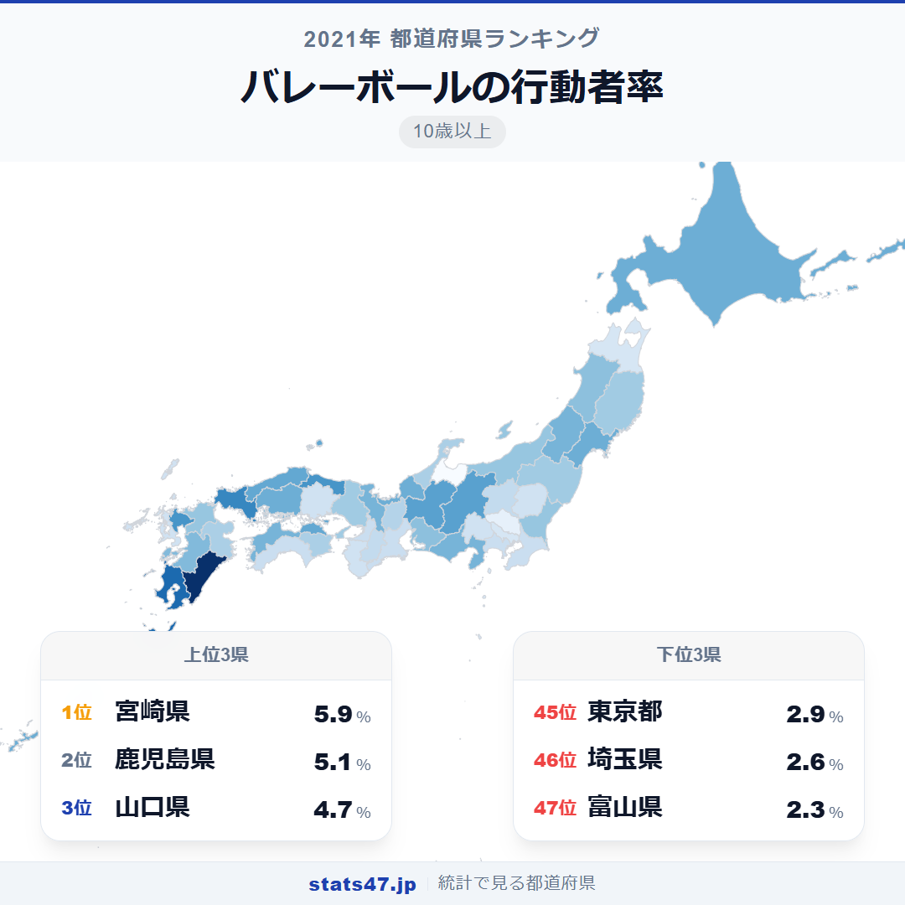
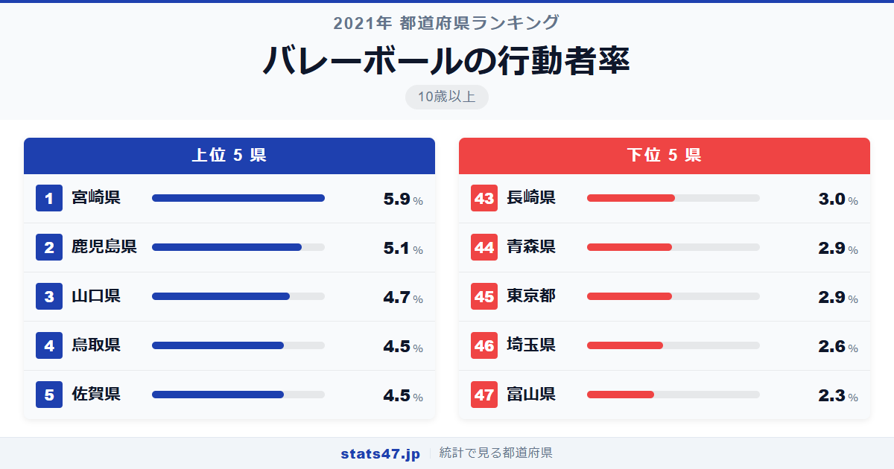
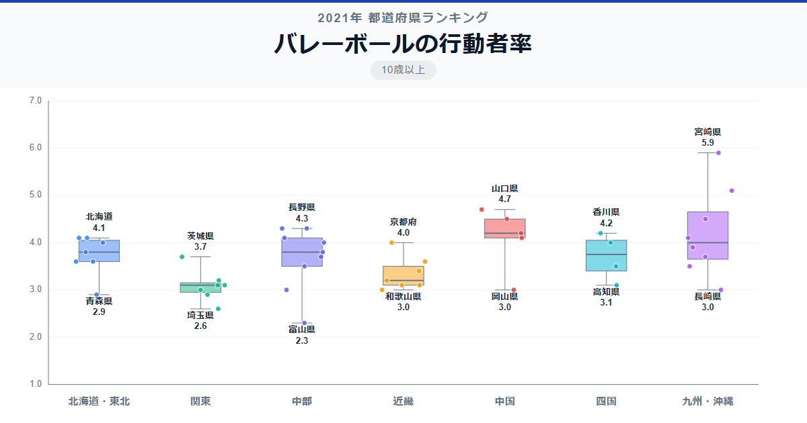

バレーボールが最も盛んな県は、南国・宮崎県です。偏差値83.2で5.9％と、2位に0.8ポイントもの差をつける圧倒的な1位。この偏差値83.2という数値は、他のスポーツ種目と比べても屈指の突出度です。

最下位の富山県は2.3％にとどまり、1位との差は2.6倍。上位は九州・中国地方に偏り、下位には北陸・関東の意外な県が並ぶ、独特の分布を見せています。

「バレーボールの行動者率」は、過去1年間にバレーボールをプレーした10歳以上の人の割合です。総務省「社会生活基本調査」の2021年データに基づいています。

## データハイライト

全国平均: 3.68％

1位: 宮崎県（5.9％ / 偏差値 83.2）

47位: 富山県（2.3％ / 偏差値 29.3）

上位は宮崎県・鹿児島県・山口県・鳥取県・佐賀県と、西日本の地方県が独占しています。東京都が45位、埼玉県が46位と、大都市圏が軒並み低い点が他のスポーツとは大きく異なります。

## 【コロプレス地図】日本全国の分布

<!-- note投稿時: この画像行を削除し、images/choropleth-map-1080x1080.png をアップロード -->

地図を見ると、九州南部と山陰・中国地方が濃く、関東・北陸が薄い。スポーツ全体の行動者率では大都市圏が強かったのとは対照的です。

バレーボールは体育館さえあればプレーできるスポーツ。フィットネスジムやランニングコースの充実した都市部よりも、地域のスポーツ大会が盛んな地方で人気が高いのかもしれません。

北海道が10位と比較的上位にいるのは、冬場の室内スポーツとしてバレーボールが選ばれやすい環境が影響していそうです。

## 上位5：分析

<!-- note投稿時: この画像行を削除し、images/chart-x-1200x630.png をアップロード -->

宮崎県のバレーボール熱は群を抜いています。偏差値83.2の5.9％は、2位鹿児島県の5.1％を大きく引き離す数値。宮崎県ではPTAバレーや地域対抗のバレーボール大会が盛んで、主婦層を中心にコミュニティスポーツとして深く定着しています。

鹿児島県が2位で偏差値71.2の5.1％。九州南部はバレーボール文化が強い地域で、学校の部活動から地域の社会人チームまで幅広い層がプレーしています。

山口県は3位で偏差値65.2の4.7％。ソフトボールでも1位だった山口県は、地域スポーツ全般に参加意欲の高い県です。自治体主催のバレーボール教室も充実しています。

鳥取県と佐賀県が同率4位で偏差値62.2の4.5％。いずれも人口の少ない県ですが、地域の体育館を拠点としたバレーボールサークルが活発に活動しています。

## 下位5：分析

富山県は偏差値29.3で2.3％と最下位。北陸は全体的にバレーボールの行動者率が高くなく、冬場は屋内スポーツに適した環境ではあるものの、バレーボールよりも他の室内活動が選ばれている可能性があります。

埼玉県が46位で偏差値33.8の2.6％。スポーツ全体の行動者率では3位だった埼玉県ですが、バレーボールに限ると下位に沈みます。フィットネスジムやランニングなど個人で楽しむスポーツが主流の地域です。

東京都は45位で偏差値38.3の2.9％。体育館の予約が取りにくい都市部の事情が、チームスポーツであるバレーボールの参加率を押し下げています。

青森県も同率44位で偏差値38.3の2.9％。スポーツ全体の行動者率が全国最下位の青森県は、個別種目でも低い傾向にあります。

長崎県が43位で偏差値39.8の3.0％。坂の多い地形は屋外スポーツに不向きですが、体育館で行うバレーボールでも参加率は低め。人口減少でチーム編成が難しくなっている面もありそうです。

## 地域別の傾向

<!-- note投稿時: この画像行を削除し、images/boxplot-1200x630.png をアップロード -->

九州・中国地方が高く、関東・北陸が低い傾向です。宮崎県の突出により九州の中央値が大きく引き上げられています。

## まとめ

バレーボールの行動者率の地域差は、地域コミュニティのスポーツ文化と密接に結びついています。このデータから以下の洞察が得られます。

**宮崎県のバレーボール文化は全国でも突出**

偏差値83.2は全スポーツ種目を通じてもトップクラスの突出度。
PTAバレーや地域大会が世代を超えて定着し、県民のスポーツ文化として根付いています。

**バレーボールは「地方で盛ん、都市で低調」**

スポーツ全体では大都市圏が上位でしたが、バレーボールは正反対。
体育館を拠点とした地域密着型のスポーツであるため、コミュニティの結束力が参加率を左右します。

**九州南部にバレーボール文化圏が存在する**

宮崎県と鹿児島県がトップ2を占めています。
九州南部の地域スポーツにおけるバレーボールの特別な地位がデータに表れました。

## もっと詳しく知りたい方へ

全47都道府県の順位や、グラフ・地図での可視化は stats47 で見ることができます。

### バレーボールの行動者率ランキング 全都道府県版

https://stats47.jp/ranking/sports-participation-rate-volleyball

### バスケットボールの行動者率ランキング

https://stats47.jp/ranking/sports-participation-rate-basketball

### ソフトボールの行動者率ランキング

https://stats47.jp/ranking/sports-participation-rate-softball

### 野球の行動者率ランキング

https://stats47.jp/ranking/sports-participation-rate-baseball

### サッカーの行動者率ランキング

https://stats47.jp/ranking/sports-participation-rate-soccer

### スポーツの年間行動者率ランキング

https://stats47.jp/ranking/sports-annual-participation-rate-10plus

---

**stats47** は、e-Stat の公的統計データを47都道府県別に可視化するサービスです。
ランキング・散布図・時系列チャートで、地域の違いがひと目でわかります。

https://stats47.jp
