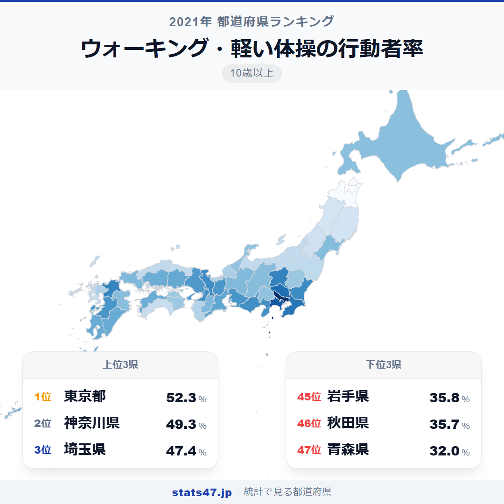
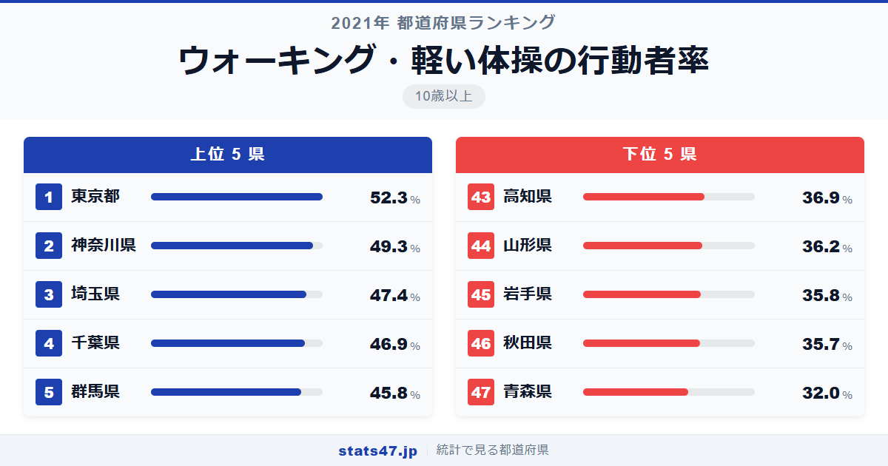
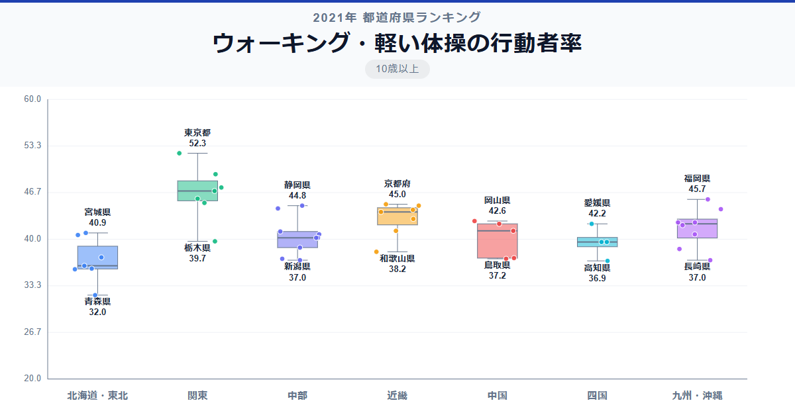

3人に1人が歩いている県もあれば、2人に1人が歩いている県もある。同じ日本でも、ウォーキングの習慣にはこれほどの地域差があります。

全国1位の東京都は偏差値78.1で52.3％。一方、最下位の青森県は偏差値26.2でわずか32.0％にとどまり、その差は1.6倍です。首都圏が上位を独占する一方で、東北地方が下位に集中しているのはなぜでしょうか。

「ウォーキング・軽い体操の行動者率」は、10歳以上の人口のうち過去1年間にウォーキングや軽い体操を行った人の割合を示す指標です。総務省の社会生活基本調査のデータに基づいています。

## データハイライト

全国平均: 41.31％

1位: 東京都（52.3％ / 偏差値 78.1）

47位: 青森県（32.0％ / 偏差値 26.2）

首都圏の4都県がトップ4を独占しています。上位10位以内に関東の都県が5つ入っており、大都市圏ほどウォーキングが盛んな傾向が鮮明です。下位には東北地方が集中し、気候や生活様式の違いがそのまま順位に表れています。

## 【コロプレス地図】日本全国の分布

<!-- note投稿時: この画像行を削除し、images/choropleth-map-1080x1080.png をアップロード -->

地図を見ると、関東地方が濃い色で際立っています。東京都を中心に、神奈川県・埼玉県・千葉県・群馬県・茨城県と、関東全域が全国平均を大きく上回る高い値を示しています。

一方、東北地方は全体的に薄い色が広がっています。青森県・秋田県・岩手県・山形県と、東北の太平洋側・日本海側を問わず低い値が並んでいます。冬季の積雪や寒冷な気候が、屋外での運動習慣に影響しているのかもしれません。

意外なのは九州です。福岡県が6位、熊本県が12位と健闘しており、温暖な気候を活かした運動習慣が根付いていることがうかがえます。北陸地方は冬の天候の影響か、福井県34位、富山県39位と低めに出ています。

## 上位5：分析

<!-- note投稿時: この画像行を削除し、images/chart-x-1200x630.png をアップロード -->

通勤・通学で「歩く」が日常に組み込まれている東京都。偏差値78.1で52.3％と、2人に1人以上がウォーキングや軽い体操を行っています。電車通勤の前後に歩く距離が長いことが、意識せずとも運動につながっているのでしょう。

2位の神奈川県は偏差値70.4で49.3％です。横浜や湘南エリアなど、海沿いの散歩コースに恵まれた地域が多いことも一因と考えられます。

埼玉県が偏差値65.6の47.4％で3位に入りました。東京への通勤者が多く、日常的に歩く機会が多い生活スタイルが反映されています。

4位は千葉県で偏差値64.3の46.9％。こちらも東京のベッドタウンとして通勤時の歩行が日常化している地域です。

関東の中でも北関東に位置する群馬県が偏差値61.5の45.8％で5位に食い込んでいます。自動車社会のイメージがありますが、健康意識の高まりが数字に表れているようです。

## 下位5：分析

冬の寒さが厳しく、積雪量も多い青森県。偏差値26.2の32.0％で全国最下位です。冬場に屋外で歩くことが難しい気候条件が、年間を通じた行動者率を押し下げています。

46位の秋田県は偏差値35.7で35.7％。青森県と同様、冬季の厳しい気候が屋外運動の機会を制限しています。日照時間の短さも影響しているでしょう。

同じ東北でも内陸に位置する岩手県は偏差値35.9の35.8％で45位です。広大な県土で移動に車を使う割合が高く、歩く習慣がつきにくい面があります。

44位は山形県で偏差値36.9の36.2％。日本海側の豪雪地帯を抱え、冬季の運動環境が限られることが響いています。

四国の高知県が偏差値38.7の36.9％で43位に入っているのは意外かもしれません。温暖な気候にもかかわらず低い値となっており、車社会であることや、中山間地域の多さが要因として考えられます。

## 地域別の傾向

<!-- note投稿時: この画像行を削除し、images/boxplot-1200x630.png をアップロード -->

関東地方が突出して高く、東北地方と北陸地方が低い傾向が明確です。九州は県ごとのばらつきが大きく、福岡県のように高い県と長崎県のように低い県が混在しています。

## まとめ

ウォーキング・軽い体操の行動者率の地域差は、気候だけでなく都市構造や生活様式の違いを映し出しています。このデータから以下の洞察が得られます。

**首都圏の「歩かざるを得ない」生活が高い行動者率を生む**

電車通勤が中心の首都圏では、駅までの徒歩や乗り換えの移動が日常的な運動になっています。
意識的にウォーキングをしているわけではなく、生活インフラが運動を促している側面があります。

**冬の気候が年間の行動者率を左右する**

東北地方が下位に集中しているのは、冬季の積雪と寒さが大きく影響しています。
夏場だけの活動では年間の行動者率は上がりにくく、通年で取り組める環境があるかどうかが鍵です。

**車社会と歩く習慣は両立しにくい**

高知県や北陸の低い値は、日常的な移動手段が車中心の地域では歩く機会自体が減ることを示唆しています。

## もっと詳しく知りたい方へ

全47都道府県の順位や、グラフ・地図での可視化は stats47 で見ることができます。

### ウォーキング・軽い体操の行動者率ランキング 全都道府県版

https://stats47.jp/ranking/sports-participation-rate-walking

### ジョギング・マラソンの行動者率ランキング

https://stats47.jp/ranking/sports-participation-rate-jogging

### ヨガの行動者率ランキング

https://stats47.jp/ranking/sports-participation-rate-yoga

### 器具を使ったトレーニングの行動者率ランキング

https://stats47.jp/ranking/sports-participation-rate-gym-training

### 水泳の行動者率ランキング

https://stats47.jp/ranking/sports-participation-rate-swimming

### 登山・ハイキングの行動者率ランキング

https://stats47.jp/ranking/sports-participation-rate-hiking

---

**stats47** は、e-Stat の公的統計データを47都道府県別に可視化するサービスです。
ランキング・散布図・時系列チャートで、地域の違いがひと目でわかります。

https://stats47.jp
