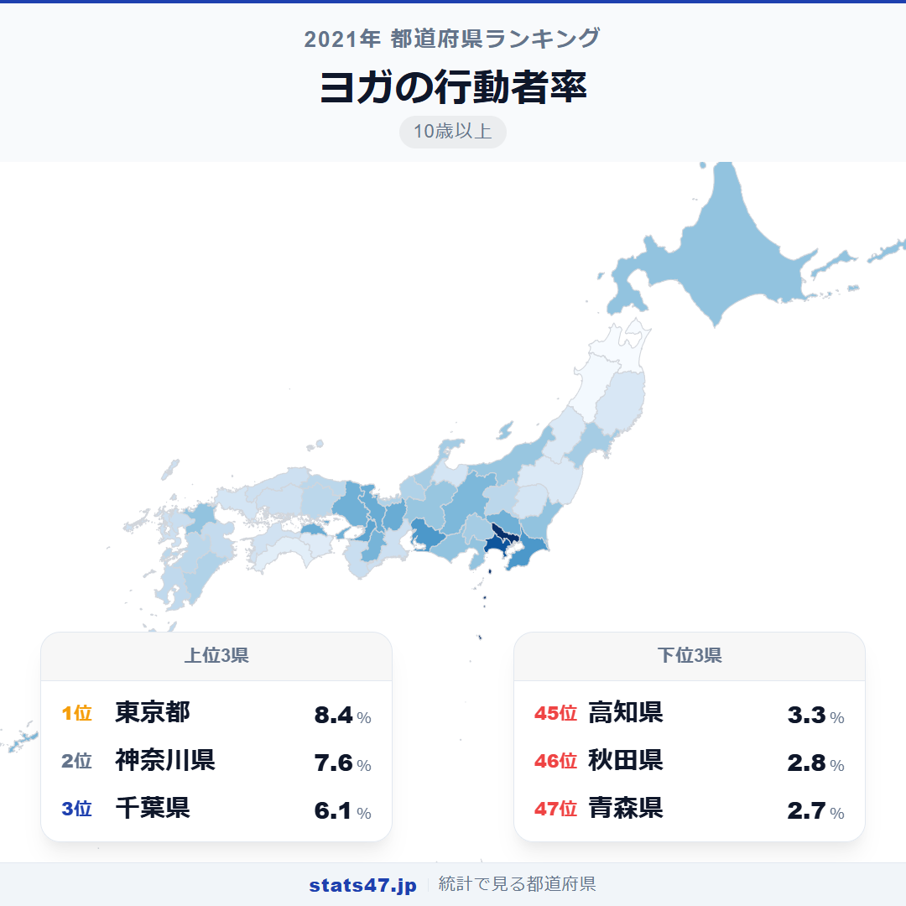
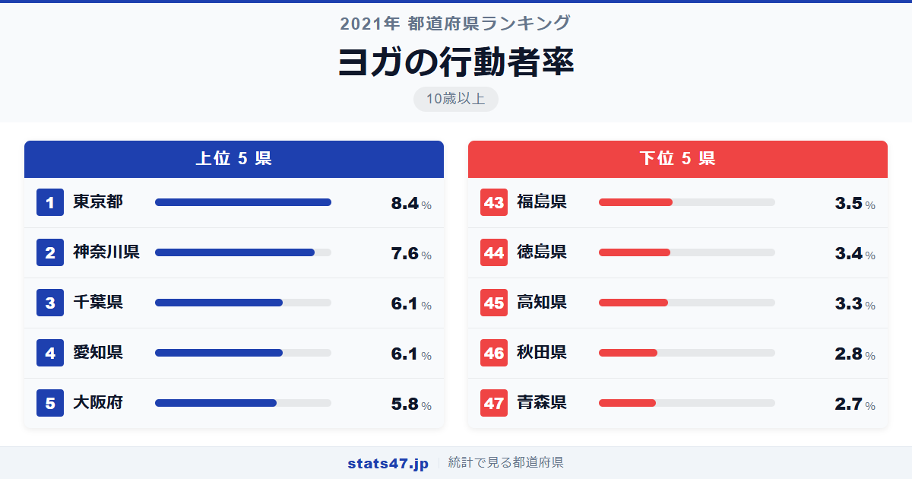
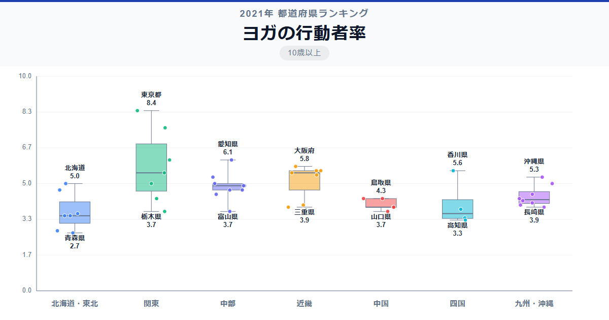

東京都では12人に1人がヨガをしているのに、青森県では37人に1人。同じ日本でありながら、ヨガの普及率には3倍もの開きがあります。

全国1位の東京都は偏差値84.4で8.4％。最下位の青森県は偏差値32.4で2.7％にとどまります。上位には大都市圏がずらりと並ぶ一方、下位は東北地方に集中しており、ヨガスタジオの立地や都市的なライフスタイルとの関連がうかがえます。

「ヨガの行動者率」は、10歳以上の人口のうち過去1年間にヨガを行った人の割合です。総務省の社会生活基本調査に基づくデータで、スタジオでのレッスンだけでなく自宅での実践も含みます。

## データハイライト

全国平均: 4.63％

1位: 東京都（8.4％ / 偏差値 84.4）

47位: 青森県（2.7％ / 偏差値 32.4）

全国平均は4.63％と、約22人に1人の割合です。東京都が偏差値84.4と突出しており、2位の神奈川県以下を大きく引き離しています。全体として大都市圏が高く地方が低い傾向ですが、滋賀県や香川県のように意外な健闘を見せる県もあります。

## 【コロプレス地図】日本全国の分布

<!-- note投稿時: この画像行を削除し、images/choropleth-map-1080x1080.png をアップロード -->

地図で見ると、東京都と神奈川県が際立って濃い色を示しています。関東・東海・近畿の三大都市圏を中心に高い値が集まり、都市部でのヨガ人気がはっきりと読み取れます。

注目すべきは香川県で、8位の5.6％と四国で唯一の高水準です。また、長野県が12位の5.3％と健康志向が強い地域として知られる実力を発揮しています。

東北地方は全域で薄い色が広がっています。寒冷な気候でスタジオへの移動が負担になることや、ヨガスタジオ自体の数が少ないことが影響していると考えられます。

## 上位5：分析

<!-- note投稿時: この画像行を削除し、images/chart-x-1200x630.png をアップロード -->

ヨガスタジオの激戦区として知られる東京都。偏差値84.4で8.4％と、2位以下を大きく突き放しています。駅前やオフィス街にスタジオが点在し、仕事帰りに通える環境が整っていることが高い行動者率の背景にあります。

2位の神奈川県は偏差値77.1の7.6％です。横浜・鎌倉エリアを中心にヨガ文化が浸透しており、海辺でのビーチヨガなど独自のスタイルも定着しています。

千葉県と愛知県がともに6.1％で偏差値63.4の3位タイ。千葉県は東京のベッドタウンとして都心のヨガ文化の影響を受けやすく、愛知県は名古屋市を中心にフィットネス市場が活発な地域です。

5位は大阪府で偏差値60.7の5.8％。大都市ならではのスタジオの充実度が行動者率を支えています。

## 下位5：分析

冬の長さと積雪が運動の選択肢を狭める青森県。偏差値32.4の2.7％で全国最下位となっています。ヨガスタジオが限られる中、オンラインヨガの普及が今後の鍵になるかもしれません。

46位の秋田県は偏差値33.3で2.8％。青森県と同様に冬場の移動の困難さがスタジオ通いのハードルを上げています。

高知県が偏差値37.9の3.3％で45位に入っています。温暖な気候ながら中山間地域が多く、スタジオへのアクセスが限られることが影響しているようです。

44位は徳島県で偏差値38.8の3.4％。四国の中でも人口規模が小さく、フィットネス産業の集積が進みにくい事情があります。

福島県は偏差値39.7で3.5％の43位。広い県土に人口が分散しており、都市部のような気軽にヨガに通える環境が整いにくい地域特性が反映されています。

## 地域別の傾向

<!-- note投稿時: この画像行を削除し、images/boxplot-1200x630.png をアップロード -->

関東・近畿が高く、東北・四国が低い傾向がはっきり出ています。中部地方は県ごとのばらつきが大きく、愛知県の高さと富山県の低さが対照的です。

## まとめ

ヨガの行動者率の地域差は、都市のインフラとライフスタイルの違いを鮮やかに映し出しています。このデータから以下の洞察が得られます。

**ヨガは「スタジオの数」に左右される都市型スポーツ**

大都市圏ほど行動者率が高いのは、通いやすいスタジオが身近にあるかどうかが決定的な要因です。
地方では施設そのものが少なく、始めるきっかけが限られています。

**東京都の突出は「選択肢の豊富さ」の表れ**

偏差値84.4という突出した値は、ホットヨガ・パワーヨガ・マタニティヨガなど多様なプログラムが揃う東京ならではの環境を反映しています。

**気候と地理が参加のハードルを左右する**

東北地方が下位に集中しているのは、冬季にスタジオへ通うこと自体が困難になるためです。
オンラインヨガの普及が、この地域格差を縮める可能性を秘めています。

## もっと詳しく知りたい方へ

全47都道府県の順位や、グラフ・地図での可視化は stats47 で見ることができます。

### ヨガの行動者率ランキング 全都道府県版

https://stats47.jp/ranking/sports-participation-rate-yoga

### ウォーキング・軽い体操の行動者率ランキング

https://stats47.jp/ranking/sports-participation-rate-walking

### 器具を使ったトレーニングの行動者率ランキング

https://stats47.jp/ranking/sports-participation-rate-gym-training

### ジョギング・マラソンの行動者率ランキング

https://stats47.jp/ranking/sports-participation-rate-jogging

### 水泳の行動者率ランキング

https://stats47.jp/ranking/sports-participation-rate-swimming

### サイクリングの行動者率ランキング

https://stats47.jp/ranking/sports-participation-rate-cycling

---

**stats47** は、e-Stat の公的統計データを47都道府県別に可視化するサービスです。
ランキング・散布図・時系列チャートで、地域の違いがひと目でわかります。

https://stats47.jp
