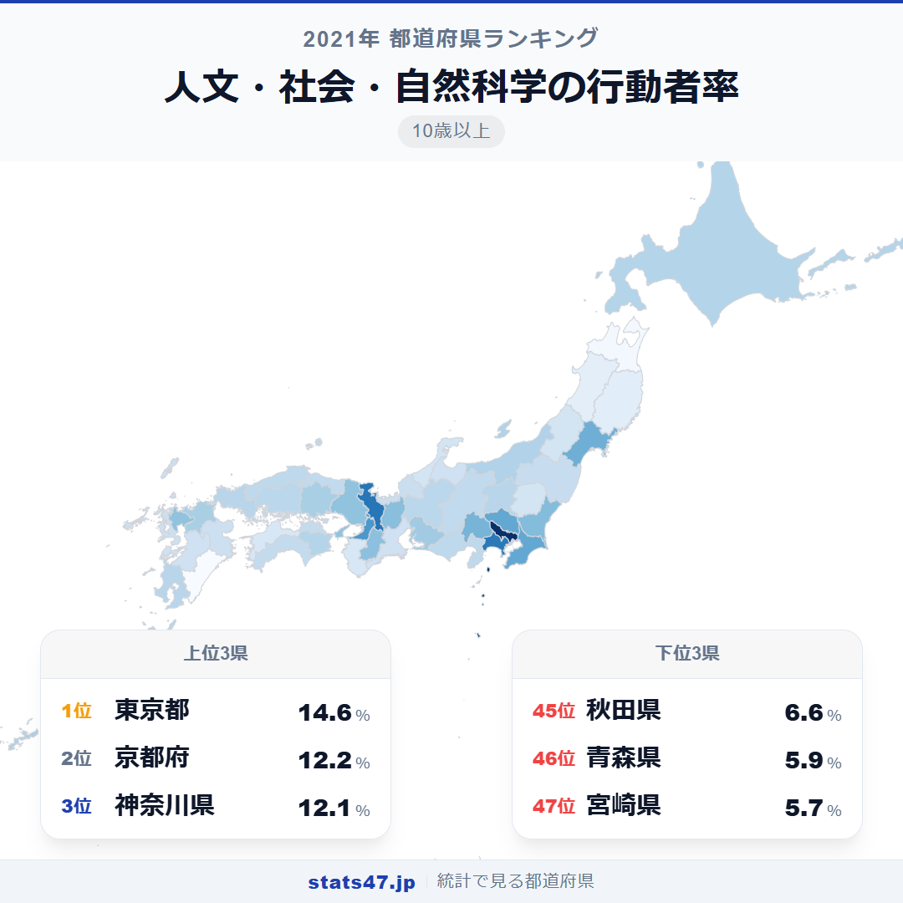
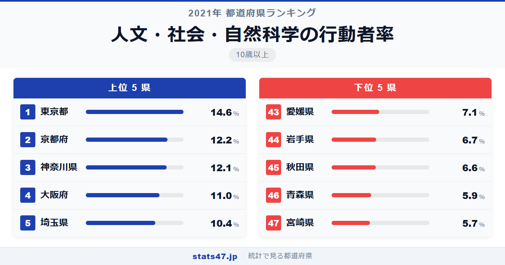
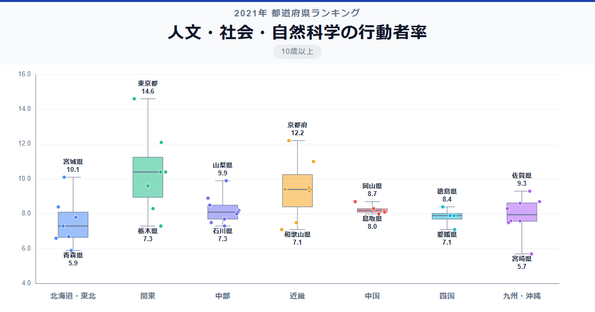

歴史、哲学、経済学、物理学。仕事に直結しない「知的好奇心」に基づく学びに、東京都では7人に1人が取り組んでいます。14.6％という数字は、最下位の宮崎県の5.7％と比べて2.6倍。学問そのものを楽しむ余裕にも、地域差があるようです。

全国1位の東京都は偏差値87.4で14.6％、47位の宮崎県は偏差値32.5で5.7％。2位の京都府は12.2％で、東京都との間に2.4ポイントの差があります。

大学や研究機関が集中する都市ほど、アカデミックな学びが身近なのでしょうか。

「人文・社会・自然科学の行動者率」は、歴史・哲学・法律・経済・自然科学などの学問的な学習を過去1年間に行った10歳以上の人の割合です。総務省「社会生活基本調査」（2021年）のデータに基づきます。

## データハイライト

全国平均: 8.54％

1位: 東京都（14.6％ / 偏差値 87.4）

47位: 宮崎県（5.7％ / 偏差値 32.5）

東京都の偏差値87.4が圧倒的に高く、2位の京都府とも15ポイント近い差があります。上位には大学が集中する都府県が並ぶ一方、下位は東北・九州の県が目立ちます。全国平均8.54％を上回るのは約20県にとどまります。

## 【コロプレス地図】日本全国の分布

<!-- note投稿時: この画像行を削除し、images/choropleth-map-1080x1080.png をアップロード -->

東京都・京都府・神奈川県の3都府県が突出して濃い色を示しています。日本の学術研究の中心地である東京と京都が1位・2位を占めるのは自然な結果といえるでしょう。

注目すべきは山梨県の8位で、偏差値58.4の9.9％。人口約80万人の小さな県ですが、複数の大学や研究施設があり、県民の学問への関心が高い地域です。沖縄県も17位の8.6％と健闘しており、独自の歴史・文化への学問的関心がうかがえます。

東北地方は宮城県の7位を除けば32位以下に沈んでおり、最下位圏には宮崎県・青森県・秋田県と、九州南部と東北北部が並んでいます。

## 上位5：分析

<!-- note投稿時: この画像行を削除し、images/chart-x-1200x630.png をアップロード -->

日本最多の大学を擁する東京都は、偏差値87.4の14.6％で断トツの1位です。国立・私立を問わず数多くの大学が公開講座やリカレント教育を提供しており、学問を学ぶ場へのアクセスが群を抜いて充実しています。

京都大学をはじめとする名門大学が集まる京都府は、偏差値72.6の12.2％で2位。人口あたりの大学数が全国トップクラスであり、学術都市としての風土がそのまま数字に表れています。

神奈川県は偏差値71.9で12.1％の3位。京都府との差はわずか0.1ポイントです。横浜国立大学や慶應義塾大学のキャンパスがあり、東京の学術機関にもアクセスしやすい環境です。

4位の大阪府は偏差値65.2で11.0％。大阪大学や関西の主要私立大学を中心に、学問への接点が豊富な都市です。

偏差値61.5の10.4％で埼玉県が5位に入りました。東京の大学への通学圏であり、都内の公開講座やセミナーに参加しやすい立地が数字に反映されているとみられます。

## 下位5：分析

宮崎県は偏差値32.5の5.7％で全国最下位です。温暖な気候と農業中心の産業構造を持ち、大学や研究機関の数が限られる環境にあります。

46位の青森県は偏差値33.7で5.9％。冬季の厳しい気候に加え、学術系の教育機関が大都市圏と比べて少ないことが、行動者率の低さに影響しています。

秋田県は偏差値38.0の6.6％で45位。高齢化が全国最速で進む県であり、学問的な学習に取り組む現役世代の割合が低下していることが考えられます。

岩手県が44位で偏差値38.6の6.7％。広い県土の中で、学術的な学びの場が都市部に集中しており、アクセスの問題が生じています。

43位の愛媛県は偏差値41.1で7.1％です。松山市に大学が集まっていますが、県全体として見ると学問的学習の機会が都市部に比べてやや少ない状況です。

## 地域別の傾向

<!-- note投稿時: この画像行を削除し、images/boxplot-1200x630.png をアップロード -->

関東と近畿が高く、東北が低い傾向です。中部・中国・九州は中間的な値で、ばらつきが見られます。

## まとめ

人文・社会・自然科学の行動者率は、知的好奇心を満たす学びの機会が地域によって大きく異なることを示しています。このデータから以下の洞察が得られます。

**大学の集積地がそのまま上位に**

東京都・京都府・神奈川県のトップ3は、いずれも大学が密集する地域です。
公開講座やリカレント教育など、大学が社会人の学びのインフラとして機能していることが読み取れます。

**仕事に直結しない学びこそ都市の特権か**

ビジネス関連の学習以上に、アカデミックな学びは大都市圏への偏りが顕著です。
実利的でない「知る楽しみ」を追求する余裕は、生活基盤が整った地域ほど大きいのかもしれません。

**山梨県8位の意外性**

人口規模では下位の山梨県が上位に食い込んでいます。
県内の大学や研究施設の存在が、県民のアカデミックな学習意欲を支えている好例です。

## もっと詳しく知りたい方へ

全47都道府県の順位や、グラフ・地図での可視化は stats47 で見ることができます。

### 人文・社会・自然科学の行動者率ランキング 全都道府県版

https://stats47.jp/ranking/study-participation-rate-academic

### 芸術・文化の行動者率ランキング

https://stats47.jp/ranking/study-participation-rate-arts-culture

### 外国語学習の行動者率ランキング

https://stats47.jp/ranking/study-participation-rate-foreign-language

### 商業実務・ビジネス関係の行動者率ランキング

https://stats47.jp/ranking/study-participation-rate-business

### パソコンなどの情報処理の行動者率ランキング

https://stats47.jp/ranking/study-participation-rate-computer

### 趣味としての読書の行動者率ランキング

https://stats47.jp/ranking/hobby-participation-rate-reading

---

**stats47** は、e-Stat の公的統計データを47都道府県別に可視化するサービスです。
ランキング・散布図・時系列チャートで、地域の違いがひと目でわかります。

https://stats47.jp
