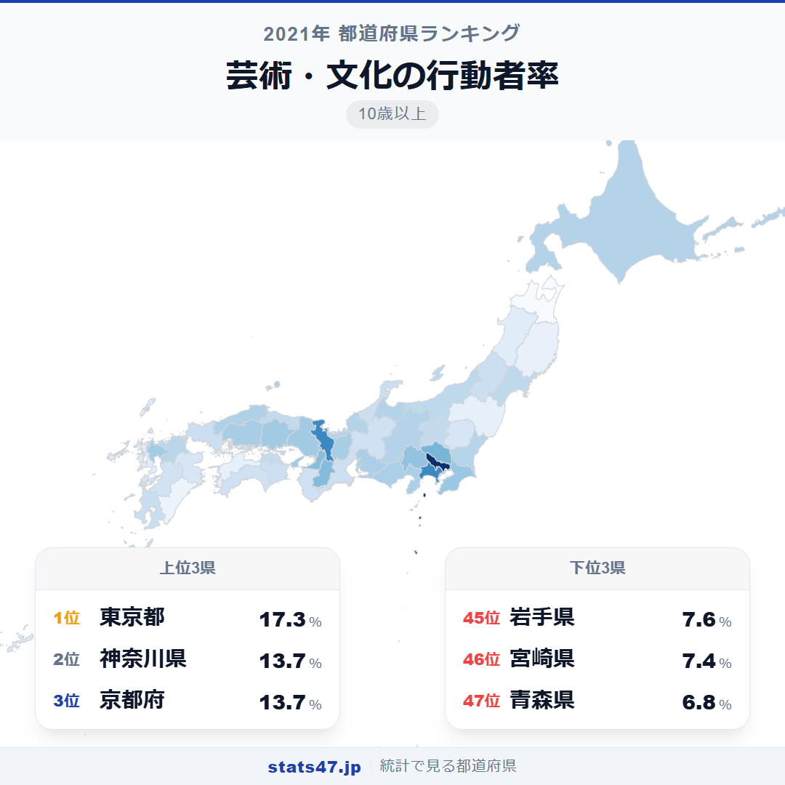
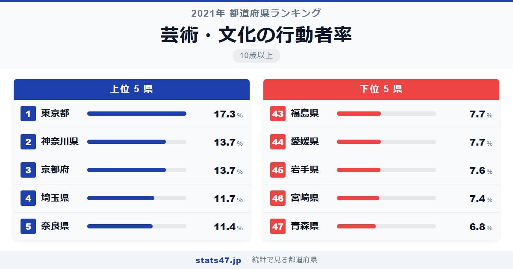
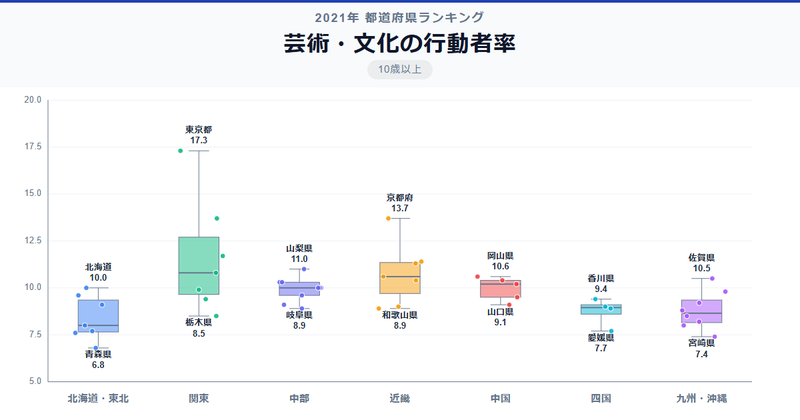

絵画教室に通う人、書道を学ぶ人、音楽を習う人。芸術・文化の学びに取り組む割合は東京都で17.3％、青森県では6.8％。同じ日本でも、住む場所によって文化的な学びの機会にこれほどの差があります。

全国1位の東京都は偏差値92.3で17.3％。2位には神奈川県と京都府がともに偏差値72.0の13.7％で並んでいます。最下位の青森県は偏差値33.2で6.8％と、東京の半分以下の水準です。

美術館やコンサートホールが集中する都市部が有利なのは当然として、奈良県が5位に入っているのは古都ならではの文化力でしょうか。

「芸術・文化の行動者率」は、絵画・書道・音楽・舞踊・写真など芸術・文化活動の学習を過去1年間に行った10歳以上の人の割合です。総務省「社会生活基本調査」（2021年）のデータです。

## データハイライト

全国平均: 9.78％

1位: 東京都（17.3％ / 偏差値 92.3）

47位: 青森県（6.8％ / 偏差値 33.2）

東京都の偏差値92.3は全学習指標の中でも最も高い部類です。2位の神奈川県・京都府との差は3.6ポイントと大きく、文化の中心地としての東京の存在感が際立ちます。全体的には上位と下位の差がゆるやかで、中間層に多くの県がひしめいています。

## 【コロプレス地図】日本全国の分布

<!-- note投稿時: この画像行を削除し、images/choropleth-map-1080x1080.png をアップロード -->

東京都が突出して濃い色を示し、そこから近畿圏にかけて高い値が広がっています。京都府・奈良県・大阪府・兵庫県と、歴史ある文化都市を擁する近畿地方の強さが目を引きます。

山梨県が7位の11.0％で上位に入っているのが目を引きます。首都圏に近い立地と、豊かな自然環境が芸術活動を後押ししているのかもしれません。島根県も16位の10.2％と健闘しており、出雲大社に代表される文化的伝統が根づく地域です。

一方、東北地方は宮城県23位を最高に、他の5県はすべて40位以下。福島県・岩手県・青森県が最下位圏に並びます。

## 上位5：分析

<!-- note投稿時: この画像行を削除し、images/chart-x-1200x630.png をアップロード -->

世界有数の美術館・ギャラリーが集積する東京都は、偏差値92.3の17.3％で圧倒的1位です。上野の美術館群、六本木のアートギャラリー、多数の音楽教室や書道教室など、芸術文化を学ぶインフラが桁違いに充実しています。

神奈川県と京都府がともに偏差値72.0の13.7％で2位タイ。神奈川県は横浜美術館や鎌倉の文化施設を中心に、首都圏の文化的な環境を享受しています。京都府は千年の文化の蓄積があり、茶道・華道・書道など伝統的な芸術文化の学びが日常に溶け込んでいます。

4位の埼玉県は偏差値60.8で11.7％。東京のカルチャースクールや美術教室へのアクセスのよさが、県民の文化活動を下支えしているとみられます。

奈良県が偏差値59.1の11.4％で5位に入りました。奈良時代から続く文化遺産に囲まれた環境で、書道・陶芸・仏像彫刻など日本の伝統芸術に触れる機会が日常的に存在する土地柄です。

## 下位5：分析

青森県は偏差値33.2の6.8％で全国最下位。冬季の厳しい気候が外出を伴う文化活動を制約する面があり、また芸術系の教育機関や文化施設が大都市圏と比べて限られています。

46位の宮崎県は偏差値36.6で7.4％。温暖で豊かな自然環境を持つ県ですが、芸術文化関連の教室や施設の数は少なく、学習機会へのアクセスが課題です。

岩手県は偏差値37.7の7.6％で45位につけています。面積が広く人口密度が低い県であり、文化施設が散在するために通いにくいという地理的なハンデがあります。

福島県と愛媛県がともに偏差値38.3の7.7％で43位タイ。福島県は2011年の震災以降、地域コミュニティの再建過程にあり、文化活動の基盤整備が今も進行中です。愛媛県は松山市に文化施設が集中しており、県全体での文化活動参加率には地域内格差がありそうです。

## 地域別の傾向

<!-- note投稿時: この画像行を削除し、images/boxplot-1200x630.png をアップロード -->

関東と近畿が高く、東北が低い傾向は他の学習指標と同様です。ただし中部・中国地方は10％前後で安定しており、地方でも一定の文化活動が維持されていることがわかります。

## まとめ

芸術・文化の行動者率は、地域の文化的インフラの充実度をそのまま映し出す指標です。このデータから以下の洞察が得られます。

**東京都の偏差値92.3は学習指標の中でも最高水準**

2位との差が3.6ポイントと、東京都の文化拠点としての突出ぶりが際立っています。
美術館・ギャラリー・教室の圧倒的な集積が、学習行動の差として表れています。

**京都・奈良の古都が示す文化の厚み**

京都府2位タイ、奈良県5位と、歴史的な文化資産を持つ地域が上位に入りました。
伝統芸術が生活に根づいている地域では、文化学習が自然に行われています。

**芸術・文化こそ地域格差が最も顕著な分野**

東京都17.3％、青森県6.8％の2.5倍差は数字以上に大きな意味を持ちます。
文化的な学びの機会は、生活の豊かさや地域の魅力に直結するだけに、格差是正の意義は大きいでしょう。

## もっと詳しく知りたい方へ

全47都道府県の順位や、グラフ・地図での可視化は stats47 で見ることができます。

### 芸術・文化の行動者率ランキング 全都道府県版

https://stats47.jp/ranking/study-participation-rate-arts-culture

### 人文・社会・自然科学の行動者率ランキング

https://stats47.jp/ranking/study-participation-rate-academic

### 美術鑑賞の行動者率ランキング

https://stats47.jp/ranking/hobby-participation-rate-art-appreciation

### 楽器の演奏の行動者率ランキング

https://stats47.jp/ranking/hobby-participation-rate-instrument

### 絵画・彫刻の制作の行動者率ランキング

https://stats47.jp/ranking/hobby-participation-rate-painting

### 書道の行動者率ランキング

https://stats47.jp/ranking/hobby-participation-rate-calligraphy

---

**stats47** は、e-Stat の公的統計データを47都道府県別に可視化するサービスです。
ランキング・散布図・時系列チャートで、地域の違いがひと目でわかります。

https://stats47.jp
