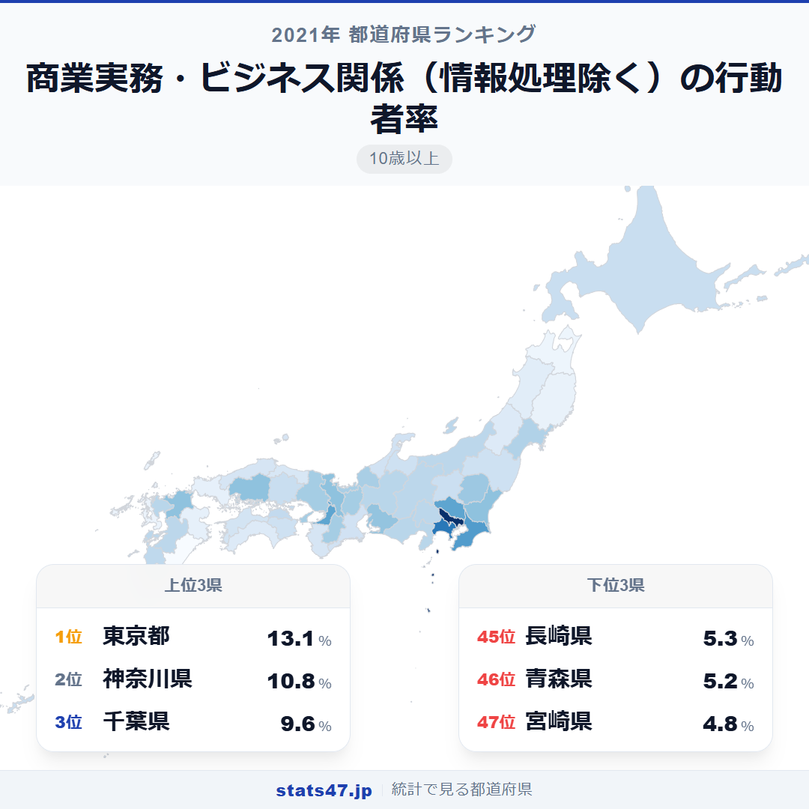
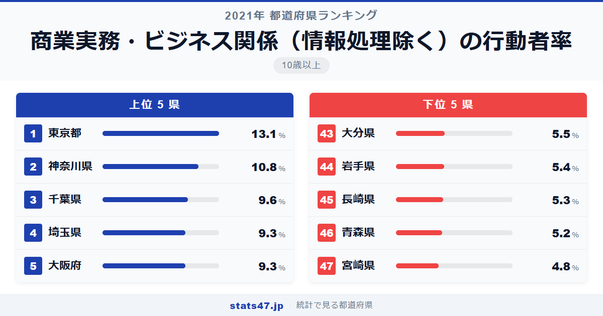
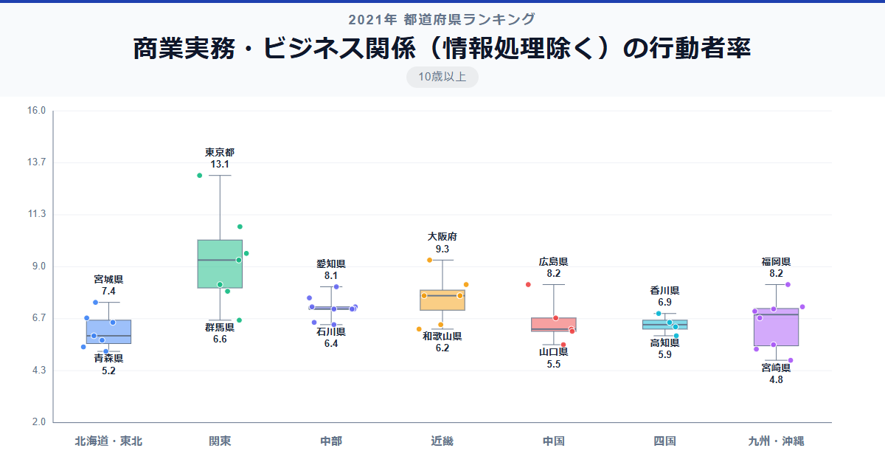

簿記、経理、マーケティング、貿易実務。パソコン操作を除いた「純粋なビジネススキル」の学習に取り組む人の割合は、東京都で13.1％、宮崎県ではわずか4.8％。その差は2.7倍にのぼります。情報処理分野を差し引いても、なお大都市圏と地方の学習格差は歴然としています。

全国1位の東京都は偏差値89.9で13.1％。最下位の宮崎県は偏差値34.3で4.8％です。2位の神奈川県でも10.8％と、東京との間に大きな断絶があります。

この指標が映し出すのは、情報処理を除いた「ビジネスの基礎体力」の地域差かもしれません。

「商業実務・ビジネス関係（情報処理除く）の行動者率」は、簿記・経理・マーケティング・貿易実務などの学習を過去1年間に行った10歳以上の人の割合です。総務省「社会生活基本調査」（2021年）のデータです。

## データハイライト

全国平均: 7.15％

1位: 東京都（13.1％ / 偏差値 89.9）

47位: 宮崎県（4.8％ / 偏差値 34.3）

東京都が偏差値89.9と極端に突出しています。2位の神奈川県でさえ偏差値74.5で、東京との間に15ポイント以上の差があります。上位4県を首都圏が占める一方、下位は地方県が並び、全体の分布は上位偏在型です。

## 【コロプレス地図】日本全国の分布

<!-- note投稿時: この画像行を削除し、images/choropleth-map-1080x1080.png をアップロード -->

首都圏の濃さが際立つ地図です。東京・神奈川・千葉・埼玉の4都県が突出して高く、ここから同心円状に薄くなっていく分布が見て取れます。

広島県と福岡県が8位タイの8.2％で、地方都市としては健闘が目立ちます。中国・九州地方の拠点都市として、商業教育の機会が一定程度確保されているのでしょう。一方、栃木県が11位の7.9％と、北関東の中では高い位置につけているのも興味深い点です。

東北・四国・中国地方の多くの県が6％台以下に沈み、全国平均の7.15％を下回っています。

## 上位5：分析

<!-- note投稿時: この画像行を削除し、images/chart-x-1200x630.png をアップロード -->

金融・商社・コンサルティング企業が集中する東京都は、偏差値89.9の13.1％で圧倒的な1位です。簿記や経理の資格スクール、マーケティングセミナーなどビジネス学習の選択肢が他の地域とは桁違いに多い環境にあります。

神奈川県は偏差値74.5で10.8％と2位。横浜・川崎の商業地区に勤務するビジネスパーソンの学習意欲が数字に表れています。

千葉県が3位で偏差値66.4の9.6％。幕張メッセ周辺のビジネスエリアに加え、首都圏のビジネス研修の恩恵を受けやすい立地です。

4位の埼玉県と5位の大阪府はともに9.3％で偏差値64.4。埼玉県は東京への通勤者が多く、都内のビジネス学習環境を活用できる点が強みです。大阪府は西日本の商業拠点として、独自のビジネス教育基盤を持っています。

## 下位5：分析

宮崎県は偏差値34.3の4.8％で全国最下位。温暖な気候と農業中心の産業構造のなかで、商業実務系の学習需要が他地域と比べて低い環境にあります。

46位の青森県は偏差値36.9で5.2％。りんご産地として名高い県ですが、ビジネス関連の教育機関は大都市圏と比べると限られています。

45位の長崎県は偏差値37.6で5.3％。造船や水産業が盛んな産業構造であり、商業実務系の学習ニーズが相対的に低い傾向がうかがえます。

岩手県は44位で偏差値38.3の5.4％。広大な面積に対して都市機能が分散しており、集中的なビジネス教育の場が限られます。

43位の大分県も偏差値39.0で5.5％にとどまっています。温泉観光業が盛んですが、商業実務系の学習機会は都市部と比べて少ない状況です。

## 地域別の傾向

<!-- note投稿時: この画像行を削除し、images/boxplot-1200x630.png をアップロード -->

関東が突出して高く、近畿がそれに続きます。東北・九州は低い水準で横並びの傾向です。

## まとめ

商業実務・ビジネス関係（情報処理除く）の行動者率は、ビジネスの基礎スキルを磨く機会の地域偏在を浮き彫りにしています。このデータから以下の洞察が得られます。

**東京都の偏差値89.9が示す圧倒的な集中**

2位の神奈川県との間にも偏差値で15ポイント以上の開きがあります。
金融・商業機能の一極集中が、学習行動にまで影響を及ぼしている実態です。

**首都圏4都県のまとまった強さ**

トップ4をすべて首都圏が占める構図は、ビジネス学習における首都圏の優位性を物語っています。
通勤圏として東京の学習インフラを共有できることが大きな要因でしょう。

**地方拠点都市の可能性**

広島県と福岡県が8位タイで健闘しており、地方であっても拠点都市を持つ県は一定の学習率を維持できています。
地方創生においてビジネス教育拠点の整備が有効である可能性を示しています。

## もっと詳しく知りたい方へ

全47都道府県の順位や、グラフ・地図での可視化は stats47 で見ることができます。

### 商業実務・ビジネス関係（情報処理除く）の行動者率ランキング 全都道府県版

https://stats47.jp/ranking/study-participation-rate-business-skills

### 商業実務・ビジネス関係の行動者率ランキング

https://stats47.jp/ranking/study-participation-rate-business

### パソコンなどの情報処理の行動者率ランキング

https://stats47.jp/ranking/study-participation-rate-computer

### 人文・社会・自然科学の行動者率ランキング

https://stats47.jp/ranking/study-participation-rate-academic

### 外国語学習の行動者率ランキング

https://stats47.jp/ranking/study-participation-rate-foreign-language

### 英語学習の行動者率ランキング

https://stats47.jp/ranking/study-participation-rate-english

---

**stats47** は、e-Stat の公的統計データを47都道府県別に可視化するサービスです。
ランキング・散布図・時系列チャートで、地域の違いがひと目でわかります。

https://stats47.jp
