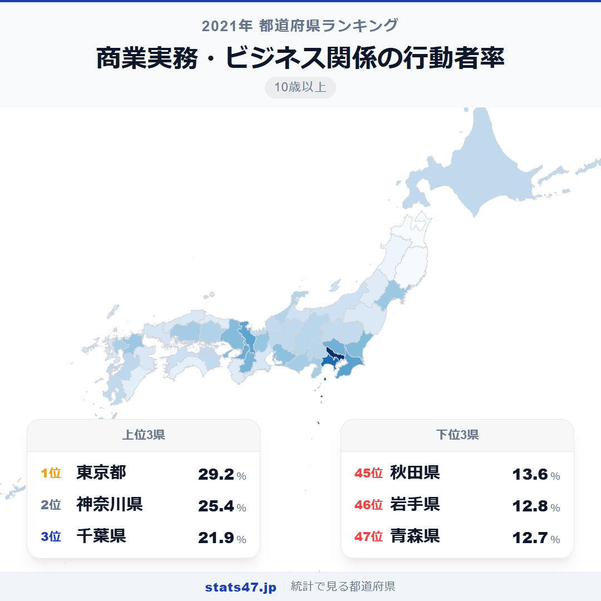
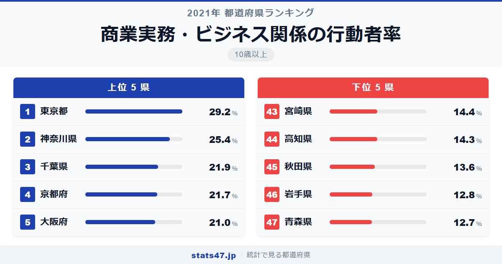
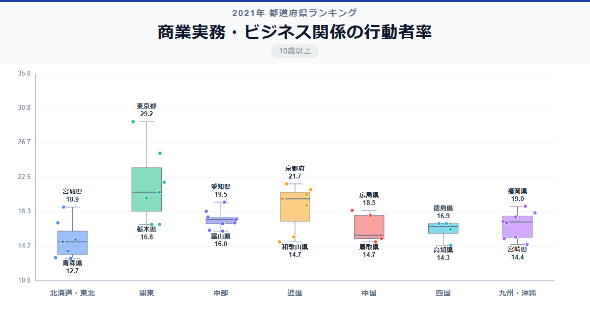

10歳以上の約3割がビジネス関連の学習に取り組んでいる東京都。一方、青森県ではその割合が12.7％にとどまり、2.3倍もの開きがあります。リスキリングやDXが叫ばれる時代に、住む場所によってこれほど学びの機会に差があるのは見過ごせません。

全国1位の東京都は偏差値88.3で29.2％。47位の青森県は偏差値34.1で12.7％です。上位には首都圏や関西圏の都府県が並び、下位には東北地方が集中するという明確な地域パターンが浮かび上がります。

なぜ大都市圏ほどビジネス学習が盛んなのでしょうか。企業の研修機会や資格スクールの充実度が関係しているのかもしれません。

「商業実務・ビジネス関係の行動者率」は、簿記・経理・パソコン操作・プログラミングなど、仕事に直結する学習を過去1年間に行った人の割合です。総務省「社会生活基本調査」（2021年）のデータに基づいています。

## データハイライト

全国平均: 17.53％

1位: 東京都（29.2％ / 偏差値 88.3）

47位: 青森県（12.7％ / 偏差値 34.1）

上位10県のうち8県が三大都市圏に属しています。首都圏4都県（東京・神奈川・千葉・埼玉）がすべてトップ6に入り、大都市圏への集中が際立ちます。全国平均の17.53％を境に、都市部と地方部で二極化する傾向が見て取れます。

## 【コロプレス地図】日本全国の分布

<!-- note投稿時: この画像行を削除し、images/choropleth-map-1080x1080.png をアップロード -->

地図を見ると、関東から近畿にかけての太平洋ベルト地帯が濃い色で目立ちます。東京都を中心に、神奈川・千葉・埼玉の首都圏が高い値を示し、そこから離れるにつれて薄くなっていく同心円状のパターンです。

意外なのは茨城県の8位です。つくば研究学園都市を擁し、研究機関や IT 企業が集積していることが影響しているのでしょう。同様に、京都府が4位に入っているのも、大学や研究機関の多さが反映されていると考えられます。

一方で、東北6県はすべて30位以下。特に青森・岩手・秋田の北東北3県は44位以下に沈んでいます。ビジネス学習を提供する民間教育機関や企業研修の機会が、地方では限られている可能性があります。

## 上位5：分析

<!-- note投稿時: この画像行を削除し、images/chart-x-1200x630.png をアップロード -->

日本の経済・情報の中心地である東京都は、偏差値88.3の29.2％で堂々の全国1位です。企業の本社が集中し、社内研修・外部セミナー・資格スクールなど、ビジネス学習へのアクセスが圧倒的に充実しています。

2位の神奈川県は偏差値75.8で25.4％。横浜・川崎を中心に大企業の事業所が多く、東京都への通勤者も含めて、ビジネスパーソンの学習意欲が高い地域です。

千葉県が3位に入り、偏差値64.3の21.9％を記録しています。千葉市や幕張の業務地区に加え、首都圏のベッドタウンとして東京の学習インフラを共有できる立地が強みでしょう。

文化・学術都市のイメージが強い京都府は偏差値63.7で21.7％の4位。多くの大学を擁し、社会人向け公開講座やリカレント教育の機会が豊富なことが背景にあります。

5位の大阪府は偏差値61.4で21.0％。西日本の経済拠点として、商業・ビジネス関連の教育インフラが充実しています。

## 下位5：分析

青森県は偏差値34.1の12.7％で全国最下位です。産業構造における第一次産業の割合が比較的高く、ビジネス関連学習の需要や提供機関が大都市圏と比べて限られています。

46位の岩手県は偏差値34.5で12.8％。広い県土に人口が分散しており、学習機会へのアクセスが地理的に難しい側面があります。

秋田県は偏差値37.1の13.6％で45位につけています。高齢化率が全国最高水準であることも、ビジネス学習の行動者率を押し下げる要因のひとつと考えられます。

44位の高知県は偏差値39.4で14.3％。四国山地に隔てられた地理的条件もあり、大都市圏との情報格差が表れているのかもしれません。

宮崎県は43位で偏差値39.7の14.4％です。温暖な気候と豊かな自然に恵まれた県ですが、大規模な企業拠点が少なく、ビジネス学習の機会が限られる環境にあります。

## 地域別の傾向

<!-- note投稿時: この画像行を削除し、images/boxplot-1200x630.png をアップロード -->

関東と近畿が高く、東北と四国が低い傾向です。中部・九州は中間的な値で、ばらつきも大きくなっています。

## まとめ

商業実務・ビジネス関係の行動者率の地域差は、学びの機会が住む場所に大きく左右されるという現実を映し出しています。このデータから以下の洞察が得られます。

**首都圏への一極集中が学習機会にも反映**

トップ6のうち4つが首都圏の都県です。
企業の本社集中と民間教育機関の充実が、学習行動の地域差を生んでいます。

**東北地方の低さは構造的な課題**

東北6県はすべて30位以下で、特に北東北3県が最下位圏に集中しています。
高齢化や産業構造の違いだけでなく、学習インフラそのものの地域間格差が示唆されます。

**京都の存在感が示す大学都市の力**

商業都市でない京都府が4位に入っているのは注目に値します。
大学や研究機関が社会人の学び直しの場としても機能していることがうかがえます。

## もっと詳しく知りたい方へ

全47都道府県の順位や、グラフ・地図での可視化は stats47 で見ることができます。

### 商業実務・ビジネス関係の行動者率ランキング 全都道府県版

https://stats47.jp/ranking/study-participation-rate-business

### パソコンなどの情報処理の行動者率ランキング

https://stats47.jp/ranking/study-participation-rate-computer

### 商業実務・ビジネス関係（情報処理除く）の行動者率ランキング

https://stats47.jp/ranking/study-participation-rate-business-skills

### 人文・社会・自然科学の行動者率ランキング

https://stats47.jp/ranking/study-participation-rate-academic

### 芸術・文化の行動者率ランキング

https://stats47.jp/ranking/study-participation-rate-arts-culture

### 外国語学習の行動者率ランキング

https://stats47.jp/ranking/study-participation-rate-foreign-language

---

**stats47** は、e-Stat の公的統計データを47都道府県別に可視化するサービスです。
ランキング・散布図・時系列チャートで、地域の違いがひと目でわかります。

https://stats47.jp
