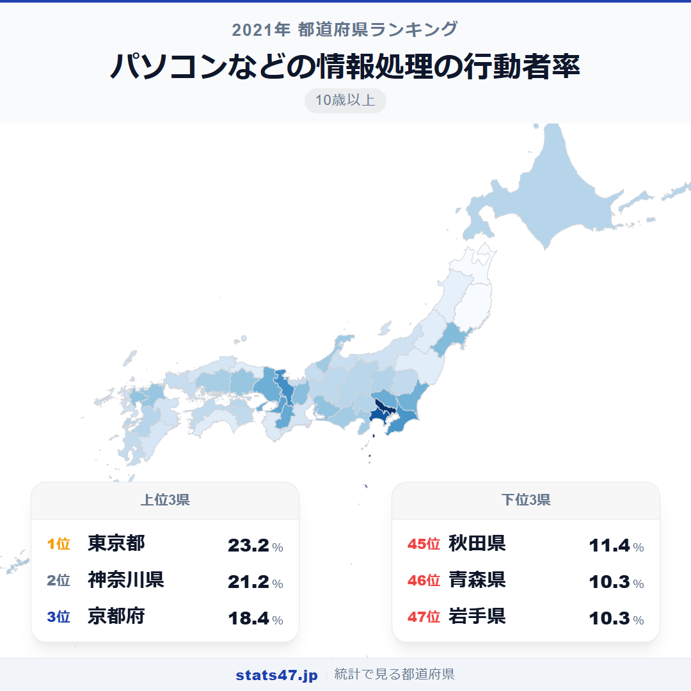
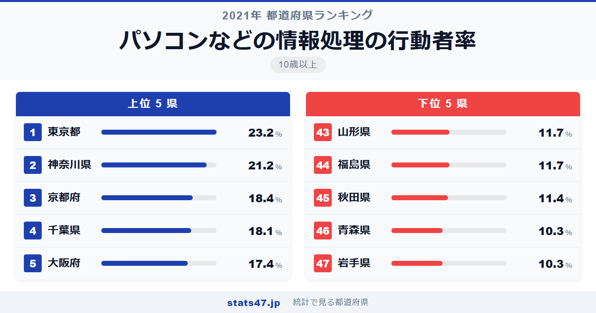
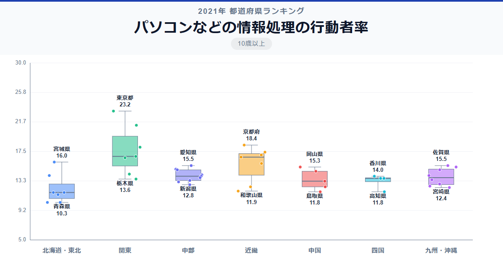

DX推進が国の成長戦略の柱となるなか、パソコンやプログラミングを学ぶ人の割合は東京都で23.2％。対して岩手県では10.3％と、半分にも満たない水準にとどまっています。デジタルスキルの習得率にこれほど地域差があるという事実は、地方のDX推進を考える上で重要な示唆を含んでいます。

全国1位の東京都は偏差値84.9で23.2％、47位の岩手県は偏差値33.6で10.3％です。青森県も同じく10.3％で並んでおり、東北地方の厳しい状況が見えます。

IT業界の企業数や研修機会の地域差が、そのまま学習行動の差として現れているのでしょうか。

「パソコンなどの情報処理の行動者率」は、パソコン操作・プログラミング・情報処理資格の学習などを過去1年間に行った10歳以上の人の割合です。総務省「社会生活基本調査」（2021年）に基づくデータとなります。

## データハイライト

全国平均: 14.42％

1位: 東京都（23.2％ / 偏差値 84.9）

47位: 岩手県（10.3％ / 偏差値 33.6）

上位は東京都が2位の神奈川県に2ポイント差をつけて突出しています。全体として三大都市圏の都府県が上位に集まる一方、東北地方の県が40位台に複数並ぶ構図です。偏差値80を超えるのは東京都のみで、その突出ぶりが際立ちます。

## 【コロプレス地図】日本全国の分布

<!-- note投稿時: この画像行を削除し、images/choropleth-map-1080x1080.png をアップロード -->

太平洋側の都市部が濃い色で浮かび上がり、日本海側や東北地方が薄い色で広がっています。首都圏から京阪神にかけてのベルト地帯が高い値を示すパターンは、ビジネス関連の学習全般に共通する特徴です。

注目すべきは佐賀県の13位。九州では福岡県と並ぶ高さで、県を挙げたICT教育推進施策の効果がうかがえます。一方、沖縄県は18位と健闘しており、IT産業の集積が進んでいることとの関連が推測されます。

東北6県は最高でも宮城県の10位。仙台という政令指定都市を有する宮城県だけが上位に食い込み、他の5県はいずれも38位以下に沈んでいます。

## 上位5：分析

<!-- note投稿時: この画像行を削除し、images/chart-x-1200x630.png をアップロード -->

IT企業の集積地として知られる東京都。偏差値84.9の23.2％は、2位との差が2ポイントと他を大きく引き離しています。渋谷・六本木・大手町のIT企業群を背景に、社内研修やプログラミングスクールの選択肢が桁違いに豊富です。

神奈川県は偏差値76.9で21.2％の2位につけています。横浜みなとみらい地区や川崎のテクノロジー拠点に加え、東京のIT企業に通勤するエンジニアも多く含まれるでしょう。

3位に入ったのは京都府で、偏差値65.8の18.4％。京都大学を筆頭に多くの理工系研究機関を擁し、学術的な情報処理学習が活発に行われています。

千葉県は偏差値64.6で18.1％の4位です。幕張地区のIT企業集積に加え、首都圏の一角として情報処理関連の学習環境に恵まれています。

偏差値61.8の17.4％で5位に入った大阪府。西日本最大の都市として、IT企業やシステム開発会社が集中し、情報処理学習の基盤が整っています。

## 下位5：分析

岩手県と青森県はともに10.3％で、偏差値33.6の最下位圏です。広大な県土に人口が点在し、IT関連の教育機関やコワーキングスペースが少ない環境が、学習機会の確保を難しくしています。

秋田県は偏差値38.0で11.4％の45位。全国最高水準の高齢化率が、デジタルスキル学習への参加率に影響している可能性があります。

福島県と山形県はともに11.7％で偏差値39.2の43位タイ。東北地方の中でも内陸部に位置し、IT産業の拠点が少ない地域です。

これら下位県に共通するのは、IT産業の拠点となる都市機能が限られている点でしょう。オンライン学習の普及が進む今後、こうした地域差がどう変化するかが注目されます。

## 地域別の傾向

<!-- note投稿時: この画像行を削除し、images/boxplot-1200x630.png をアップロード -->

関東が最も高く、近畿がそれに続きます。東北は全体的に低く、ばらつきも小さいのが特徴です。

## まとめ

パソコンなどの情報処理の行動者率は、デジタル人材の地域偏在を映す鏡と言えます。このデータから以下の洞察が得られます。

**東京都の突出が示すIT産業の一極集中**

偏差値84.9は47都道府県で唯一の80超えです。
IT企業とデジタル人材が東京に集中する構造が、学習行動にもそのまま反映されています。

**東北地方のデジタルデバイド**

宮城県を除く東北5県がすべて38位以下で、下位5県のうち4県を東北が占めています。
地方のDX推進には、まず学習機会へのアクセス改善が課題です。

**佐賀県・沖縄県の健闘が示す政策効果の可能性**

人口規模では小さい佐賀県が13位、沖縄県が18位と上位に入っています。
地方であっても、IT産業誘致やICT教育施策によって情報処理学習率を高められることを示唆しています。

## もっと詳しく知りたい方へ

全47都道府県の順位や、グラフ・地図での可視化は stats47 で見ることができます。

### パソコンなどの情報処理の行動者率ランキング 全都道府県版

https://stats47.jp/ranking/study-participation-rate-computer

### 商業実務・ビジネス関係の行動者率ランキング

https://stats47.jp/ranking/study-participation-rate-business

### 商業実務・ビジネス関係（情報処理除く）の行動者率ランキング

https://stats47.jp/ranking/study-participation-rate-business-skills

### 人文・社会・自然科学の行動者率ランキング

https://stats47.jp/ranking/study-participation-rate-academic

### 芸術・文化の行動者率ランキング

https://stats47.jp/ranking/study-participation-rate-arts-culture

### 外国語学習の行動者率ランキング

https://stats47.jp/ranking/study-participation-rate-foreign-language

---

**stats47** は、e-Stat の公的統計データを47都道府県別に可視化するサービスです。
ランキング・散布図・時系列チャートで、地域の違いがひと目でわかります。

https://stats47.jp
