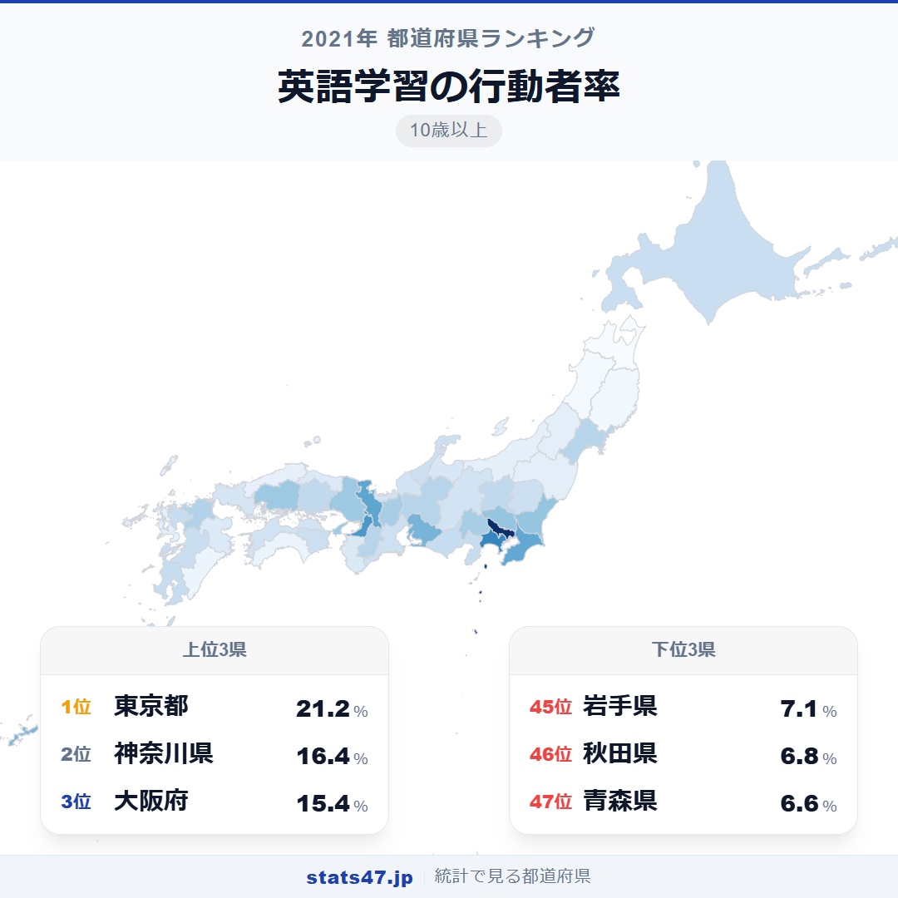
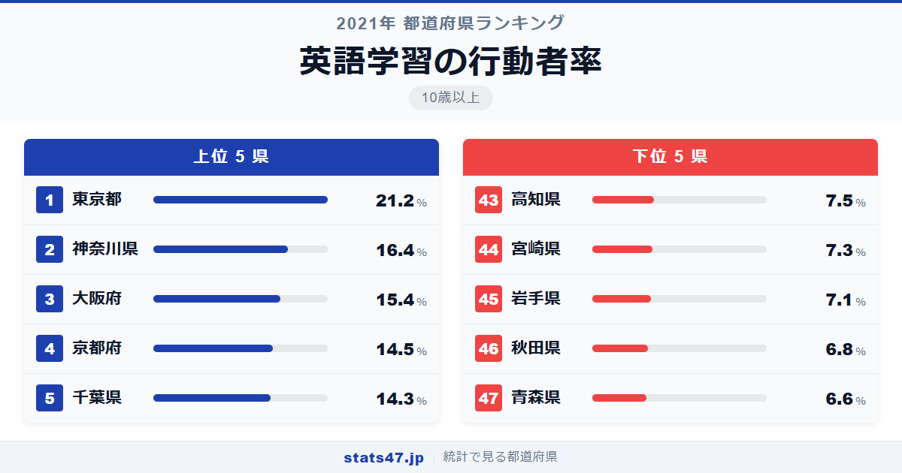
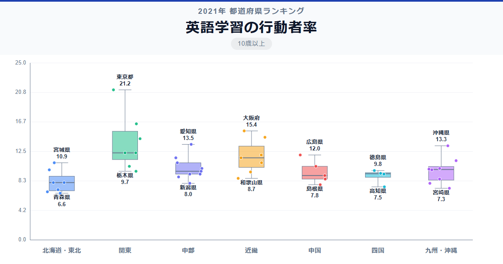

東京都民の5人に1人が英語を学んでいます。21.2％、偏差値89.4という数値は全国で断然のトップです。最下位の青森県は6.6％で偏差値36.0。住む場所によって英語学習に取り組む人の割合は3.2倍もの開きがあります。

グローバル化が進む日本社会ですが、英語学習の「熱量」は都市と地方で大きく異なります。この差はビジネス環境の違いだけでは説明しきれません。

「英語学習の行動者率」は、過去1年間に英語の学習を行った10歳以上の人の割合です。総務省「社会生活基本調査」（2021年）のデータに基づいています。

## データハイライト

全国平均: 10.43％

1位: 東京都（21.2％ / 偏差値 89.4）

47位: 青森県（6.6％ / 偏差値 36.0）

外国語学習全体と同じ傾向で、大都市圏が上位、東北・山陰が下位を占めます。英語は外国語学習の9割を占める主流言語であり、パターンもほぼ同じです。

## 【コロプレス地図】日本全国の分布

<!-- note投稿時: この画像行を削除し、images/choropleth-map-1080x1080.png をアップロード -->

地図では東京の突出ぶりが一目瞭然です。神奈川・大阪・京都・千葉と続く上位県はすべて太平洋ベルト地帯に位置しています。

東北地方は全県が10％を下回りました。最も高い宮城県でも10.9％で15位にとどまり、東北のハブ都市・仙台でさえ全国の上位には入れていません。

沖縄県の13.3％は7位で注目に値します。外国語学習全体でも7位であり、米軍関係者との日常的な接触が英語学習の動機になっていることがわかります。

## 上位5：分析

<!-- note投稿時: この画像行を削除し、images/chart-x-1200x630.png をアップロード -->

ビジネス英語のニーズが日本で最も高い東京都は、偏差値89.4の21.2％で圧倒的な1位。TOEIC受験者数や英会話スクールの密度も全国最高水準で、「英語ができること」がキャリアに直結する環境です。

2位の神奈川県は偏差値71.9で16.4％。外資系企業の研究所やグローバル企業の拠点が多い横浜エリアを中心に、ビジネスパーソンの英語学習需要が高い地域です。

大阪府が偏差値68.2の15.4％で3位。インバウンド観光の拡大に伴い、サービス業での英語ニーズが高まっている関西の中心地です。

京都府は偏差値64.9で14.5％の4位。世界的な観光地としてのブランドに加え、京都大学をはじめとする研究機関の国際化が進む学術都市です。

5位の千葉県は偏差値64.2の14.3％。成田空港の存在が航空・物流業界の英語需要を生み、空港周辺のホテル・サービス業でも英語力が求められています。

## 下位5：分析

青森県は6.6％で偏差値36.0の最下位。英語を使う仕事の機会が限られ、外国人住民の比率も低い環境では、英語学習への動機が生まれにくい状況です。

46位の秋田県は偏差値36.7で6.8％。国際教養大学がある秋田ですが、県全体で見ると英語学習率は低い水準にとどまっています。

岩手県は偏差値37.8の7.1％で45位。東北3県がワースト3を形成し、地域としての構造的な課題が浮き彫りになりました。

44位の宮崎県は偏差値38.5で7.3％。南九州のリゾート地として外国人観光客は増えていますが、住民の英語学習率への波及はまだ限定的です。

高知県は偏差値39.3の7.5％で43位。四国の中でも特に英語学習率が低く、国際的なビジネス拠点の少なさが反映されています。

## 地域別の傾向

<!-- note投稿時: この画像行を削除し、images/boxplot-1200x630.png をアップロード -->

関東と近畿が高く、東北が最低。外国語学習全体とほぼ同じパターンで、英語学習が外国語学習の大部分を占めていることが確認できます。

## まとめ

英語学習の行動者率は、地域の国際化とビジネス環境を如実に反映する指標です。このデータから以下の洞察が得られます。

**東京と地方の英語格差は「機会の格差」**

偏差値89.4の東京と36.0の青森では、英語を使う場面も学ぶ手段もまったく異なります。
オンライン英会話の普及がこの差を縮められるかが今後の注目点です。

**沖縄の英語学習率の高さは独自環境の反映**

7位の13.3％は、米軍関係者との日常的な接触という他県にはない環境がもたらした結果です。
基地問題とは別の文脈で、英語との接点が住民の学習行動を促しています。

**東北3県のワースト3は地方の国際化課題**

青森・秋田・岩手が6〜7％台で最下位グループを形成。
英語学習の「必要性」を感じる機会自体が少ないことが、根本的な課題です。

## もっと詳しく知りたい方へ

全47都道府県の順位や、グラフ・地図での可視化は stats47 で見ることができます。

### 英語学習の行動者率ランキング 全都道府県版

https://stats47.jp/ranking/study-participation-rate-english

### 外国語学習の行動者率ランキング

https://stats47.jp/ranking/study-participation-rate-foreign-language

### 英語以外の外国語学習の行動者率ランキング

https://stats47.jp/ranking/study-participation-rate-other-language

### パソコンなどの情報処理の行動者率ランキング

https://stats47.jp/ranking/study-participation-rate-computer

### 最終学歴が大学・大学院卒の者の割合ランキング

https://stats47.jp/ranking/final-education-university-graduate-school-ratio

### 商業実務・ビジネス関係の行動者率ランキング

https://stats47.jp/ranking/study-participation-rate-business

---

**stats47** は、e-Stat の公的統計データを47都道府県別に可視化するサービスです。
ランキング・散布図・時系列チャートで、地域の違いがひと目でわかります。

https://stats47.jp
