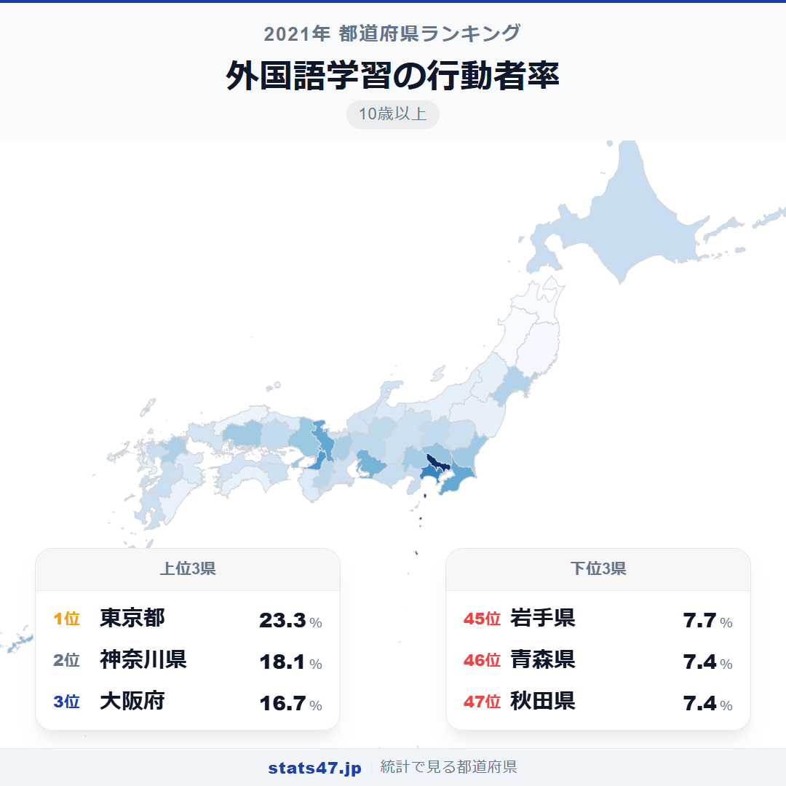
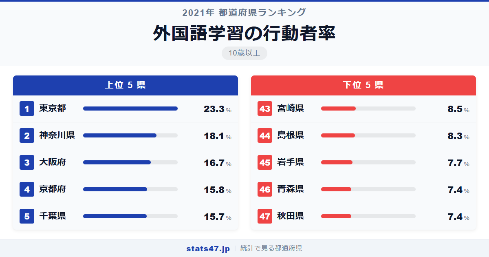
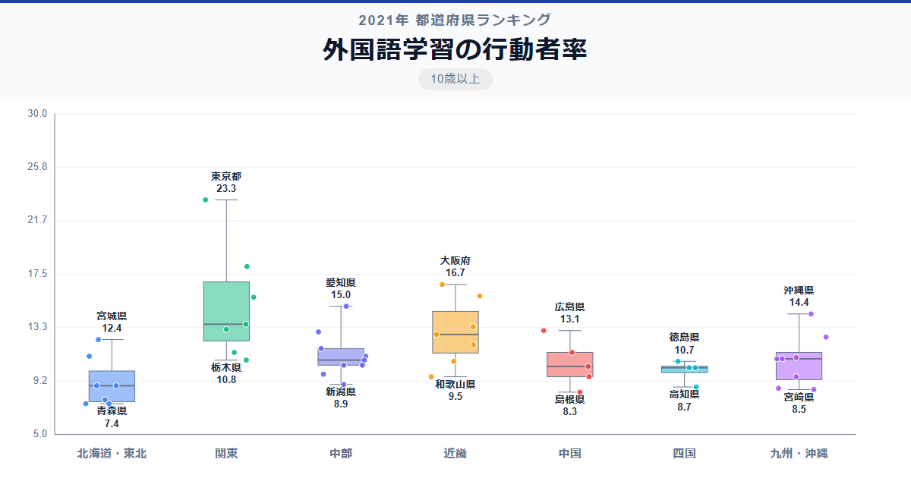

東京都民の4人に1人近くが外国語を学んでいます。23.3％という数値は、偏差値89.6で全国を圧倒するダントツの1位。一方、最下位の秋田県はわずか7.4％で偏差値36.2。同じ国に住んでいながら、外国語学習に取り組む人の割合は3倍以上の差があります。

なぜこれほどの差がつくのか。仕事で外国語を使う機会の多さや、外国人住民の比率が背景にありそうです。

「外国語学習の行動者率」は、過去1年間に外国語の学習を行った10歳以上の人の割合です。英語を含むすべての外国語が対象で、総務省「社会生活基本調査」（2021年）のデータに基づいています。

## データハイライト

全国平均: 11.50％

1位: 東京都（23.3％ / 偏差値 89.6）

47位: 秋田県（7.4％ / 偏差値 36.2）

東京が突出し、2位の神奈川とも5ポイント以上の差。上位は大都市圏に集中し、下位は東北・山陰に偏っています。国際化の度合いがそのまま数値に表れた格好です。

## 【コロプレス地図】日本全国の分布

<!-- note投稿時: この画像行を削除し、images/choropleth-map-1080x1080.png をアップロード -->

地図を見ると、東京を頂点に首都圏が際立って濃く、大阪・京都・愛知も高い水準を示しています。太平洋ベルト地帯に沿った分布が鮮明です。

東北地方は全県が全国平均以下。秋田・青森はともに7.4％で最下位タイに沈んでいます。山陰の島根も8.3％と低く、国際的なビジネスや交流の機会が少ない地域との格差が浮き彫りになっています。

注目は沖縄県の14.4％で7位。米軍基地の存在もあり、英語をはじめとした外国語に接する機会が多い独特の環境が数値に反映されています。

## 上位5：分析

<!-- note投稿時: この画像行を削除し、images/chart-x-1200x630.png をアップロード -->

外資系企業の本社や国際機関が集中する東京都は、偏差値89.6の23.3％で他を圧倒しています。ビジネスでの実用性に加え、語学スクールやオンライン学習サービスへのアクセスも全国最多です。

2位の神奈川県は偏差値72.2で18.1％。横浜の国際的な雰囲気や外国人コミュニティの存在が、語学学習への動機づけになっています。

大阪府が偏差値67.5の16.7％で3位。関西国際空港を擁するインバウンドの玄関口として、観光業やサービス業での語学需要が高まっています。

4位の京都府は偏差値64.4で15.8％。留学生が多い大学都市であり、国際交流の機会が日常的にある環境です。

千葉県は偏差値64.1の15.7％で5位。成田国際空港の所在地であり、航空・物流関連の国際的なビジネス環境が語学学習を後押ししています。

## 下位5：分析

秋田県と青森県がともに7.4％で偏差値36.2の46位タイ。外国人住民比率が低く、日常生活や仕事で外国語を使う場面が極めて限られている地域です。

45位の岩手県は偏差値37.3で7.7％。東北3県が最下位グループを形成し、地域の国際化の遅れが語学学習率に直結しています。

島根県は偏差値39.3の8.3％で44位。山陰地方は外国人観光客の訪問も少なく、語学のニーズが高まりにくい環境にあります。

43位の宮崎県は偏差値39.9で8.5％。温暖な気候と自然豊かな環境を持つ宮崎ですが、国際的なビジネス拠点は少なく、語学学習の動機が生まれにくい状況です。

## 地域別の傾向

<!-- note投稿時: この画像行を削除し、images/boxplot-1200x630.png をアップロード -->

関東が突出して高く、近畿がそれに続きます。東北が最も低く、北海道・中国・九州も平均を下回る傾向です。

## まとめ

外国語学習の行動者率は、地域の国際化の度合いを映す鏡です。このデータから以下の洞察が得られます。

**東京の偏差値89.6は学習系指標で最大級の格差**

2位の神奈川にも5ポイント以上の差をつける独走状態です。
外資系企業・国際機関・語学スクールの集中が、学習機会と動機の両面で圧倒的な環境を生んでいます。

**沖縄7位は米軍基地の影響か**

全国平均を上回る14.4％は、沖縄の独特の国際環境を反映しています。
基地周辺での英語との接触や、観光業での外国語ニーズが高い地域です。

**東北の語学学習格差は地方の国際化課題を示唆**

秋田・青森・岩手が最下位グループを形成。
外国語を学ぶ「理由」と「機会」の両方が少ないことが、低い数値の根底にあります。

## もっと詳しく知りたい方へ

全47都道府県の順位や、グラフ・地図での可視化は stats47 で見ることができます。

### 外国語学習の行動者率ランキング 全都道府県版

https://stats47.jp/ranking/study-participation-rate-foreign-language

### 英語学習の行動者率ランキング

https://stats47.jp/ranking/study-participation-rate-english

### 英語以外の外国語学習の行動者率ランキング

https://stats47.jp/ranking/study-participation-rate-other-language

### パソコンなどの情報処理の行動者率ランキング

https://stats47.jp/ranking/study-participation-rate-computer

### 商業実務・ビジネス関係の行動者率ランキング

https://stats47.jp/ranking/study-participation-rate-business

### 最終学歴が大学・大学院卒の者の割合ランキング

https://stats47.jp/ranking/final-education-university-graduate-school-ratio

---

**stats47** は、e-Stat の公的統計データを47都道府県別に可視化するサービスです。
ランキング・散布図・時系列チャートで、地域の違いがひと目でわかります。

https://stats47.jp
