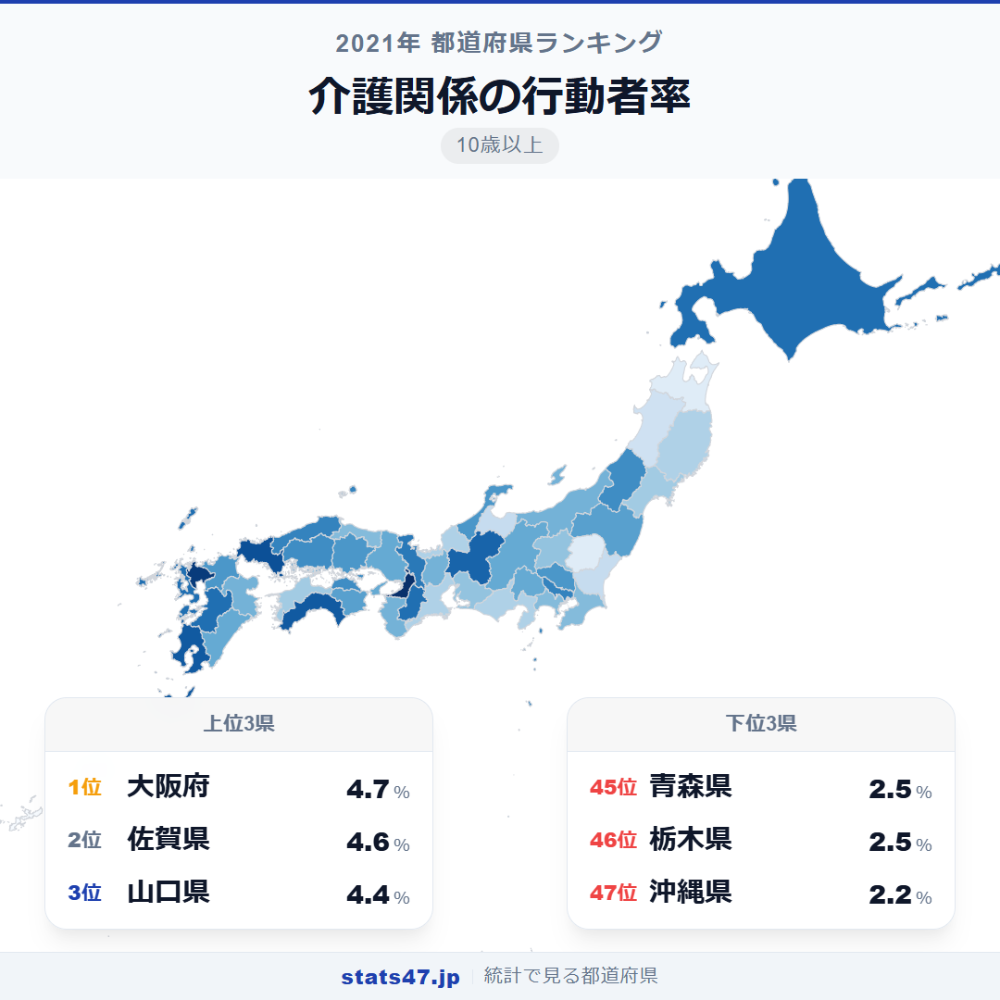
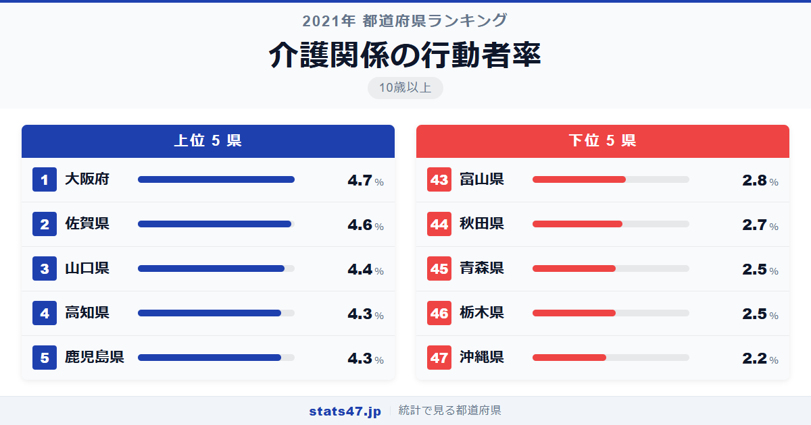
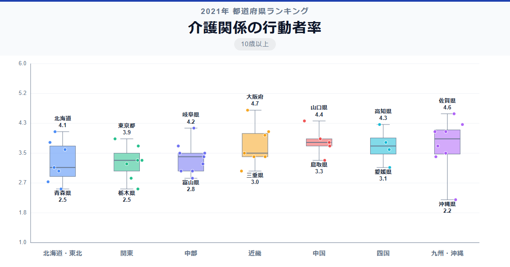

高齢化率が全国一の秋田県ではなく、大阪府が介護学習で全国1位。意外に思われるかもしれませんが、介護を学ぶ人の割合は必ずしも高齢化率と一致しません。大阪府は4.7％で全国トップ、一方最下位の沖縄県はわずか2.2％です。

1位の大阪府は偏差値71.1で4.7％、47位の沖縄県は偏差値26.2で2.2％。その差は2.1倍。全国平均は3.53％で、上位と下位の差は他の学習分野と比べると小さいものの、介護の現場が抱える課題を映し出すデータです。

高齢化率が高い秋田県は44位の2.7％。なぜ高齢化が進んだ県で介護学習率が低いのか、考えさせられます。

「介護関係の行動者率」は、介護の知識や技術に関する学習を過去1年間に行った10歳以上の人の割合です。総務省「社会生活基本調査」（2021年）のデータに基づいています。

## データハイライト

全国平均: 3.53％

1位: 大阪府（4.7％ / 偏差値 71.1）

47位: 沖縄県（2.2％ / 偏差値 26.2）

最大と最小の差が2.1倍と、学習関連の指標としては比較的小さな格差です。上位には大阪府、佐賀県、山口県など多様な地域が入り、必ずしも大都市圏が優位とは限らない独特の分布を見せています。高齢化の進行度や介護施設の充実度が複雑に絡み合っているようです。

## 【コロプレス地図】日本全国の分布

<!-- note投稿時: この画像行を削除し、images/choropleth-map-1080x1080.png をアップロード -->

他の学習指標とは異なり、大都市圏への偏りが少ない分布です。西日本、特に山口県・佐賀県・鹿児島県など中国・九州地方で高い値が目立ちます。

大阪府が1位というのは意外ですが、人口の多さに比例して介護施設・事業所数も多く、介護人材の育成ニーズが高いことが背景にあるのでしょう。佐賀県や高知県など人口規模の小さい県が上位に入っていることも特徴的で、地域の高齢化対策として介護学習を推進している可能性があります。

東北地方は岩手県38位、秋田県44位、青森県45位と低迷。高齢化率は高いにもかかわらず、介護学習の行動者率は全国平均を下回っています。

## 上位5：分析

<!-- note投稿時: この画像行を削除し、images/chart-x-1200x630.png をアップロード -->

西日本最大の都市を擁する大阪府が偏差値71.1の4.7％で全国1位です。介護事業所の数が多く、介護職員初任者研修などの資格取得の場が充実していることが、高い行動者率につながっています。

佐賀県が偏差値69.3の4.6％で2位に入っています。人口約80万人の小さな県ながら、高齢化の進行に対応した介護人材育成に積極的に取り組んでいることがうかがえます。

3位は山口県で、偏差値65.7の4.4％。高齢化率が高い県であり、地域包括ケアシステムの構築に向けた介護学習が活発に行われていると推測されます。

高知県と鹿児島県がともに偏差値63.9の4.3％で4位タイです。高知県は中山間地域が多く、在宅介護の担い手育成が課題。鹿児島県は離島を多く抱え、介護人材の確保が喫緊の課題となっているため、学習機会の提供に力を入れていると考えられます。

## 下位5：分析

沖縄県は偏差値26.2の2.2％で全国最下位です。全国で最も平均年齢が若い県であり、高齢化が他県に比べて進んでいないことが、介護学習の需要を相対的に低く抑えています。

栃木県と青森県はともに偏差値31.6の2.5％で45位タイ。栃木県は比較的若い就業者が多い工業県で、介護分野への関心がやや低い傾向にあるのかもしれません。青森県は高齢化が進んでいるものの、学習環境へのアクセスが限られています。

44位の秋田県は偏差値35.2で2.7％。高齢化率全国トップの県でありながら、介護学習率が低い背景には、若年層の流出が激しく学習の担い手そのものが減少していることがありそうです。

富山県も偏差値37.0の2.8％で43位。持ち家率が高く三世代同居の家族形態が多い県で、家族介護の伝統が根強いことから、制度的な介護学習への参加が少ない可能性があります。

## 地域別の傾向

<!-- note投稿時: この画像行を削除し、images/boxplot-1200x630.png をアップロード -->

近畿と九州が高めで、関東と東北がやや低い傾向です。他の学習指標と異なり、大都市圏が必ずしも優位ではないのが特徴的です。

## まとめ

介護関係の行動者率は、高齢化率だけでは説明できない複雑な地域差を示しています。このデータから以下の洞察が得られます。

**高齢化率と介護学習率は一致しない**

高齢化率全国1位の秋田県が44位、2位の青森県が45位という結果は衝撃的です。
高齢化が進んでも、学習の担い手である若年層が流出すれば介護学習率は上がりません。

**大都市圏の優位が崩れる唯一の学習指標**

佐賀県2位、山口県3位、高知県4位と、人口の少ない県が上位に並んでいます。
地方の介護現場のニーズが、学習行動を後押ししている構図です。

**沖縄県の最下位は「若さ」の裏返し**

全国で最も若い人口構成の沖縄県が最下位であることは、この指標が高齢化と深く結びついていることを物語っています。
ただし、沖縄県も今後の高齢化進行に備えた人材育成は重要な課題です。

## もっと詳しく知りたい方へ

全47都道府県の順位や、グラフ・地図での可視化は stats47 で見ることができます。

### 介護関係の行動者率ランキング 全都道府県版

https://stats47.jp/ranking/study-participation-rate-nursing-care

### 家政・家事の行動者率ランキング

https://stats47.jp/ranking/study-participation-rate-home-economics

### 商業実務・ビジネス関係の行動者率ランキング

https://stats47.jp/ranking/study-participation-rate-business

### 人文・社会・自然科学の行動者率ランキング

https://stats47.jp/ranking/study-participation-rate-academic

### 芸術・文化の行動者率ランキング

https://stats47.jp/ranking/study-participation-rate-arts-culture

### ボランティア活動の年間行動者率ランキング

https://stats47.jp/ranking/volunteer-activity-annual-participation-rate-10plus

---

**stats47** は、e-Stat の公的統計データを47都道府県別に可視化するサービスです。
ランキング・散布図・時系列チャートで、地域の違いがひと目でわかります。

https://stats47.jp
