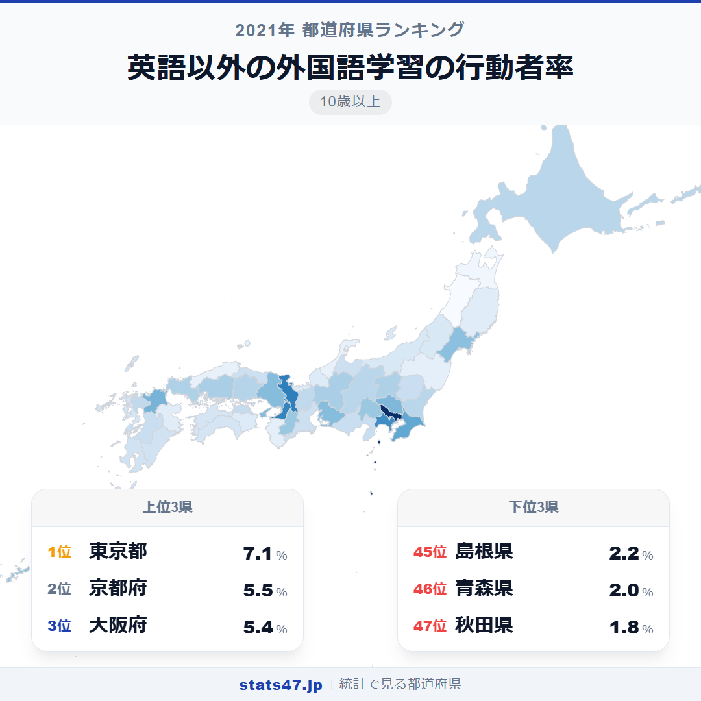
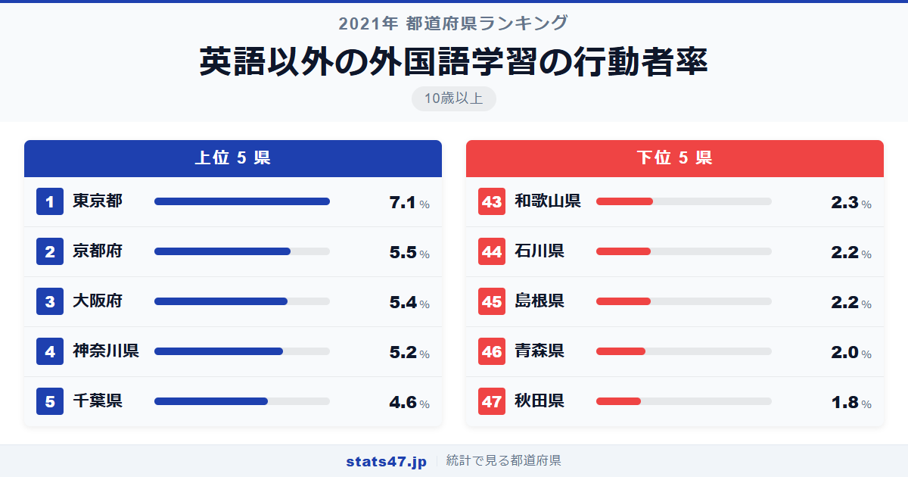
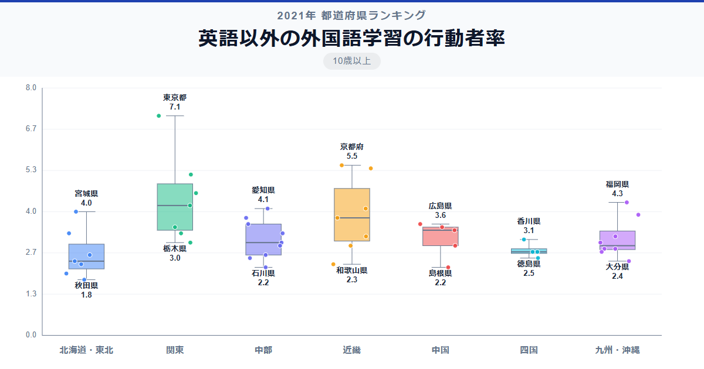

韓国語、中国語、フランス語、スペイン語。英語以外の外国語を学ぶ人は全国平均でわずか3.32％ですが、東京都だけは7.1％と突出しています。偏差値87.3で断然の1位。最下位の秋田県は1.8％で偏差値35.0、その差は約3.9倍です。

英語学習が「実用」なら、英語以外の外国語学習は「興味・関心」の要素が強い指標。なぜ京都が2位で大阪が3位なのか、地域による違いの背景が見えてきます。

「英語以外の外国語学習の行動者率」は、過去1年間に英語を除く外国語の学習を行った10歳以上の人の割合です。総務省「社会生活基本調査」（2021年）のデータに基づいています。

## データハイライト

全国平均: 3.32％

1位: 東京都（7.1％ / 偏差値 87.3）

47位: 秋田県（1.8％ / 偏差値 35.0）

英語学習と似た傾向ですが、京都が2位に入るなど文化的な関心の強い地域が上位に現れるのが特徴です。下位は東北と北陸に集中しています。

## 【コロプレス地図】日本全国の分布

<!-- note投稿時: この画像行を削除し、images/choropleth-map-1080x1080.png をアップロード -->

地図では東京の突出が際立ちます。京都・大阪・神奈川も高めで、大都市圏に濃い色が集中する傾向は英語学習と共通しています。

興味深いのは福岡県の6位で4.3％。アジアへの玄関口として韓国語や中国語の学習需要が高い地域です。沖縄県も3.9％で11位と健闘しており、国際的な環境が英語以外の語学にも波及していることがわかります。

東北地方は全県が平均以下。秋田1.8％、青森2.0％と極めて低く、多言語学習への関心が薄い地域です。

## 上位5：分析

<!-- note投稿時: この画像行を削除し、images/chart-x-1200x630.png をアップロード -->

多国籍な環境が日常の東京都は、偏差値87.3の7.1％で圧倒的な1位。韓流ブームによる韓国語人気、ビジネスでの中国語需要、フランス語・スペイン語のカルチャースクールと、多言語学習の選択肢が豊富です。

2位の京都府は偏差値71.5で5.5％。留学生の多さに加え、伝統文化と国際性が共存する独特の学術環境が、多言語への関心を育てています。

大阪府が偏差値70.5の5.4％で3位に続きます。在日コリアンの歴史的コミュニティがあり、韓国語学習が盛んな地域。中華街のある神戸に近い立地も、中国語学習者を生む土壌になっています。

4位の神奈川県は偏差値68.5で5.2％。横浜の中華街をはじめ、多文化が交差する国際都市としての特性が表れています。

千葉県は偏差値62.6の4.6％で5位。成田空港の存在による国際的な雰囲気に加え、県内のアジア系住民コミュニティの影響も考えられます。

## 下位5：分析

秋田県は1.8％で偏差値35.0の最下位。外国人住民の比率が極めて低く、英語以外の外国語に触れる機会がほとんどない環境です。

46位の青森県は偏差値36.9で2.0％。秋田と同様に、多言語学習への動機となる国際的な接点が少ない地域です。

島根県は偏差値38.9の2.2％で45位タイ。山陰地方は外国人観光客の訪問も相対的に少なく、多言語環境とは距離のある生活圏です。

石川県も2.2％で偏差値38.9の同率45位。北陸新幹線の開業で観光客は増えていますが、住民の語学学習行動への影響はまだ限定的のようです。

43位の和歌山県は偏差値39.9で2.3％。近畿圏にありながら、大阪・京都の国際的な雰囲気からは距離があり、低い数値にとどまりました。

## 地域別の傾向

<!-- note投稿時: この画像行を削除し、images/boxplot-1200x630.png をアップロード -->

関東と近畿が高く、東北・北陸が低い傾向です。英語学習よりも地域差がやや大きく、「関心ベース」の学習はより都市に集中しやすいことがわかります。

## まとめ

英語以外の外国語学習の行動者率は、地域の多文化度と住民の国際的関心を反映する指標です。このデータから以下の洞察が得られます。

**英語以外の語学は「文化的関心」の指標**

京都2位、大阪3位は、歴史的な国際交流やアジア系コミュニティの存在が背景にあります。
英語学習が「実用」中心なのに対し、その他の語学は「興味・文化への憧れ」の要素が強いといえます。

**福岡のアジア言語需要が光る**

6位の福岡は、韓国・中国との地理的近さが多言語学習を促進しています。
「アジアの玄関口」としての立地が、数値に如実に表れた結果です。

**東京と秋田で約4倍の格差**

3.9倍という差は、英語学習の3.2倍よりも大きい数字です。
英語以外の語学は「必要に迫られて」よりも「環境の中で自然に」学ぶケースが多いため、国際的な環境の有無がより直接的に影響しています。

## もっと詳しく知りたい方へ

全47都道府県の順位や、グラフ・地図での可視化は stats47 で見ることができます。

### 英語以外の外国語学習の行動者率ランキング 全都道府県版

https://stats47.jp/ranking/study-participation-rate-other-language

### 外国語学習の行動者率ランキング

https://stats47.jp/ranking/study-participation-rate-foreign-language

### 英語学習の行動者率ランキング

https://stats47.jp/ranking/study-participation-rate-english

### 芸術・文化の行動者率ランキング

https://stats47.jp/ranking/study-participation-rate-arts-culture

### パソコンなどの情報処理の行動者率ランキング

https://stats47.jp/ranking/study-participation-rate-computer

### 人文・社会・自然科学の行動者率ランキング

https://stats47.jp/ranking/study-participation-rate-academic

---

**stats47** は、e-Stat の公的統計データを47都道府県別に可視化するサービスです。
ランキング・散布図・時系列チャートで、地域の違いがひと目でわかります。

https://stats47.jp
