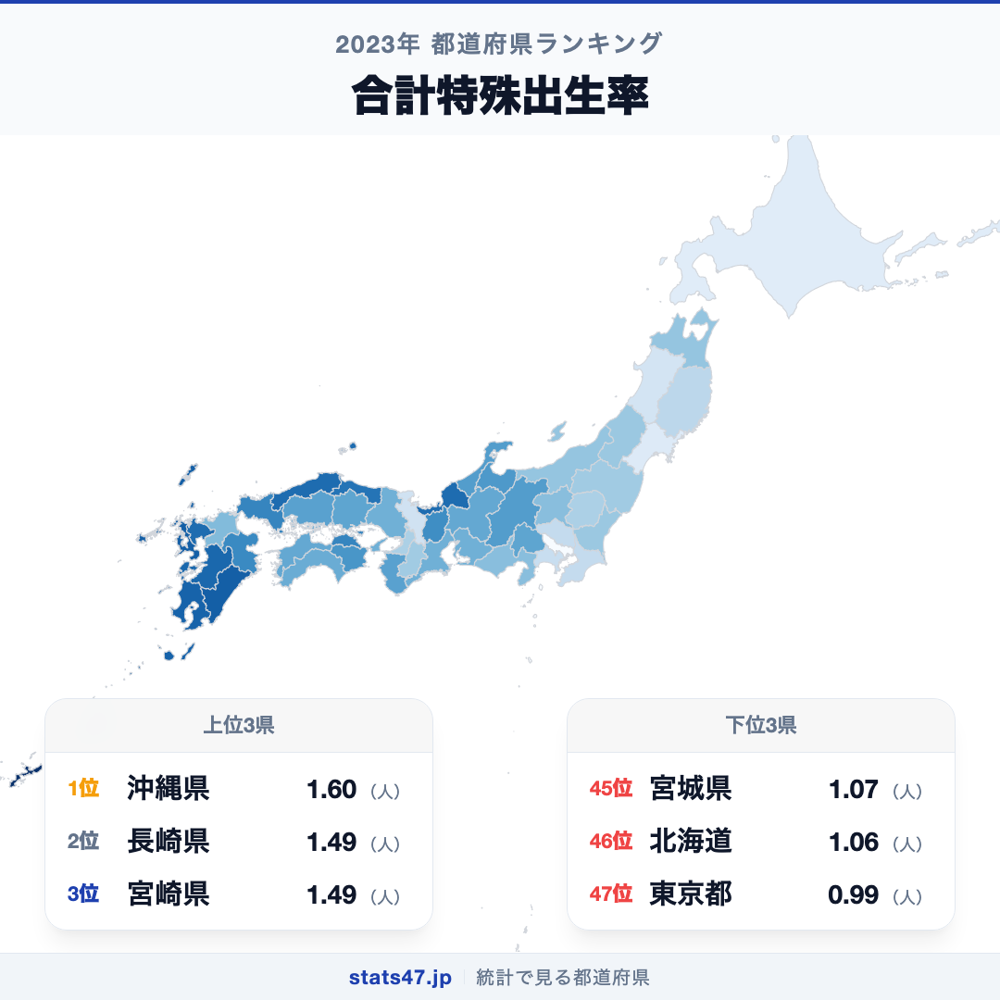
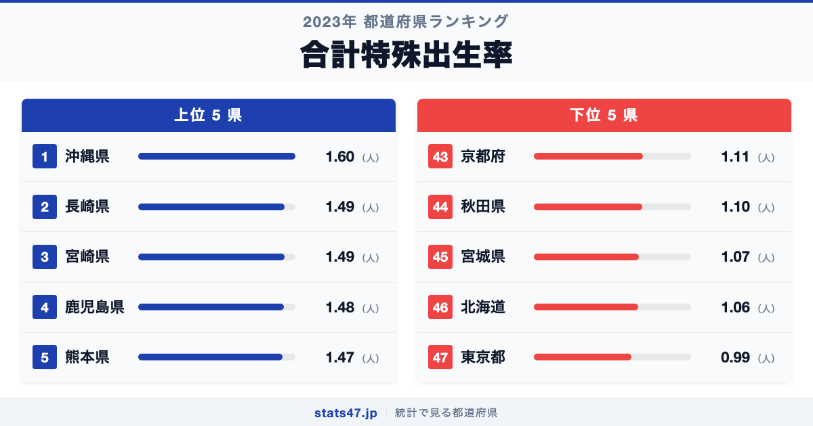
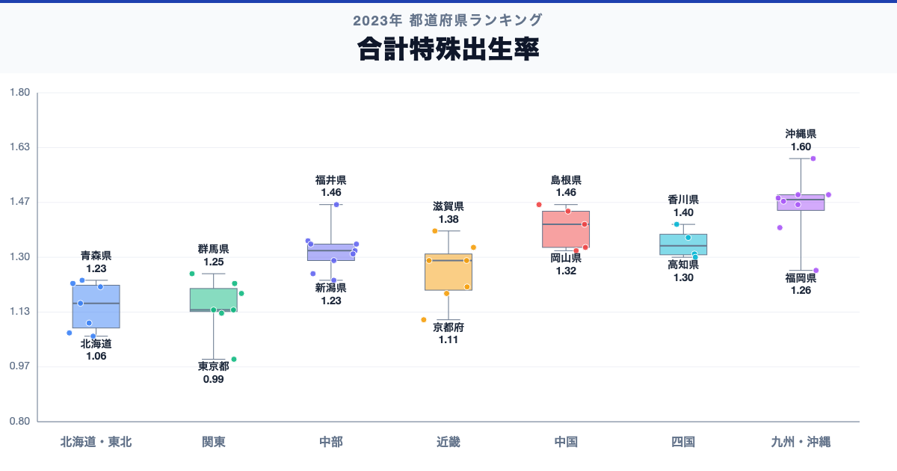

沖縄県が全国1位、東京都が47位。合計特殊出生率には、同じ日本の中でも1.6倍の開きがあります。

首位の沖縄県は1.6（人）で偏差値73.3、最下位の東京都は0.99（人）で偏差値27.0です。なぜこれほど差があるのでしょうか。

「合計特殊出生率」は、合計特殊出生率は、年齢別出生率を合計し、その年の出生状況が続くと仮定したときの女性1人あたりの出生数に相当する指標です。単年の率は変動するため、数年間の推移と出産年齢人口の大きさを併せて確認します。

## データハイライト

全国平均: 1.29（人）

1位: 沖縄県　1.6（人） / 偏差値 73.3

47位: 東京都　0.99（人） / 偏差値 27.0

上位5県と下位5県の間には明確な開きがあります。一方、順位が近い県では値の差が小さい場合もあるため、一つの順位差を地域の優劣として扱わないことが大切です。

## 【コロプレス地図】日本全国の分布

<!-- note投稿時: この画像行を削除し、images/choropleth-map-1080x1080.png をアップロード -->

地域中央値が最も高いのは九州・沖縄で1.48（人）、最も低いのは北海道で1.06（人）です。県別の順位だけでなく、まとまりとして見ると分布の偏りを捉えやすくなります。

ただし、地域内にもばらつきがあります。率は人口規模をならして地域を比べやすくしますが、出生数の総量とは異なります。低い値の背景を個人の意識だけに求めず、年齢構成、雇用、住宅、子育て環境を分けて見ます。地図の色を原因の地図とみなさず、観測された分布として読みます。

## 上位5：分析

<!-- note投稿時: この画像行を削除し、images/chart-x-1200x630.png をアップロード -->

全国首位の沖縄県は1位で、1.6（人）、偏差値は73.3です。全国平均を0.31（人）上回ります。率は人口規模をならして地域を比べやすくしますが、出生数の総量とは異なります。この順位だけで原因を決めず、出生数、出産年齢女性人口、初婚年齢、未婚率、保育・住宅・雇用指標を確認すると背景を分解できます。

続く長崎県は2位で、1.49（人）、偏差値は65.0です。全国平均を0.2（人）上回ります。九州・沖縄に位置し、同じ地域内の県と比べる視点も必要です。この順位だけで原因を決めず、出生数、出産年齢女性人口、初婚年齢、未婚率、保育・住宅・雇用指標を確認すると背景を分解できます。

上位に入った宮崎県は3位で、1.49（人）、偏差値は65.0です。全国平均を0.2（人）上回ります。九州・沖縄に位置し、同じ地域内の県と比べる視点も必要です。この順位だけで原因を決めず、出生数、出産年齢女性人口、初婚年齢、未婚率、保育・住宅・雇用指標を確認すると背景を分解できます。

4番手の鹿児島県は4位で、1.48（人）、偏差値は64.2です。全国平均を0.19（人）上回ります。九州・沖縄に位置し、同じ地域内の県と比べる視点も必要です。この順位だけで原因を決めず、出生数、出産年齢女性人口、初婚年齢、未婚率、保育・住宅・雇用指標を確認すると背景を分解できます。

上位5県を締める熊本県は5位で、1.47（人）、偏差値は63.4です。全国平均を0.18（人）上回ります。九州・沖縄に位置し、同じ地域内の県と比べる視点も必要です。この順位だけで原因を決めず、出生数、出産年齢女性人口、初婚年齢、未婚率、保育・住宅・雇用指標を確認すると背景を分解できます。

## 下位5：分析

下位側を見ると、京都府は43位で、1.11（人）、偏差値は36.1です。全国平均を0.18（人）下回ります。近畿の中でも、この県の位置を周辺県と見比べることが次の手がかりです。単年の率は変動するため、数年間の推移と出産年齢人口の大きさを併せて確認します。

次に秋田県は44位で、1.1（人）、偏差値は35.4です。全国平均を0.19（人）下回ります。東北の中でも、この県の位置を周辺県と見比べることが次の手がかりです。単年の率は変動するため、数年間の推移と出産年齢人口の大きさを併せて確認します。

45位の宮城県は45位で、1.07（人）、偏差値は33.1です。全国平均を0.22（人）下回ります。東北の中でも、この県の位置を周辺県と見比べることが次の手がかりです。単年の率は変動するため、数年間の推移と出産年齢人口の大きさを併せて確認します。

46位の北海道は46位で、1.06（人）、偏差値は32.3です。全国平均を0.23（人）下回ります。北海道の中でも、この県の位置を周辺県と見比べることが次の手がかりです。単年の率は変動するため、数年間の推移と出産年齢人口の大きさを併せて確認します。

最下位の東京都は47位で、0.99（人）、偏差値は27.0です。全国平均を0.3（人）下回ります。低い値の背景を個人の意識だけに求めず、年齢構成、雇用、住宅、子育て環境を分けて見ます。単年の率は変動するため、数年間の推移と出産年齢人口の大きさを併せて確認します。

## あなたの県は何位？

ここまで上位・下位の10県を見てきましたが、残る37県の順位も気になるはずです。全47都道府県の順位は、色分け地図と並べ替え可能なグラフ付きでstats47から確認できます。

### 合計特殊出生率ランキング 全47都道府県版

https://stats47.jp/ranking/total-fertility-rate

## 地域別の傾向

<!-- note投稿時: この画像行を削除し、images/boxplot-1200x630.png をアップロード -->

箱ひげ図では、九州・沖縄の中央値が高く、北海道が低い配置です。ただし、箱の重なりや外れた県も確認し、地域名だけで各県の値を決めつけないようにします。

## このランキングを正しく読む3つの視点

**総数と比率を混同しない**

率は人口規模をならして地域を比べやすくしますが、出生数の総量とは異なります。低い値の背景を個人の意識だけに求めず、年齢構成、雇用、住宅、子育て環境を分けて見ます。

**順位だけで原因を決めない**

このデータから直接分かるのは、2023年の47都道府県の値と順位です。背景を確かめるには、出生数、出産年齢女性人口、初婚年齢、未婚率、保育・住宅・雇用指標が必要です。

**対象年と定義を確認する**

単年の率は変動するため、数年間の推移と出産年齢人口の大きさを併せて確認します。別年や別調査と比べるときは、対象となる世帯・人・施設と単位をそろえます。

## まとめ

合計特殊出生率の地域差は、単純な県の優劣ではなく、指標の対象と地域条件の違いを映しています。

**首位と最下位には1.6倍の開き**

沖縄県の1.6（人）に対し、東京都は0.99（人）でした。まずは差の大きさを事実として押さえます。

**地域のまとまりと県内差は両方見る**

地域中央値には違いがありますが、同じ地域のすべての県が同じ傾向とは限りません。地図と全47県の順位を併用すると例外も見つけられます。

**次のデータで理由を分解する**

出生数、出産年齢女性人口、初婚年齢、未婚率、保育・住宅・雇用指標を重ねれば、総数・割合・価格・人口構成など、順位を動かす要素を切り分けられます。

## もっと詳しく知りたい方へ

全47都道府県の順位や、グラフ・地図での可視化はstats47で確認できます。

### 合計特殊出生率ランキング 全都道府県版

https://stats47.jp/ranking/total-fertility-rate

### 不慮の事故による死亡者数

https://stats47.jp/ranking/accidental-deaths-per-100k

### 年齢別死亡率

https://stats47.jp/ranking/age-specific-death-rate-0-4-per-1000

### 農業就業人口

https://stats47.jp/ranking/agricultural-employment-population

---

**stats47** は、e-Statなどの公的統計データを47都道府県別に可視化するサービスです。ランキング・散布図・時系列チャートで、地域の違いがひと目で分かります。

https://stats47.jp
