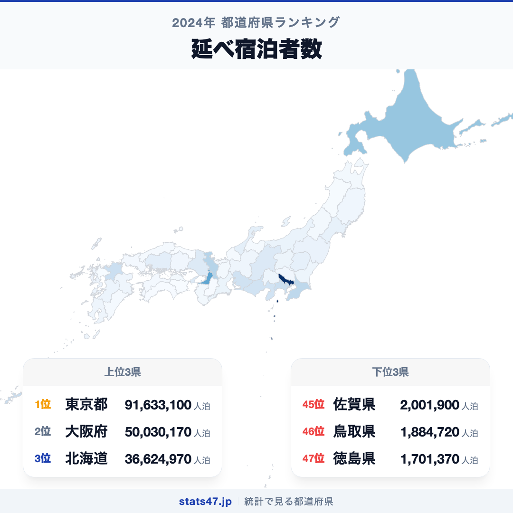
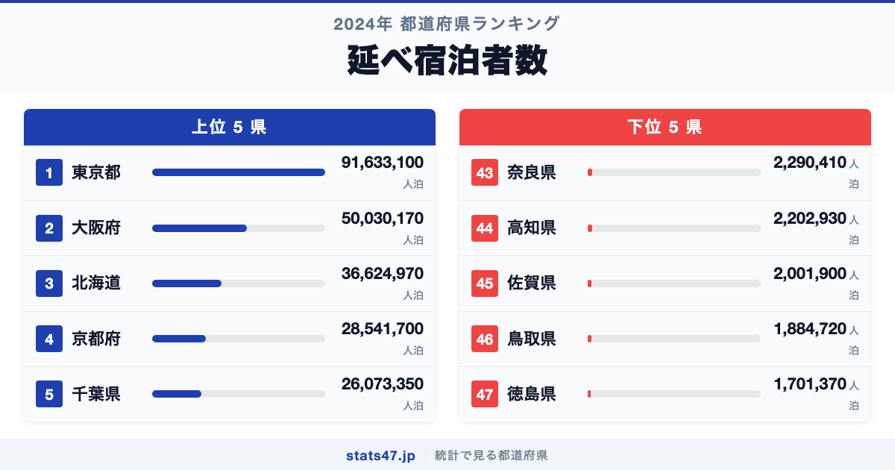
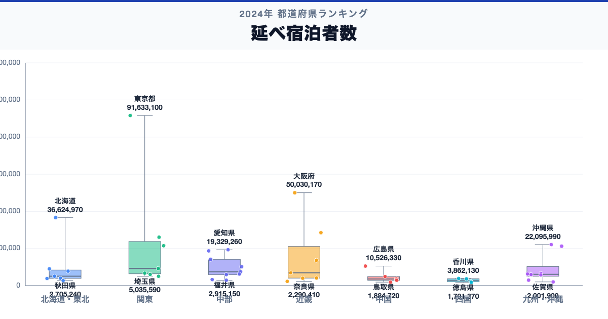

東京都が全国1位、徳島県が47位。延べ宿泊者数には、同じ日本の中でも53.9倍の開きがあります。

首位の東京都は91,633,100人泊で偏差値102.1、最下位の徳島県は1,701,370人泊で偏差値43.6です。なぜこれほど差があるのでしょうか。

「延べ宿泊者数」は、延べ宿泊者数（全施設タイプ合計、宿泊旅行統計調査）単年の順位だけで判断せず、同じ定義の時系列と関連する内訳を併せて確認します。

## データハイライト

全国平均: 11,512,206.17人泊

1位: 東京都　91,633,100人泊 / 偏差値 102.1

47位: 徳島県　1,701,370人泊 / 偏差値 43.6

上位5県と下位5県の間には明確な開きがあります。一方、順位が近い県では値の差が小さい場合もあるため、一つの順位差を地域の優劣として扱わないことが大切です。

## 【コロプレス地図】日本全国の分布

<!-- note投稿時: この画像行を削除し、images/choropleth-map-1080x1080.png をアップロード -->

地域中央値が最も高いのは北海道で36,624,970人泊、最も低いのは四国で2,921,650人泊です。県別の順位だけでなく、まとまりとして見ると分布の偏りを捉えやすくなります。

ただし、地域内にもばらつきがあります。総数・比率・平均のどれを測る指標かを確認し、値の大きさを地域の優劣へ置き換えないことが重要です。低い値にも人口規模、分母、対象範囲など複数の要因があり、このランキングだけで原因は決められません。地図の色を原因の地図とみなさず、観測された分布として読みます。

## 上位5：分析

<!-- note投稿時: この画像行を削除し、images/chart-x-1200x630.png をアップロード -->

全国首位の東京都は1位で、91,633,100人泊、偏差値は102.1です。全国平均を80,120,893.83人泊上回ります。総数・比率・平均のどれを測る指標かを確認し、値の大きさを地域の優劣へ置き換えないことが重要です。この順位だけで原因を決めず、指標の分子・分母、構成内訳、人口規模、同一定義の時系列、一次資料の注記を確認すると背景を分解できます。

続く大阪府は2位で、50,030,170人泊、偏差値は75.0です。全国平均を38,517,963.83人泊上回ります。近畿に位置し、同じ地域内の県と比べる視点も必要です。この順位だけで原因を決めず、指標の分子・分母、構成内訳、人口規模、同一定義の時系列、一次資料の注記を確認すると背景を分解できます。

上位に入った北海道は3位で、36,624,970人泊、偏差値は66.3です。全国平均を25,112,763.83人泊上回ります。北海道に位置し、同じ地域内の県と比べる視点も必要です。この順位だけで原因を決めず、指標の分子・分母、構成内訳、人口規模、同一定義の時系列、一次資料の注記を確認すると背景を分解できます。

4番手の京都府は4位で、28,541,700人泊、偏差値は61.1です。全国平均を17,029,493.83人泊上回ります。近畿に位置し、同じ地域内の県と比べる視点も必要です。この順位だけで原因を決めず、指標の分子・分母、構成内訳、人口規模、同一定義の時系列、一次資料の注記を確認すると背景を分解できます。

上位5県を締める千葉県は5位で、26,073,350人泊、偏差値は59.5です。全国平均を14,561,143.83人泊上回ります。関東に位置し、同じ地域内の県と比べる視点も必要です。この順位だけで原因を決めず、指標の分子・分母、構成内訳、人口規模、同一定義の時系列、一次資料の注記を確認すると背景を分解できます。

## 下位5：分析

下位側を見ると、奈良県は43位で、2,290,410人泊、偏差値は44.0です。全国平均を9,221,796.17人泊下回ります。近畿の中でも、この県の位置を周辺県と見比べることが次の手がかりです。単年の順位だけで判断せず、同じ定義の時系列と関連する内訳を併せて確認します。

次に高知県は44位で、2,202,930人泊、偏差値は43.9です。全国平均を9,309,276.17人泊下回ります。四国の中でも、この県の位置を周辺県と見比べることが次の手がかりです。単年の順位だけで判断せず、同じ定義の時系列と関連する内訳を併せて確認します。

45位の佐賀県は45位で、2,001,900人泊、偏差値は43.8です。全国平均を9,510,306.17人泊下回ります。九州・沖縄の中でも、この県の位置を周辺県と見比べることが次の手がかりです。単年の順位だけで判断せず、同じ定義の時系列と関連する内訳を併せて確認します。

46位の鳥取県は46位で、1,884,720人泊、偏差値は43.7です。全国平均を9,627,486.17人泊下回ります。中国の中でも、この県の位置を周辺県と見比べることが次の手がかりです。単年の順位だけで判断せず、同じ定義の時系列と関連する内訳を併せて確認します。

最下位の徳島県は47位で、1,701,370人泊、偏差値は43.6です。全国平均を9,810,836.17人泊下回ります。低い値にも人口規模、分母、対象範囲など複数の要因があり、このランキングだけで原因は決められません。単年の順位だけで判断せず、同じ定義の時系列と関連する内訳を併せて確認します。

## あなたの県は何位？

ここまで上位・下位の10県を見てきましたが、残る37県の順位も気になるはずです。全47都道府県の順位は、色分け地図と並べ替え可能なグラフ付きでstats47から確認できます。

### 延べ宿泊者数ランキング 全47都道府県版

https://stats47.jp/ranking/total-overnight-guests

## 地域別の傾向

<!-- note投稿時: この画像行を削除し、images/boxplot-1200x630.png をアップロード -->

箱ひげ図では、北海道の中央値が高く、四国が低い配置です。ただし、箱の重なりや外れた県も確認し、地域名だけで各県の値を決めつけないようにします。

## このランキングを正しく読む3つの視点

**総数と比率を混同しない**

総数・比率・平均のどれを測る指標かを確認し、値の大きさを地域の優劣へ置き換えないことが重要です。低い値にも人口規模、分母、対象範囲など複数の要因があり、このランキングだけで原因は決められません。

**順位だけで原因を決めない**

このデータから直接分かるのは、2024年の47都道府県の値と順位です。背景を確かめるには、指標の分子・分母、構成内訳、人口規模、同一定義の時系列、一次資料の注記が必要です。

**対象年と定義を確認する**

単年の順位だけで判断せず、同じ定義の時系列と関連する内訳を併せて確認します。別年や別調査と比べるときは、対象となる世帯・人・施設と単位をそろえます。

## まとめ

延べ宿泊者数の地域差は、単純な県の優劣ではなく、指標の対象と地域条件の違いを映しています。

**首位と最下位には53.9倍の開き**

東京都の91,633,100人泊に対し、徳島県は1,701,370人泊でした。まずは差の大きさを事実として押さえます。

**地域のまとまりと県内差は両方見る**

地域中央値には違いがありますが、同じ地域のすべての県が同じ傾向とは限りません。地図と全47県の順位を併用すると例外も見つけられます。

**次のデータで理由を分解する**

指標の分子・分母、構成内訳、人口規模、同一定義の時系列、一次資料の注記を重ねれば、総数・割合・価格・人口構成など、順位を動かす要素を切り分けられます。

## もっと詳しく知りたい方へ

全47都道府県の順位や、グラフ・地図での可視化はstats47で確認できます。

### 延べ宿泊者数ランキング 全都道府県版

https://stats47.jp/ranking/total-overnight-guests

### 航空貨物輸送量

https://stats47.jp/ranking/air-cargo-transport

### 航空輸送人員

https://stats47.jp/ranking/air-passenger-transport

### バス事業者

https://stats47.jp/ranking/bus-operators

---

**stats47** は、e-Statなどの公的統計データを47都道府県別に可視化するサービスです。ランキング・散布図・時系列チャートで、地域の違いがひと目で分かります。

https://stats47.jp
