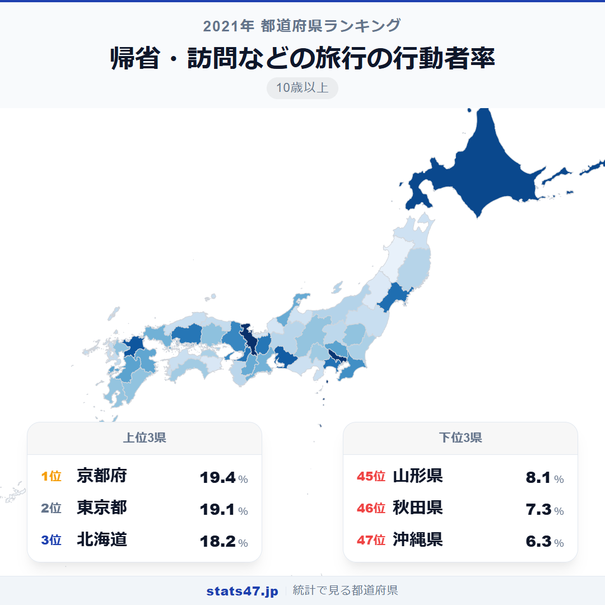
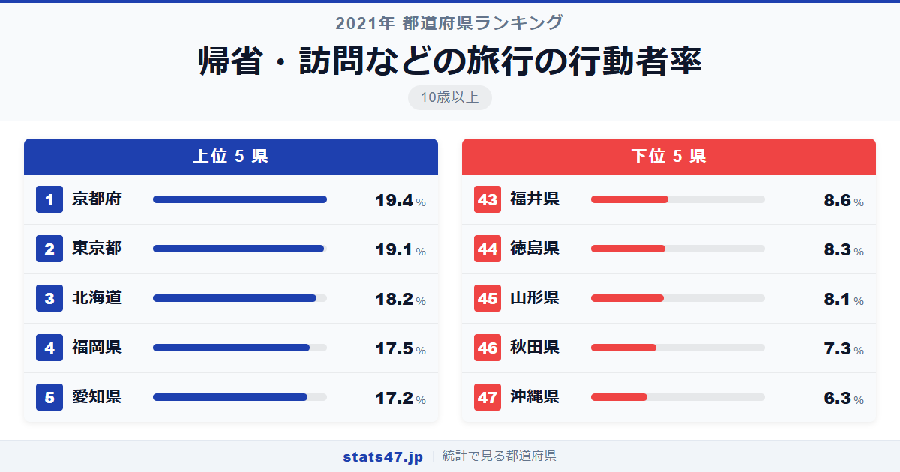
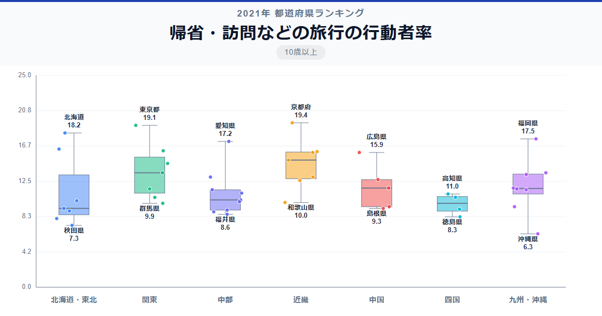

帰省ラッシュといえばお盆と年末年始の風物詩。しかし「帰省する人の割合」が最も高いのは、意外にも東京都ではなく京都府です。19.4％で全国1位。全国から人が集まる京都は、同時に全国に故郷を持つ人が多い街なのかもしれません。

全国1位の京都府は偏差値72.6で19.4％、47位の沖縄県は偏差値32.0で6.3％。その差は3.1倍にのぼります。東京都は19.1％の2位で、京都府との差はわずか0.3ポイントです。

北海道が3位に入っていることからも、「故郷が遠い人」が多い地域ほど帰省率が高い傾向が見えてきます。

「帰省・訪問などの旅行の行動者率」は、帰省や知人訪問を目的とした1泊以上の旅行を過去1年間に行った10歳以上の人の割合です。総務省「社会生活基本調査」（2021年）のデータに基づきます。

## データハイライト

全国平均: 12.10％

1位: 京都府（19.4％ / 偏差値 72.6）

47位: 沖縄県（6.3％ / 偏差値 32.0）

全国平均は12.10％と、約8人に1人が帰省旅行を行っています。上位は大都市圏に加え、北海道・福岡県と「地方出身者が集まる都市」が並びます。全国平均を上回るのは約15県にとどまり、上位に偏った分布です。

## 【コロプレス地図】日本全国の分布

<!-- note投稿時: この画像行を削除し、images/choropleth-map-1080x1080.png をアップロード -->

大都市圏が濃い色で目立つのは観光旅行と同じですが、帰省旅行ならではの特徴も見えます。北海道が3位と高い値を示しており、道内の広さゆえに実家への帰省に宿泊を伴うケースが多いことが反映されているのでしょう。

広島県が10位の15.9％と、中国地方で突出して高い位置にいます。広島市に転勤で来た人が実家に帰省するパターンが多いのかもしれません。福岡県も4位の17.5％で、九州各県からの流入人口が帰省旅行の需要を押し上げていると考えられます。

東北地方は宮城県6位を除くと30位以下。山形県45位、秋田県46位と低迷しており、これは「東北各県から出て行く人は多いが、残った人は帰省先がない」という構図を反映しています。

## 上位5：分析

<!-- note投稿時: この画像行を削除し、images/chart-x-1200x630.png をアップロード -->

大学の街・京都府が偏差値72.6の19.4％で全国1位です。全国から学生が集まり、卒業後もそのまま京都に定住する人が多い土地柄。実家が他県にある住民の割合が高く、帰省需要が自然と高くなります。

東京都は偏差値71.7で19.1％の2位。日本最大の人口流入地であり、全国各地に故郷を持つ人が集中しています。年末年始やお盆の帰省ラッシュの主役は東京発の旅客です。

北海道が偏差値68.9の18.2％で3位に入ったのは注目に値します。道内の広さから、札幌に住む人が道東・道北の実家に帰省する際に宿泊が必要となるケースが多いことが、この高い数値の背景にあるでしょう。

4位の福岡県は偏差値66.8で17.5％。九州各県から福岡市に集まった人々が、お盆や正月に故郷へ帰省するパターンが多いとみられます。博多駅・福岡空港の交通利便性も帰省を後押ししています。

愛知県が偏差値65.8の17.2％で5位です。名古屋を中心とする製造業の集積地に、全国から労働者が集まっており、帰省需要が一定程度存在します。

## 下位5：分析

沖縄県は偏差値32.0の6.3％で全国最下位。県外への帰省には航空機が必須であり、旅費負担が大きいことが最大の制約です。また、沖縄県出身者は県内にとどまる傾向が比較的強く、そもそも県外出身の住民比率が低いという構造的な要因もあります。

秋田県が偏差値35.1の7.3％で46位。高齢化が進み、帰省する側の若年層が大幅に減少しています。帰省先としては存在感がある秋田県ですが、秋田県から帰省に出かける人は少ない構図です。

45位の山形県は偏差値37.6で8.1％。秋田県と同様に人口流出が進み、県内に残った住民の多くが地元出身者であるため、帰省旅行の需要が構造的に低くなっています。

徳島県は偏差値38.2の8.3％で44位。四国の交通環境の制約に加え、県外からの転入者が少ないことが帰省率の低さにつながっています。

43位の福井県は偏差値39.2で8.6％です。北陸の中でも人口規模が小さく、県外からの流入が限られる地域。地元出身者の定住率が高い県ほど帰省率は低くなる傾向が表れています。

## 地域別の傾向

<!-- note投稿時: この画像行を削除し、images/boxplot-1200x630.png をアップロード -->

関東・近畿・北海道が高く、東北・四国が低い傾向です。九州は福岡県が突出して高く、県間のばらつきが大きくなっています。

## まとめ

帰省・訪問などの旅行の行動者率は、人口移動のパターンを映す鏡です。このデータから以下の洞察が得られます。

**「人が集まる街」ほど帰省率が高い**

京都府・東京都・福岡県と、全国から人が流入する都市が上位を占めています。
帰省率の高さは、その地域がどれだけ多くの「他県出身者」を抱えているかを示しています。

**北海道3位の意味は「道内帰省」**

北海道の広さゆえに、道内の移動ですら宿泊を伴うことが珍しくありません。
札幌一極集中が進むなか、道内帰省が高い行動者率を支えているとみられます。

**人口流出県は帰省率が低い逆説**

秋田県46位、山形県45位と、帰省先としてのイメージが強い県が帰省率では最下位圏に入ります。
若者が流出した後に残る住民は地元出身者が多く、帰省する先がないという構図です。

## もっと詳しく知りたい方へ

全47都道府県の順位や、グラフ・地図での可視化は stats47 で見ることができます。

### 帰省・訪問などの旅行の行動者率ランキング 全都道府県版

https://stats47.jp/ranking/travel-participation-rate-homecoming

### 国内旅行の行動者率ランキング

https://stats47.jp/ranking/travel-participation-rate-domestic

### 国内観光旅行の行動者率ランキング

https://stats47.jp/ranking/travel-participation-rate-domestic-tourism

### 旅行（1泊2日以上）の行動者率ランキング

https://stats47.jp/ranking/travel-participation-rate-overnight

### 行楽（日帰り）の行動者率ランキング

https://stats47.jp/ranking/travel-participation-rate-day-trip

### 海外観光旅行の行動者率ランキング

https://stats47.jp/ranking/travel-participation-rate-overseas

---

**stats47** は、e-Stat の公的統計データを47都道府県別に可視化するサービスです。
ランキング・散布図・時系列チャートで、地域の違いがひと目でわかります。

https://stats47.jp
