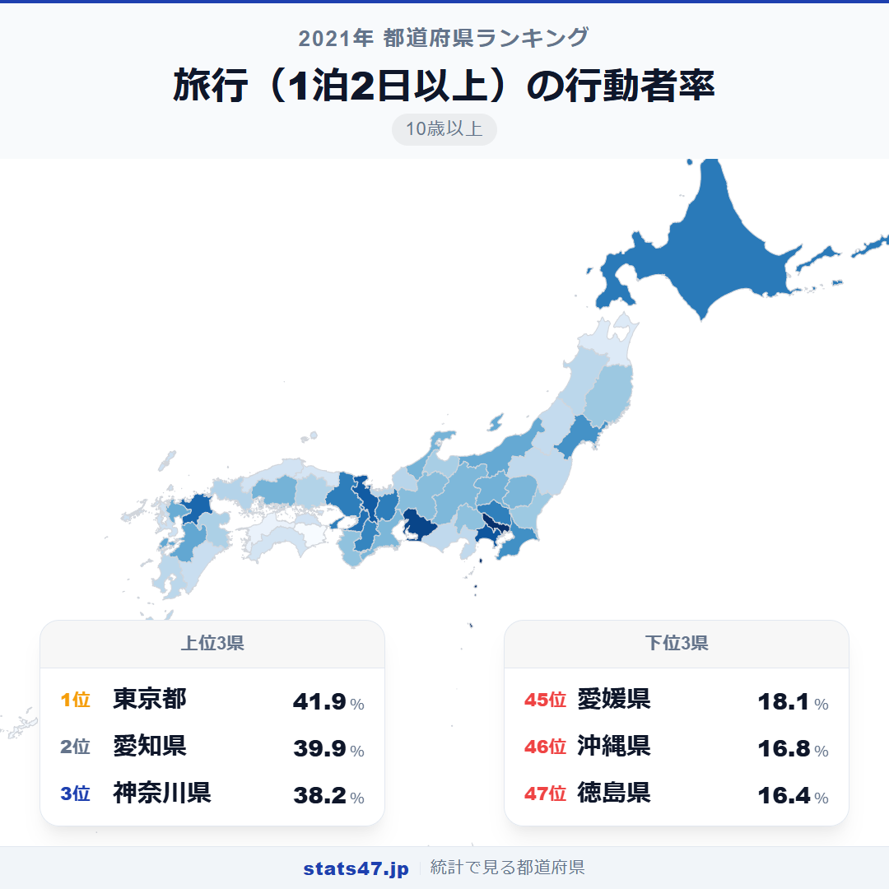
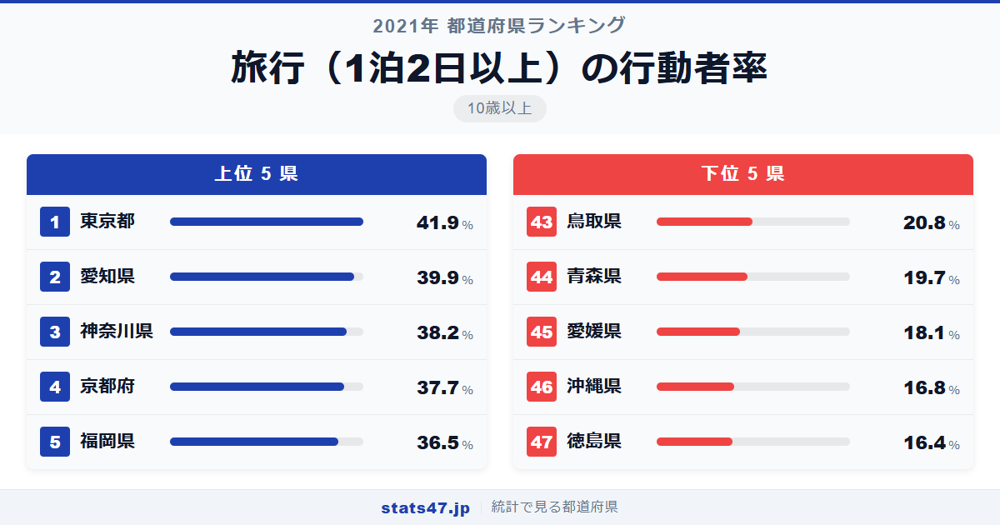
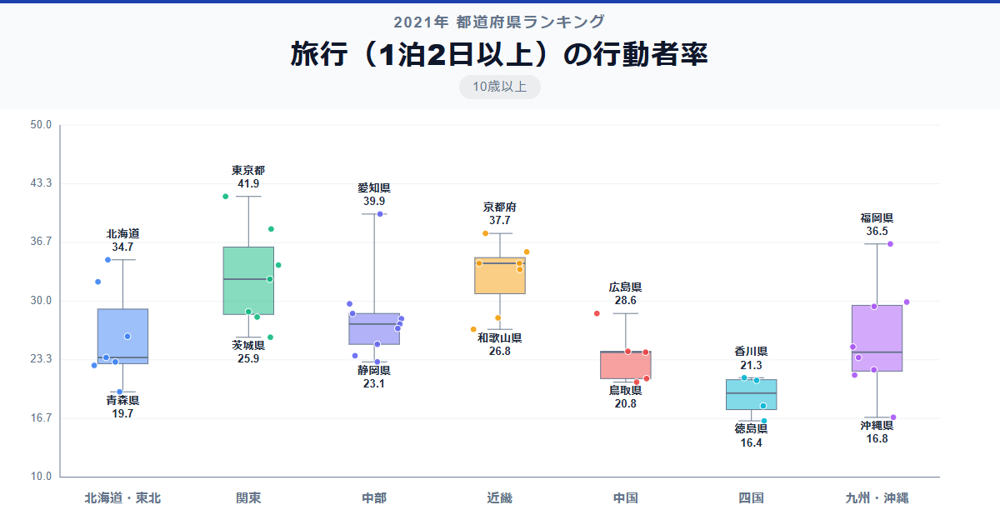

東京都民の4割以上が1泊以上の旅行を経験。41.9％という数字は、最下位の徳島県の16.4％と比べて2.6倍の開きです。コロナ禍で旅行が大きく制約された2021年のデータですが、それでもなお地域差は歴然としています。

全国1位の東京都は偏差値73.3で41.9％。47位の徳島県は偏差値31.9で16.4％です。2位には愛知県が39.9％で続き、大都市圏の旅行行動の活発さが際立ちます。

所得水準の高さが旅行行動に直結しているのか、それとも他の要因があるのか。データが語る実態を見ていきます。

「旅行（1泊2日以上）の行動者率」は、1泊以上の旅行を過去1年間に行った10歳以上の人の割合です。国内旅行・海外旅行の両方を含みます。総務省「社会生活基本調査」（2021年）のデータです。

## データハイライト

全国平均: 27.56％

1位: 東京都（41.9％ / 偏差値 73.3）

47位: 徳島県（16.4％ / 偏差値 31.9）

全国平均は27.56％で、約4人に1人が宿泊旅行を経験しています。上位10県は大都市圏に集中し、偏差値60以上が11県。一方、下位10県には四国・東北・山陰の県が多く、30％台前半から20％台に分布しています。格差が大きい指標です。

## 【コロプレス地図】日本全国の分布

<!-- note投稿時: この画像行を削除し、images/choropleth-map-1080x1080.png をアップロード -->

三大都市圏が濃い色で浮かび上がる、非常にわかりやすい分布です。東京・愛知・大阪を核に、それぞれの周辺県がやや薄い色で取り囲んでいます。

福岡県が5位の36.5％と高い位置にあるのは注目点です。九州の拠点都市として、九州内の温泉地や観光地への宿泊旅行が活発であること、また本州や海外への旅行の出発地としても機能していることが背景にあるでしょう。北海道も7位の34.7％で、広大な大地を宿泊しながら旅する文化が根づいていることがうかがえます。

四国4県は40位から47位の間に3県が入っており、徳島県47位、愛媛県45位と特に低迷しています。

## 上位5：分析

<!-- note投稿時: この画像行を削除し、images/chart-x-1200x630.png をアップロード -->

日本の経済・交通の中心である東京都が偏差値73.3の41.9％で1位です。新幹線・飛行機の起点として全国どこへでもアクセスしやすく、また所得水準の高さが旅行への支出を支えています。

愛知県は偏差値70.1で39.9％の2位。名古屋を起点に、北陸・関西・信州など多方面への宿泊旅行が盛んです。製造業を中心とした経済力も旅行行動を後押ししています。

3位は神奈川県で偏差値67.3の38.2％。横浜・川崎の都市部に住む層は所得水準が高く、東京とともに首都圏の旅行需要を牽引しています。

京都府が偏差値66.5の37.7％で4位です。大阪・神戸にも近く、関西圏の観光地へのアクセスに加え、京都自体が学会やイベントの開催地として人の移動を生んでいます。

福岡県は偏差値64.5で36.5％の5位につけています。九州の玄関口として別府温泉や阿蘇、長崎など九州各地への旅行基地の役割を果たすとともに、アジアへの近さもプラスに働いています。

## 下位5：分析

徳島県は偏差値31.9の16.4％で全国最下位。四国東端に位置し、高速バスや自家用車が主な移動手段となる交通環境のなかで、宿泊を伴う旅行のハードルが高い地域です。

沖縄県が偏差値32.5の16.8％で46位。島嶼県のため県外旅行には飛行機が必須で、旅費が高くなりがちです。2021年はコロナ禍による航空便の減便も影響したと考えられます。

愛媛県は偏差値34.6で18.1％の45位。四国南西部に位置し、本州への移動にしまなみ海道や松山空港を経由する必要があり、気軽な宿泊旅行のハードルがやや高い環境にあります。

44位の青森県は偏差値37.2で19.7％。冬季の交通制約に加え、東京や大阪への距離的な遠さが宿泊旅行率を押し下げています。

鳥取県は偏差値39.0の20.8％で43位です。人口が少なく、山陰地方特有の地理的な孤立性が影響しています。出雲空港や米子空港があるものの、便数が限られるためアクセス面での不利が残ります。

## 地域別の傾向

<!-- note投稿時: この画像行を削除し、images/boxplot-1200x630.png をアップロード -->

関東・近畿・中部が高く、四国・東北が低い傾向です。九州は福岡県が牽引して中央値がやや高めですが、県間のばらつきが大きくなっています。

## まとめ

旅行（1泊2日以上）の行動者率は、経済力と交通アクセスが複合的に影響する指標です。このデータから以下の洞察が得られます。

**三大都市圏の旅行行動が突出**

上位5県のうち4県が三大都市圏の核となる都府県です。
所得水準と交通インフラの両方が整った地域ほど、宿泊旅行が活発になります。

**福岡県5位・北海道7位が示す地方拠点の力**

大都市圏以外でも、交通ハブとしての機能を持つ県は旅行行動が活発です。
福岡空港の国内線・国際線の充実ぶりが、5位という結果に直結しているとみられます。

**四国の低迷は交通アクセスの課題を物語る**

4県中3県が40位台と、四国全体の宿泊旅行率の低さが目立ちます。
本州との連絡橋はあるものの、移動の時間とコストが依然として障壁となっているようです。

## もっと詳しく知りたい方へ

全47都道府県の順位や、グラフ・地図での可視化は stats47 で見ることができます。

### 旅行（1泊2日以上）の行動者率ランキング 全都道府県版

https://stats47.jp/ranking/travel-participation-rate-overnight

### 行楽（日帰り）の行動者率ランキング

https://stats47.jp/ranking/travel-participation-rate-day-trip

### 国内旅行の行動者率ランキング

https://stats47.jp/ranking/travel-participation-rate-domestic

### 国内観光旅行の行動者率ランキング

https://stats47.jp/ranking/travel-participation-rate-domestic-tourism

### 帰省・訪問などの旅行の行動者率ランキング

https://stats47.jp/ranking/travel-participation-rate-homecoming

### 海外観光旅行の行動者率ランキング

https://stats47.jp/ranking/travel-participation-rate-overseas

---

**stats47** は、e-Stat の公的統計データを47都道府県別に可視化するサービスです。
ランキング・散布図・時系列チャートで、地域の違いがひと目でわかります。

https://stats47.jp
