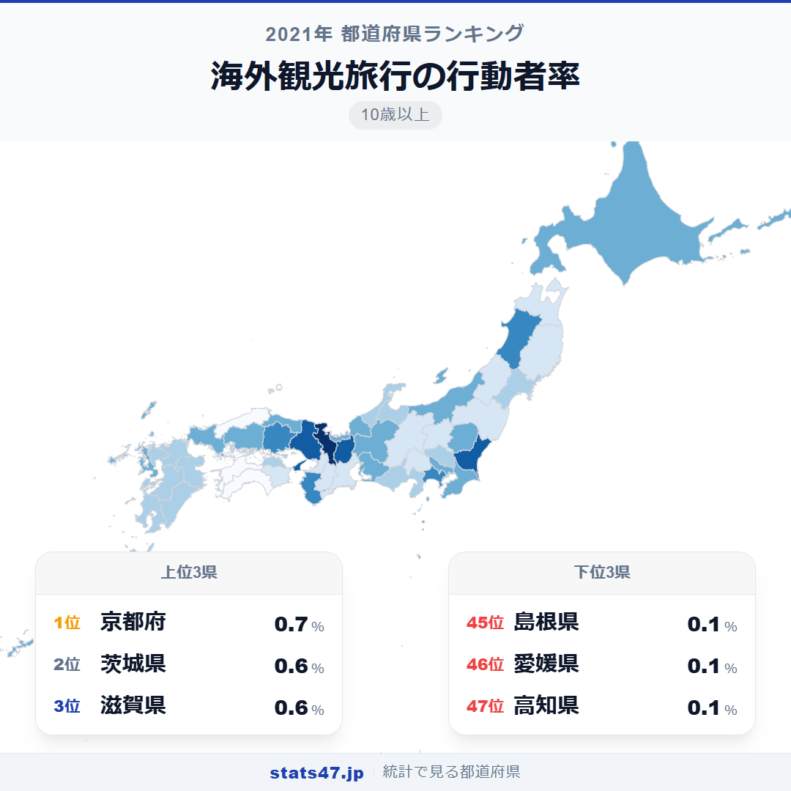
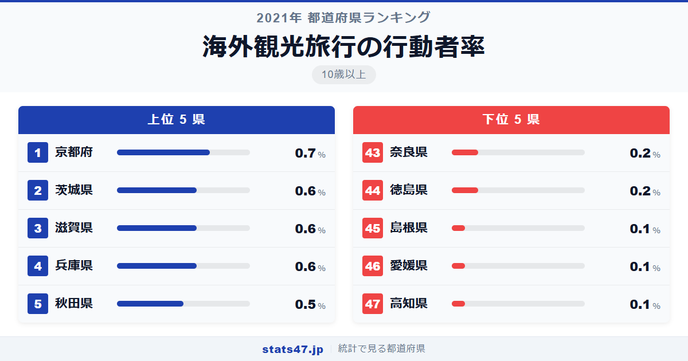
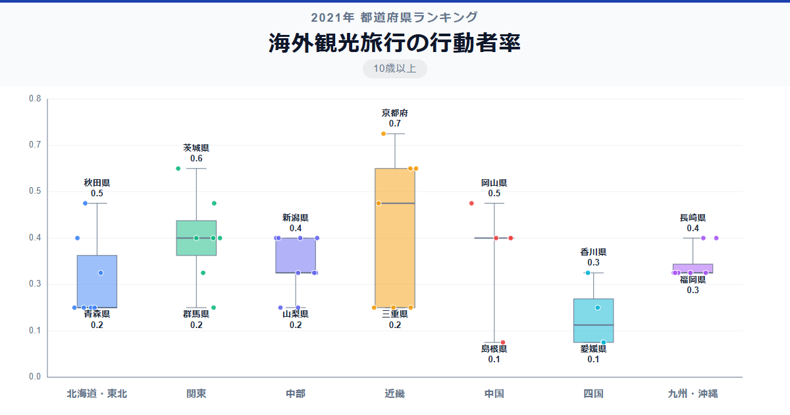

コロナ禍の2021年、海外観光旅行に出かけた日本人はほぼゼロに等しい数字でした。全国1位の京都府ですらわずか0.7％。それでも最下位の高知県0.1％との間に7.0倍もの差が存在するのは驚くべきことです。

1位の京都府は偏差値76.5で0.7％。47位の高知県は偏差値32.8で0.1％。全国平均は0.34％で、ほぼすべての県が1％未満という異常な年のデータです。

東京都が12位の0.4％にとどまっているのは意外です。なぜ京都府がトップなのでしょうか。

「海外観光旅行の行動者率」は、観光を目的とした海外旅行を過去1年間に行った10歳以上の人の割合です。総務省「社会生活基本調査」（2021年）のデータで、コロナ禍の渡航制限下における調査結果です。

## データハイライト

全国平均: 0.34％

1位: 京都府（0.7％ / 偏差値 76.5）

47位: 高知県（0.1％ / 偏差値 32.8）

全体が0.1〜0.7％という極端に狭い範囲に収まっており、通常の年とは大きく異なる分布です。値が小さいため統計的なばらつきも大きく、順位にはある程度の偶然が含まれる可能性があります。それでも上位と下位の傾向には一定のパターンが見えます。

## 【コロプレス地図】日本全国の分布

<!-- note投稿時: この画像行を削除し、images/choropleth-map-1080x1080.png をアップロード -->

通常の旅行指標と異なり、地理的な法則性が読み取りにくい分布です。コロナ禍で海外旅行がほぼ不可能だった年のデータであるため、ごくわずかな渡航者の存在が結果を左右しています。

京都府が1位、茨城県・滋賀県・兵庫県が2位タイの0.6％で並ぶという結果は、通常年の海外旅行ランキングとは異なる顔ぶれです。茨城県にはつくばの研究機関が、滋賀県には製造業の海外拠点を持つ企業が多く、業務渡航に近い旅行が一部含まれている可能性があります。

島根県・愛媛県・高知県が0.1％で最下位圏に並んでいます。いずれも国際空港へのアクセスが遠い地域です。

## 上位5：分析

<!-- note投稿時: この画像行を削除し、images/chart-x-1200x630.png をアップロード -->

京都大学や多くの研究機関を擁する京都府が偏差値76.5の0.7％で1位です。国際的な学術交流が盛んであり、コロナ禍でも一部の研究者や国際機関関係者が渡航していた可能性があります。留学生との国際交流も、海外旅行への意識を高める要因でしょう。

茨城県・滋賀県・兵庫県がともに偏差値69.2の0.6％で2位タイに並んでいます。茨城県はつくば研究学園都市の国際的な研究者コミュニティ、滋賀県は大手メーカーの海外事業拠点、兵庫県は神戸の国際港湾都市としての性格が、それぞれの背景にあると推測されます。

5位は秋田県・神奈川県・和歌山県・岡山県の4県が偏差値61.9の0.5％で横並びです。秋田県が上位に入っているのは意外ですが、サンプル数が少ないなかでのばらつきの影響と考えるのが妥当かもしれません。

## 下位5：分析

高知県・愛媛県・島根県がともに偏差値32.8の0.1％で最下位圏です。いずれも国際空港から遠く、そもそも海外旅行のハードルが高い地域。コロナ禍で航空便が激減したなかで、これらの県から海外に出かけた人はほぼ皆無だったと推測されます。

徳島県と奈良県も0.2％で偏差値40.1の下位に入っています。徳島県は四国の交通事情、奈良県は県内に空港がないという事情がそれぞれ影響しています。通常年であれば大阪・関西国際空港を利用して海外旅行に出かける奈良県民も多いはずですが、コロナ禍では国際線がほぼ運休でした。

これら下位県に共通するのは、国際空港へのアクセスの遠さです。渡航制限下ではなおさら、地理的条件の影響が大きく表れています。

## 地域別の傾向

<!-- note投稿時: この画像行を削除し、images/boxplot-1200x630.png をアップロード -->

地域間の差はほとんどなく、全体が0.1〜0.7％の極めて狭い範囲に収まっています。コロナ禍の特殊事情により、通常の地域パターンが読み取りにくい年のデータです。

## まとめ

海外観光旅行の行動者率は、コロナ禍の異常事態を如実に反映するデータです。このデータから以下の洞察が得られます。

**全県1％未満が物語るコロナ禍のインパクト**

通常年であれば東京都は10％を超えるとされる海外旅行率が、わずか0.4％に激減しました。
2021年の渡航制限がいかに徹底していたかを、数字が証明しています。

**京都府1位の背景は国際学術交流**

一般的な海外観光ではなく、研究者や国際機関関係者の業務的な渡航が京都府の数字を押し上げた可能性があります。
大学・研究機関の密度が高い地域ほど、コロナ禍でも一定の海外渡航が維持されたと推測できます。

**0.1％差で順位が変動する特殊なデータ**

0.1ポイントの差で数十位の順位変動が生じるため、個別の順位の解釈には慎重さが必要です。
このデータの本質的な価値は、コロナ禍における日本全体の海外旅行の「消滅」を記録したことにあります。

## もっと詳しく知りたい方へ

全47都道府県の順位や、グラフ・地図での可視化は stats47 で見ることができます。

### 海外観光旅行の行動者率ランキング 全都道府県版

https://stats47.jp/ranking/travel-participation-rate-overseas

### 国内観光旅行の行動者率ランキング

https://stats47.jp/ranking/travel-participation-rate-domestic-tourism

### 国内旅行の行動者率ランキング

https://stats47.jp/ranking/travel-participation-rate-domestic

### 旅行（1泊2日以上）の行動者率ランキング

https://stats47.jp/ranking/travel-participation-rate-overnight

### 帰省・訪問などの旅行の行動者率ランキング

https://stats47.jp/ranking/travel-participation-rate-homecoming

### 行楽（日帰り）の行動者率ランキング

https://stats47.jp/ranking/travel-participation-rate-day-trip

---

**stats47** は、e-Stat の公的統計データを47都道府県別に可視化するサービスです。
ランキング・散布図・時系列チャートで、地域の違いがひと目でわかります。

https://stats47.jp
